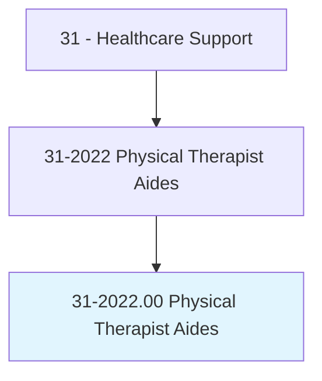
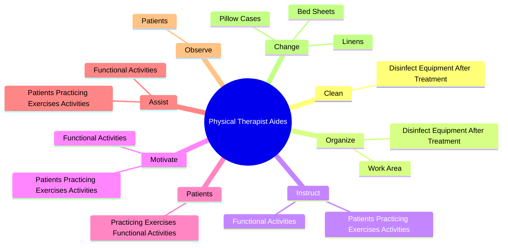
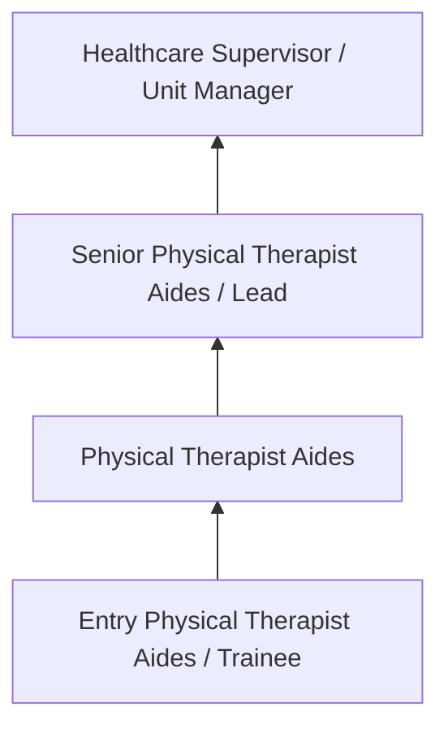
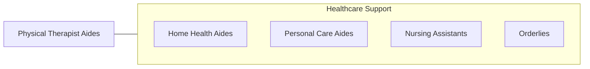

# Physical Therapist Aides

> Under close supervision of a physical therapist or physical therapy assistant, perform only delegated, selected, or routine tasks in specific situations. These duties include preparing the patient and the treatment area.

## Overview

Physical Therapist Aides professionals under close supervision of a physical therapist or physical therapy assistant, perform only delegated, selected, or routine tasks in specific situations. This occupation falls within the Healthcare Support category and requires a combination of specialized knowledge, technical skills, and practical experience.

These professionals work across diverse settings and organizational contexts, applying their expertise to meet the demands of their field. They must stay current with industry standards, emerging practices, and regulatory requirements that affect their work. The role demands both independent judgment and collaborative skills, as practitioners regularly interact with colleagues, stakeholders, and the public.

As the field continues to evolve, Physical Therapist Aides professionals increasingly leverage technology and data-driven approaches to enhance their effectiveness. Career opportunities span the public and private sectors, with demand influenced by economic conditions, demographic shifts, and technological advancement.

## Classification Hierarchy



## Key Statistics

| Metric | Value |
|--------|-------|
| SOC Code | 31-2022.00 |
| Job Zone | N/A |
| Category | [Healthcare Support](/occupations/HealthcareSupport/index) |
| Core Tasks | 37+ |
| Salary Range | $28,000 - $55,000 |
| Median Salary | $38,000 |
| Growth Outlook | 15% (Much faster than average) |
| Source | O*NET |

## Core Tasks



### maintain.Equipment

Physical Therapist Aides maintain equipment as part of their core responsibilities.

**Actions:**
- `maintain.Equipment.to.keep.ItInGoodWorkingCondition` - Maintain equipment or furniture to keep it in good working condition, includi...
- `maintain.Equipment.to.IncludingPerformingAssembly` - Maintain equipment or furniture to keep it in good working condition, includi...
- `maintain.Equipment.to.DisassemblyOfEquipment` - Maintain equipment or furniture to keep it in good working condition, includi...
- `maintain.Equipment.to.Accessories` - Maintain equipment or furniture to keep it in good working condition, includi...
- `maintain.Furniture.to.keep.ItInGoodWorkingCondition` - Maintain equipment or furniture to keep it in good working condition, includi...

### change.Linens

Physical Therapist Aides change linens as part of their core responsibilities.

**Actions:**
- `change.Linens` - Change linens, such as bed sheets and pillow cases.
- `change.BedSheets` - Change linens, such as bed sheets and pillow cases.
- `change.PillowCases` - Change linens, such as bed sheets and pillow cases.

### train.Patients

Physical Therapist Aides train patients as part of their core responsibilities.

**Actions:**
- `train.Patients.to.use.OrthopedicBraces` - Train patients to use orthopedic braces, prostheses, or supportive devices.
- `train.Patients.to.Prostheses` - Train patients to use orthopedic braces, prostheses, or supportive devices.
- `train.Patients.to.SupportiveDevices` - Train patients to use orthopedic braces, prostheses, or supportive devices.

### participate.Assisting

Physical Therapist Aides participate assisting as part of their core responsibilities.

**Actions:**
- `participate.Assisting.with.PassingFoodTrays` - Participate in patient care tasks, such as assisting with passing food trays,...
- `participate.Assisting.with.FeedingResidents` - Participate in patient care tasks, such as assisting with passing food trays,...
- `participate.Assisting.with.BathingResidents.on.BedRest` - Participate in patient care tasks, such as assisting with passing food trays,...


## Skills & Competencies

### Technical Skills
- **Patient Care** - Advanced
- **Vital Signs Monitoring** - Advanced
- **Infection Control** - Advanced
- **Medical Terminology** - Proficient
- **Patient Safety** - Proficient
- **Electronic Health Records** - Proficient

### Soft Skills
- **Compassion** - Critical
- **Communication** - Critical
- **Physical Stamina** - Essential
- **Attention to Detail** - Essential
- **Emotional Resilience** - Essential

## Education & Certifications

| Requirement | Details |
|-------------|---------|
| Typical Education | Post-secondary certificate or associate degree |
| Work Experience | 0-1 years clinical experience |
| On-the-Job Training | Moderate - clinical procedures and patient care |
| Certifications | CNA, CPR/BLS, state-specific healthcare certifications |

## Career Progression



## Industry Variations

### Hospital Settings
Acute care support in hospital environments. Physical Therapist Aides professionals assist with direct patient care under nursing supervision.

### Long-Term Care
Extended care in nursing homes and assisted living facilities. Emphasis on daily living assistance and ongoing patient relationships.

### Home Health
In-home patient care services. Requires independence and ability to work with minimal supervision in patient homes.

### Rehabilitation Services
Support for physical, occupational, or speech therapy. Focus on helping patients recover function and independence.

## Technology & Tools

- **Electronic health records (EHR)**
- **Patient monitoring equipment**
- **Medical devices and assistive technology**
- **Vital signs measurement tools**
- **Healthcare information systems**

## Related Occupations



## Industries

- [Hospitals](/industries/Hospitals) - High Employment
- [Nursing Care Facilities](/industries/NursingFacilities) - High Employment
- [Home Health Services](/industries/HomeHealth) - High Employment
- [Outpatient Care Centers](/industries/OutpatientCare) - Moderate Employment

## Departments

This occupation typically works in:
- [Patient Care](/departments/PatientCare)
- [Nursing Services](/departments/NursingServices)
- [Clinical Support](/departments/ClinicalSupport)

## GraphDL Semantic Structure

```
Physical Therapist Aides perform:
- clean.DisinfectEquipmentAfterTreatment
- organize.WorkArea
- organize.DisinfectEquipmentAfterTreatment
- instruct.PatientsPracticingExercisesActivities.under.Direction.of.MedicalStaff
- instruct.FunctionalActivities.under.Direction.of.MedicalStaff
- motivate.PatientsPracticingExercisesActivities.under.Direction.of.MedicalStaff
```

---

*Source: O*NET 31-2022.00 - ONETOccupation*
