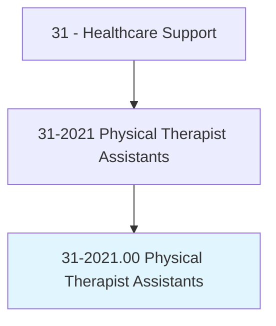
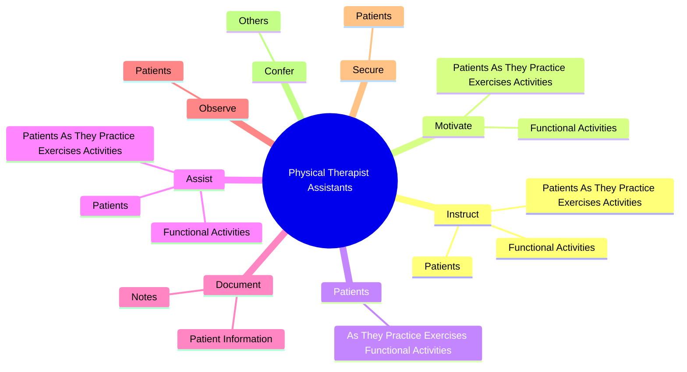
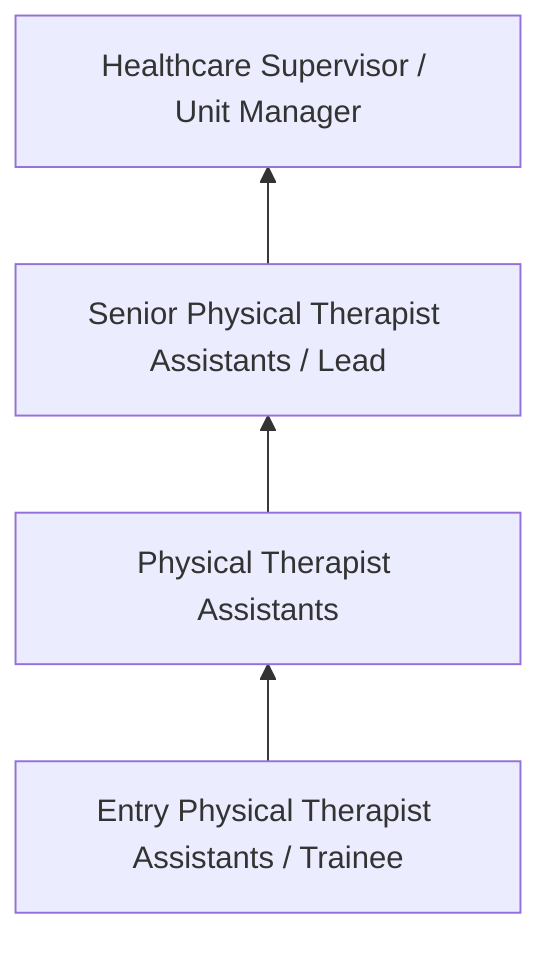
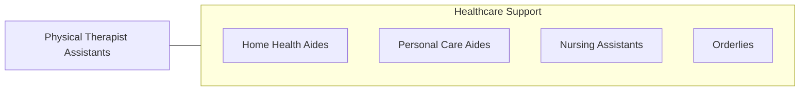

# Physical Therapist Assistants

> Assist physical therapists in providing physical therapy treatments and procedures. May, in accordance with state laws, assist in the development of treatment plans, carry out routine functions, document the progress of treatment, and modify specific treatments in accordance with patient status and within the scope of treatment plans established by a physical therapist. Generally requires formal training.

## Overview

Physical Therapist Assistants professionals assist physical therapists in providing physical therapy treatments and procedures. This occupation falls within the Healthcare Support category and requires a combination of specialized knowledge, technical skills, and practical experience.

These professionals work across diverse settings and organizational contexts, applying their expertise to meet the demands of their field. They must stay current with industry standards, emerging practices, and regulatory requirements that affect their work. The role demands both independent judgment and collaborative skills, as practitioners regularly interact with colleagues, stakeholders, and the public.

As the field continues to evolve, Physical Therapist Assistants professionals increasingly leverage technology and data-driven approaches to enhance their effectiveness. Career opportunities span the public and private sectors, with demand influenced by economic conditions, demographic shifts, and technological advancement.

## Classification Hierarchy



## Key Statistics

| Metric | Value |
|--------|-------|
| SOC Code | 31-2021.00 |
| Job Zone | N/A |
| Category | [Healthcare Support](/occupations/HealthcareSupport/index) |
| Core Tasks | 78+ |
| Salary Range | $28,000 - $55,000 |
| Median Salary | $38,000 |
| Growth Outlook | 15% (Much faster than average) |
| Source | O*NET |

## Core Tasks



### administer.ActiveManualTherapeuticExercises

Physical Therapist Assistants administer active manual therapeutic exercises as part of their core responsibilities.

**Actions:**
- `administer.ActiveManualTherapeuticExercises` - Administer active or passive manual therapeutic exercises, therapeutic massag...
- `administer.PassiveManualTherapeuticExercises` - Administer active or passive manual therapeutic exercises, therapeutic massag...
- `administer.TherapeuticMassage` - Administer active or passive manual therapeutic exercises, therapeutic massag...
- `administer.AquaticPhysicalTherapy` - Administer active or passive manual therapeutic exercises, therapeutic massag...
- `administer.Heat` - Administer active or passive manual therapeutic exercises, therapeutic massag...

### assist.PatientsAsTheyPracticeExercisesActivities

Physical Therapist Assistants assist patients as they practice exercises activities as part of their core responsibilities.

**Actions:**
- `assist.PatientsAsTheyPracticeExercisesActivities` - Instruct, motivate, safeguard, and assist patients as they practice exercises...
- `assist.FunctionalActivities` - Instruct, motivate, safeguard, and assist patients as they practice exercises...
- `assist.Patients.to.dress` - Assist patients to dress, undress, or put on and remove supportive devices, s...
- `assist.Patients.to.undress` - Assist patients to dress, undress, or put on and remove supportive devices, s...
- `assist.Patients.to.put.On` - Assist patients to dress, undress, or put on and remove supportive devices, s...

### perform.PosturalDrainage

Physical Therapist Assistants perform postural drainage as part of their core responsibilities.

**Actions:**
- `perform.PosturalDrainage.to.treat.RespiratoryConditions` - Perform postural drainage, percussions, or vibrations or teach deep breathing...
- `perform.Percussions.to.treat.RespiratoryConditions` - Perform postural drainage, percussions, or vibrations or teach deep breathing...
- `perform.Vibrations.to.treat.RespiratoryConditions` - Perform postural drainage, percussions, or vibrations or teach deep breathing...
- `perform.TeachDeepBreathingExercises.to.treat.RespiratoryConditions` - Perform postural drainage, percussions, or vibrations or teach deep breathing...
- `perform.AnsweringTelephone` - Perform clerical duties, such as taking inventory, ordering supplies, answeri...

### measure.PatientsRange

Physical Therapist Assistants measure patients range as part of their core responsibilities.

**Actions:**
- `measure.PatientsRange.of.JointMotion.to.determine.EffectsOfTreatmentsPatientEvaluations` - Measure patients' range-of-joint motion, body parts, or vital signs to determ...
- `measure.PatientsRange.of.JointMotionToForPatientEvaluations` - Measure patients' range-of-joint motion, body parts, or vital signs to determ...
- `measure.BodyParts.to.determine.EffectsOfTreatmentsPatientEvaluations` - Measure patients' range-of-joint motion, body parts, or vital signs to determ...
- `measure.BodyParts.to.ForPatientEvaluations` - Measure patients' range-of-joint motion, body parts, or vital signs to determ...
- `measure.VitalSigns.to.determine.EffectsOfTreatmentsPatientEvaluations` - Measure patients' range-of-joint motion, body parts, or vital signs to determ...


## Skills & Competencies

### Technical Skills
- **Patient Care** - Advanced
- **Vital Signs Monitoring** - Advanced
- **Infection Control** - Advanced
- **Medical Terminology** - Proficient
- **Patient Safety** - Proficient
- **Electronic Health Records** - Proficient

### Soft Skills
- **Compassion** - Critical
- **Communication** - Critical
- **Physical Stamina** - Essential
- **Attention to Detail** - Essential
- **Emotional Resilience** - Essential

## Education & Certifications

| Requirement | Details |
|-------------|---------|
| Typical Education | Post-secondary certificate or associate degree |
| Work Experience | 0-1 years clinical experience |
| On-the-Job Training | Moderate - clinical procedures and patient care |
| Certifications | CNA, CPR/BLS, state-specific healthcare certifications |

## Career Progression



## Industry Variations

### Hospital Settings
Acute care support in hospital environments. Physical Therapist Assistants professionals assist with direct patient care under nursing supervision.

### Long-Term Care
Extended care in nursing homes and assisted living facilities. Emphasis on daily living assistance and ongoing patient relationships.

### Home Health
In-home patient care services. Requires independence and ability to work with minimal supervision in patient homes.

### Rehabilitation Services
Support for physical, occupational, or speech therapy. Focus on helping patients recover function and independence.

## Technology & Tools

- **Electronic health records (EHR)**
- **Patient monitoring equipment**
- **Medical devices and assistive technology**
- **Vital signs measurement tools**
- **Healthcare information systems**

## Related Occupations



## Industries

- [Hospitals](/industries/Hospitals) - High Employment
- [Nursing Care Facilities](/industries/NursingFacilities) - High Employment
- [Home Health Services](/industries/HomeHealth) - High Employment
- [Outpatient Care Centers](/industries/OutpatientCare) - Moderate Employment

## Departments

This occupation typically works in:
- [Patient Care](/departments/PatientCare)
- [Nursing Services](/departments/NursingServices)
- [Clinical Support](/departments/ClinicalSupport)

## GraphDL Semantic Structure

```
Physical Therapist Assistants perform:
- instruct.PatientsAsTheyPracticeExercisesActivities
- instruct.FunctionalActivities
- motivate.PatientsAsTheyPracticeExercisesActivities
- motivate.FunctionalActivities
- patients.AsTheyPracticeExercisesFunctionalActivities
- assist.PatientsAsTheyPracticeExercisesActivities
```

---

*Source: O*NET 31-2021.00 - ONETOccupation*
