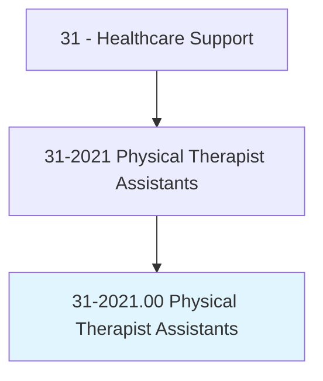
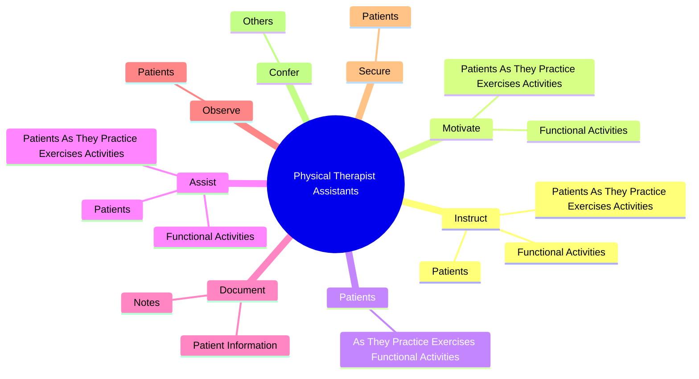
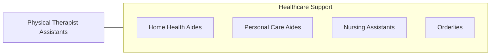

# Physical Therapist Assistants

> Assist physical therapists in providing physical therapy treatments and procedures. May, in accordance with state laws, assist in the development of treatment plans, carry out routine functions, document the progress of treatment, and modify specific treatments in accordance with patient status and within the scope of treatment plans established by a physical therapist. Generally requires formal training.

## Overview

Physical Therapist Assistants is an occupation within the Healthcare Support category. Assist physical therapists in providing physical therapy treatments and procedures. May, in accordance with state laws, assist in the development of treatment plans, carry out routine functions, document the progress of treatment, and modify specific treatments in accordance with patient status and within the scope of treatment plans established by a physical therapist.

## Classification Hierarchy

## Key Statistics

| Metric | Value |
|--------|-------|
| SOC Code | 31-2021.00 |
| Category | [Healthcare Support](/occupations/HealthcareSupport) |
| Task Count | 78 |
| Source | O*NET |

## Core Tasks

### instruct.PatientsAsTheyPracticeExercisesActivities

Physical Therapist Assistants instruct patients as they practice exercises activities as part of their core responsibilities.

**Actions:**
- `instruct.PatientsAsTheyPracticeExercisesActivities`
- `instruct.FunctionalActivities`
- `instruct.Patients.in.ProperBodyMechanicsWays.to.improve.FunctionalMobility`
- `instruct.Patients.in.InWays.to.improve.FunctionalMobility`

### motivate.PatientsAsTheyPracticeExercisesActivities

Physical Therapist Assistants motivate patients as they practice exercises activities as part of their core responsibilities.

**Actions:**
- `motivate.PatientsAsTheyPracticeExercisesActivities`
- `motivate.FunctionalActivities`

### patients.AsTheyPracticeExercisesFunctionalActivities

Physical Therapist Assistants patients as they practice exercises functional activities as part of their core responsibilities.

**Actions:**
- `patients.AsTheyPracticeExercisesFunctionalActivities`

## Skills & Competencies

### Technical Skills
- **Patient Care** - Advanced
- **Medical Terminology** - Intermediate
- **Health Records** - Intermediate

### Soft Skills
- **Communication** - Essential
- **Problem Solving** - Essential
- **Critical Thinking** - Important
- **Teamwork** - Important
- **Adaptability** - Important

## Related Occupations

## Industries

This occupation is found across multiple industries. See [Industries](/industries) for sector-specific employment data.

## Career Progression

---

*Source: O*NET 31-2021.00 - ONETOccupation*
