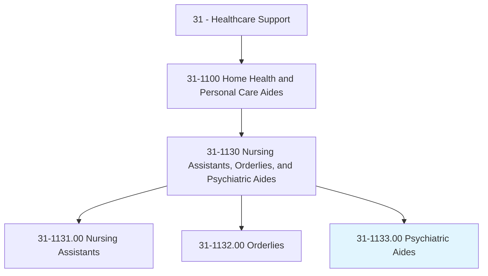
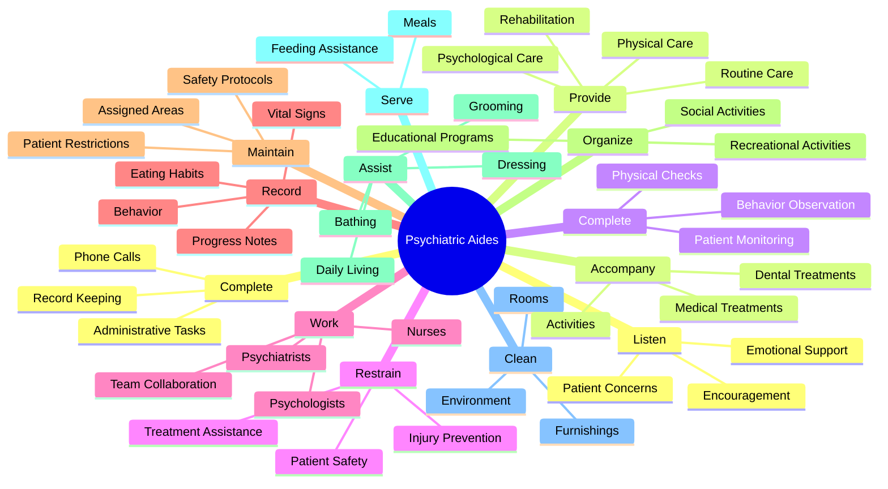
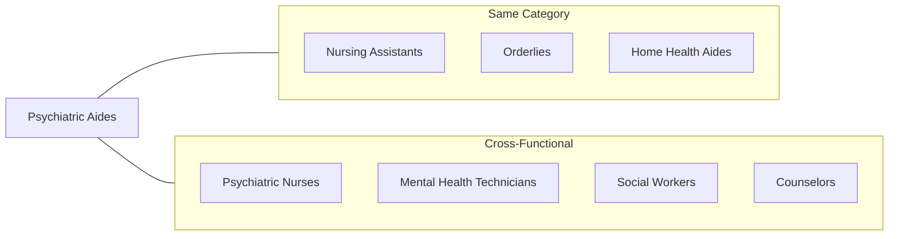
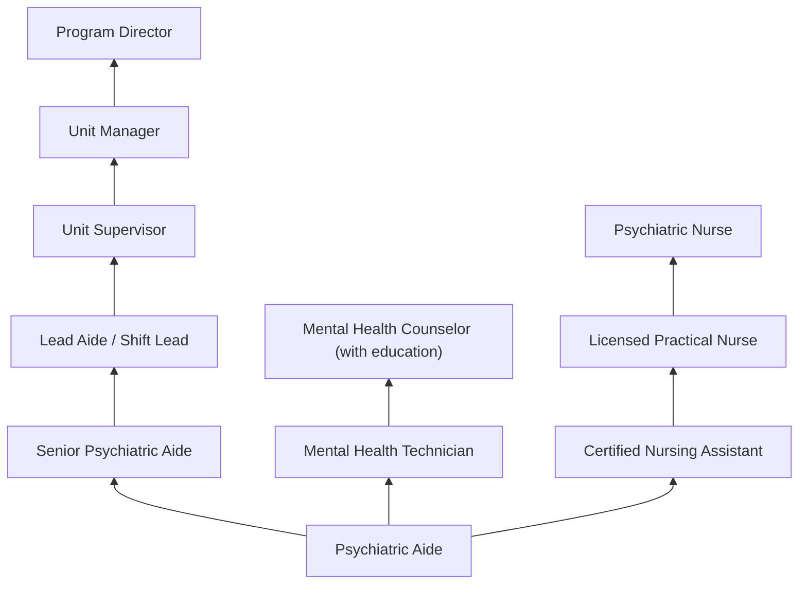

# Psychiatric Aides

> Assist mentally impaired or emotionally disturbed patients, working under direction of nursing and medical staff. May assist with daily living activities, lead patients in educational and recreational activities, or accompany patients to and from examinations and treatments. May restrain violent patients. Includes psychiatric orderlies.

## Overview

Psychiatric Aides provide care and support to patients with mental illness, emotional disorders, or developmental disabilities in psychiatric hospitals, residential mental health facilities, and substance abuse treatment centers. They work under the supervision of psychiatric nurses and other mental health professionals to help patients with daily activities, monitor behavior, provide emotional support, and maintain a safe therapeutic environment. Psychiatric Aides play a crucial role in the mental health treatment team, often developing meaningful relationships with patients during their recovery.

## Classification Hierarchy

## Key Statistics

| Metric | Value |
|--------|-------|
| SOC Code | 31-1133.00 |
| Job Zone | 2 (Some Preparation) |
| Category | [Healthcare Support](/occupations/HealthcareSupport/index) |
| Core Tasks | 18+ |
| Source | O*NET |

## Core Tasks

### listen.EmotionalSupport

Psychiatric Aides provide compassionate listening and encouragement.

**Actions:**
- `listen.EmotionalSupport.to.PsychiatricPatients` - Listen supportively
- `listen.Encouragement.to.PsychiatricPatients` - Offer encouragement
- `provide.EmotionalSupport.to.PsychiatricPatients` - Give emotional care
- `provide.Encouragement.to.PsychiatricPatients` - Encourage progress

### provide.RoutineCare

Psychiatric Aides deliver comprehensive patient care.

**Actions:**
- `provide.Patients.with.Cognitive` - Support cognitive needs
- `provide.Patients.with.Intellectual` - Address intellectual needs
- `provide.Patients.with.DevelopmentalDisabilities.with.RoutinePhysical` - Physical care
- `provide.Patients.with.Emotional` - Emotional support
- `provide.Patients.with.Psychological` - Psychological assistance
- `provide.Patients.with.RehabilitationCareUnderDirection.of.NursingStaff` - Rehabilitation care

### complete.PhysicalChecks

Psychiatric Aides monitor patient status and behavior.

**Actions:**
- `complete.PhysicalChecks.to.detect.UnusualBehaviorReportObservationsToProfessionalStaff` - Monitor for unusual behavior
- `complete.PhysicalChecks.to.HarmfulBehaviorReportObservationsToProfessionalStaff` - Watch for harmful behavior
- `complete.MonitorPatients.to.detect.UnusualBehaviorReportObservationsToProfessionalStaff` - Patient monitoring

### restrain.Patients

Psychiatric Aides assist with patient safety when necessary.

**Actions:**
- `restrain.PatientsAsNecessary.to.prevent.Injury` - Prevent patient injury
- `aid.PatientsAsNecessary.to.prevent.Injury` - Assist with safety

### work.Team

Psychiatric Aides collaborate with mental health professionals.

**Actions:**
- `work.AsPart.of.TeamMayIncludePsychiatrists` - Work with psychiatrists
- `work.AsPart.of.Psychologists` - Collaborate with psychologists
- `work.AsPart.of.PsychiatricNurses` - Partner with psychiatric nurses
- `work.AsPart.of.SocialWorkers` - Coordinate with social workers

### record.PatientInformation

Psychiatric Aides document patient status and activities.

**Actions:**
- `record.EatingHabits` - Track eating patterns
- `record.Behavior` - Document behavior observations
- `record.ProgressNotes` - Write progress notes
- `record.Treatments` - Record treatments given
- `record.DischargePlans` - Document discharge information
- `maintain.VitalSigns` - Track vital signs
- `maintain.EatingHabits` - Monitor dietary intake
- `maintain.Behavior` - Maintain behavior records

### maintain.Restrictions

Psychiatric Aides enforce patient boundaries.

**Actions:**
- `maintain.PatientsRestrictions.to.assigned.Areas` - Ensure patients stay in designated areas

### organize.Activities

Psychiatric Aides facilitate therapeutic activities.

**Actions:**
- `organize.PatientParticipation.in.Social` - Social activities
- `organize.PatientParticipation.in.Educational` - Educational programs
- `organize.PatientParticipation.in.RecreationalActivities` - Recreation
- `supervise.PatientParticipation.in.Social` - Supervise social events
- `supervise.PatientParticipation.in.RecreationalActivities` - Oversee recreation
- `encourage.PatientParticipation.in.Social` - Promote engagement

### provide.PersonalCare

Psychiatric Aides assist with hygiene and daily activities.

**Actions:**
- `provide.Patients.with.Assistance.in.Bathing` - Bathing help
- `provide.Patients.with.Dressing` - Dressing assistance
- `provide.Patients.with.Grooming` - Grooming support
- `provide.Patients.with.DemonstratingSkillsAsNecessary` - Demonstrate skills

### aid.Adjustment

Psychiatric Aides help patients adapt to their environment.

**Actions:**
- `aid.Patients.in.BecomingAccustomedToHospitalRoutines` - Orientation assistance

### serve.Meals

Psychiatric Aides manage patient nutrition.

**Actions:**
- `serve.Meals` - Serve food
- `serve.FeedPatientsNeedingAssistance` - Feed patients who need help
- `serve.Persuasion` - Encourage eating

### clean.Environment

Psychiatric Aides maintain safe, clean spaces.

**Actions:**
- `clean.Rooms.to.maintain.SafeEnvironment` - Clean patient rooms
- `clean.Rooms.to.OrderlyEnvironment` - Maintain orderliness
- `clean.Furnishings.to.maintain.SafeEnvironment` - Clean furniture
- `disinfect.Rooms.to.maintain.SafeEnvironment` - Disinfect areas
- `disinfect.Furnishings.to.maintain.SafeEnvironment` - Sanitize furnishings

### complete.AdminTasks

Psychiatric Aides perform administrative duties.

**Actions:**
- `complete.AdministrativeTasks` - General admin work
- `complete.EnteringOrders.into.Computer` - Data entry
- `complete.AnsweringTelephoneCalls` - Answer phones
- `complete.MaintainingMedical` - Maintain records
- `complete.FacilityInformation` - Update facility info

### accompany.Patients

Psychiatric Aides escort patients to activities and appointments.

**Actions:**
- `accompany.Patients.to.FromWardsForMedicalTreatments` - Medical escort
- `accompany.Patients.to.DentalTreatments` - Dental appointments
- `accompany.Patients.to.ShoppingTrips` - Community outings
- `accompany.Patients.to.ReligiousEvents` - Religious activities
- `accompany.Patients.to.RecreationalEvents` - Recreation events

### perform.NursingDuties

Psychiatric Aides assist with clinical tasks under supervision.

**Actions:**
- `perform.NursingDuties` - Basic nursing tasks
- `perform.AdministeringMedications` - Medication assistance
- `perform.MeasuringVitalSigns` - Vital signs monitoring
- `perform.CollectingSpecimens` - Specimen collection
- `perform.DrawingBloodSamples` - Blood draws (where certified)

### interview.Patients

Psychiatric Aides gather patient information.

**Actions:**
- `interview.Patients.upon.Admission` - Admission interviews
- `interview.RecordInformation` - Document interview data

## Skills & Competencies

### Technical Skills
- **Patient Observation** - Proficient
- **Crisis Intervention** - Proficient
- **Behavioral Documentation** - Proficient
- **Vital Signs Monitoring** - Basic
- **Medication Assistance** - Basic
- **Restraint Techniques** - Proficient
- **CPR/First Aid** - Certified

### Soft Skills
- **Empathy** - Critical
- **Patience** - Critical
- **Emotional Stability** - Critical
- **Communication** - Essential
- **Crisis Management** - Essential
- **Team Collaboration** - Essential

## Related Occupations

## Industries

- [Psychiatric and Substance Abuse Hospitals](/industries/PsychiatricHospitals) - Primary Employment
- [Residential Mental Health Facilities](/industries/Healthcare/ResidentialCareFacilities/ResidentialIntellectualAndDevelopmentalDisability/ResidentialMentalHealth) - Residential Care
- [Hospitals](/industries/Healthcare/Hospitals/index) - Psychiatric Units
- [Outpatient Mental Health Centers](/industries/Healthcare/AmbulatoryHealthCareServices/OutpatientCareCenters/OutpatientMentalHealth) - Community Care
- [Government](/industries/PublicAdministration) - State Mental Health Systems

## Career Progression

## Education & Training

| Requirement | Details |
|-------------|---------|
| Typical Education | High school diploma or equivalent |
| Work Experience | None required for entry |
| On-the-Job Training | Extensive facility-specific training |
| Certification | CNA certification helpful; crisis intervention training |
| Special Training | De-escalation techniques, restraint procedures, safety protocols |

## Departments

This occupation typically works in:
- Psychiatric Services
- Behavioral Health
- Inpatient Psychiatry
- Substance Abuse Treatment
- Crisis Intervention

---

*Source: O*NET 31-1133.00 - ONETOccupation*
