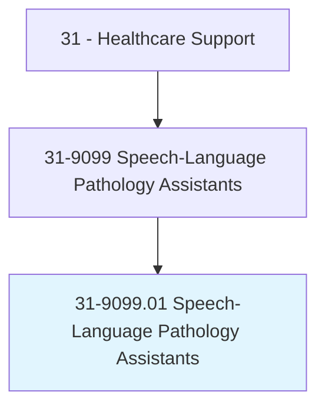
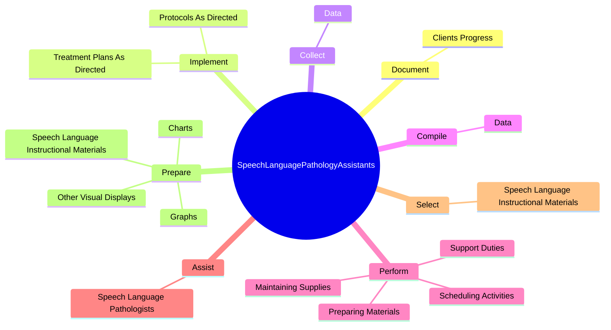
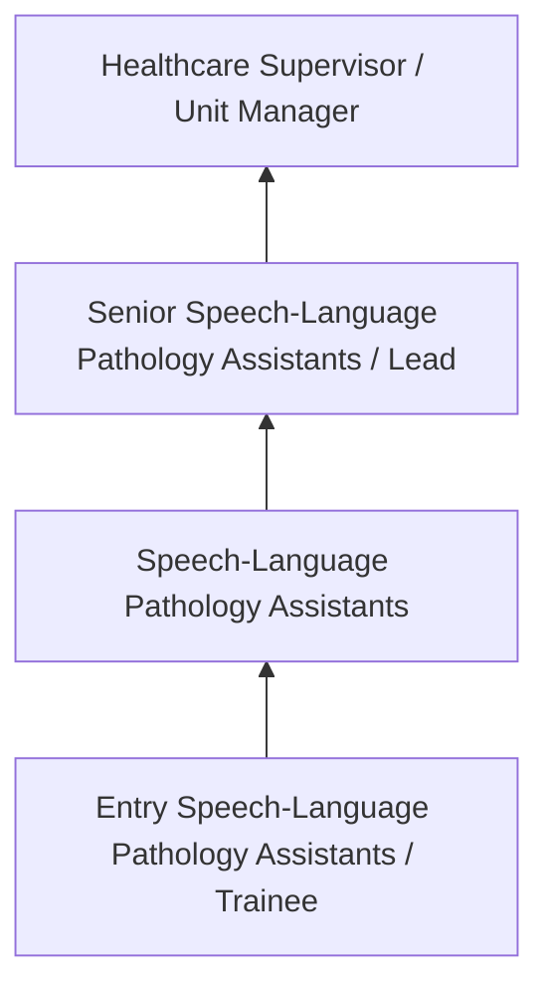
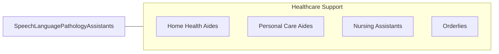

# Speech-Language Pathology Assistants

> Assist speech-language pathologists in the assessment and treatment of speech, language, voice, and fluency disorders. Implement speech and language programs or activities as planned and directed by speech-language pathologists. Monitor the use of alternative communication devices and systems.

## Overview

Speech-Language Pathology Assistants professionals assist speech-language pathologists in the assessment and treatment of speech, language, voice, and fluency disorders. This occupation falls within the Healthcare Support category and requires a combination of specialized knowledge, technical skills, and practical experience.

These professionals work across diverse settings and organizational contexts, applying their expertise to meet the demands of their field. They must stay current with industry standards, emerging practices, and regulatory requirements that affect their work. The role demands both independent judgment and collaborative skills, as practitioners regularly interact with colleagues, stakeholders, and the public.

As the field continues to evolve, Speech-Language Pathology Assistants professionals increasingly leverage technology and data-driven approaches to enhance their effectiveness. Career opportunities span the public and private sectors, with demand influenced by economic conditions, demographic shifts, and technological advancement.

## Classification Hierarchy



## Key Statistics

| Metric | Value |
|--------|-------|
| SOC Code | 31-9099.01 |
| Job Zone | N/A |
| Category | [Healthcare Support](/occupations/HealthcareSupport/index) |
| Core Tasks | N/A+ |
| Salary Range | $28,000 - $55,000 |
| Median Salary | $38,000 |
| Growth Outlook | 15% (Much faster than average) |
| Source | O*NET |

## Core Tasks



### document.ClientsProgress

Speech-Language Pathology Assistants document clients progress as part of their core responsibilities.

**Actions:**
- `document.ClientsProgress.toward.MeetingEstablishedTreatmentObjectives`

### implement.TreatmentPlansAsDirected

Speech-Language Pathology Assistants implement treatment plans as directed as part of their core responsibilities.

**Actions:**
- `implement.TreatmentPlansAsDirected.by.SpeechLanguagePathologists`
- `implement.ProtocolsAsDirected.by.SpeechLanguagePathologists`

### collect.Data

Speech-Language Pathology Assistants collect data as part of their core responsibilities.

**Actions:**
- `collect.Data.to.document.ClientsPerformance`
- `collect.Data.to.assess.ProgramQuality`

### Technical Skills
- **Patient Care** - Advanced
- **Medical Terminology** - Intermediate
- **Health Records** - Intermediate

### Soft Skills
- **Communication** - Essential
- **Problem Solving** - Essential
- **Critical Thinking** - Important
- **Teamwork** - Important
- **Adaptability** - Important


## Skills & Competencies

### Technical Skills
- **Patient Care** - Advanced
- **Vital Signs Monitoring** - Advanced
- **Infection Control** - Advanced
- **Medical Terminology** - Proficient
- **Patient Safety** - Proficient
- **Electronic Health Records** - Proficient

### Soft Skills
- **Compassion** - Critical
- **Communication** - Critical
- **Physical Stamina** - Essential
- **Attention to Detail** - Essential
- **Emotional Resilience** - Essential

## Education & Certifications

| Requirement | Details |
|-------------|---------|
| Typical Education | Post-secondary certificate or associate degree |
| Work Experience | 0-1 years clinical experience |
| On-the-Job Training | Moderate - clinical procedures and patient care |
| Certifications | CNA, CPR/BLS, state-specific healthcare certifications |

## Career Progression



## Industry Variations

### Hospital Settings
Acute care support in hospital environments. Speech-Language Pathology Assistants professionals assist with direct patient care under nursing supervision.

### Long-Term Care
Extended care in nursing homes and assisted living facilities. Emphasis on daily living assistance and ongoing patient relationships.

### Home Health
In-home patient care services. Requires independence and ability to work with minimal supervision in patient homes.

### Rehabilitation Services
Support for physical, occupational, or speech therapy. Focus on helping patients recover function and independence.

## Technology & Tools

- **Electronic health records (EHR)**
- **Patient monitoring equipment**
- **Medical devices and assistive technology**
- **Vital signs measurement tools**
- **Healthcare information systems**

## Related Occupations



## Industries

- [Hospitals](/industries/Hospitals) - High Employment
- Nursing Care Facilities - High Employment
- Home Health Services - High Employment
- Outpatient Care Centers - Moderate Employment

## Departments

This occupation typically works in:
- Patient Care
- Nursing Services
- Clinical Support

## GraphDL Semantic Structure

```graphdl
Speech-Language Pathology Assistants perform:
- assist.Patients.with.DailyActivities
- monitor.VitalSigns.for.PatientHealth
- maintain.Equipment.for.PatientCare
- follow.Procedures.for.InfectionControl
- document.Care.in.PatientRecords
```

---

*Source: O*NET 31-9099.01 - ONETOccupation*
