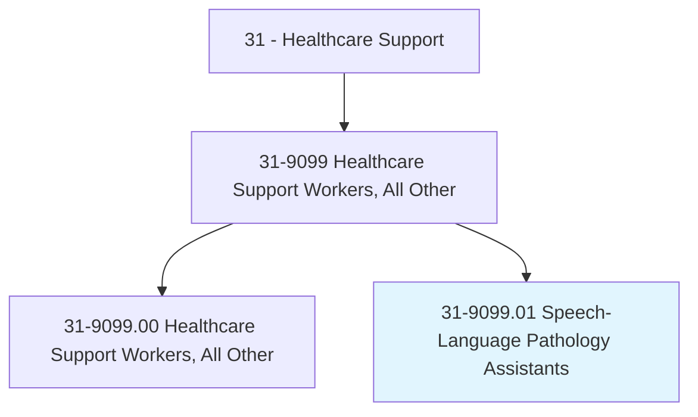
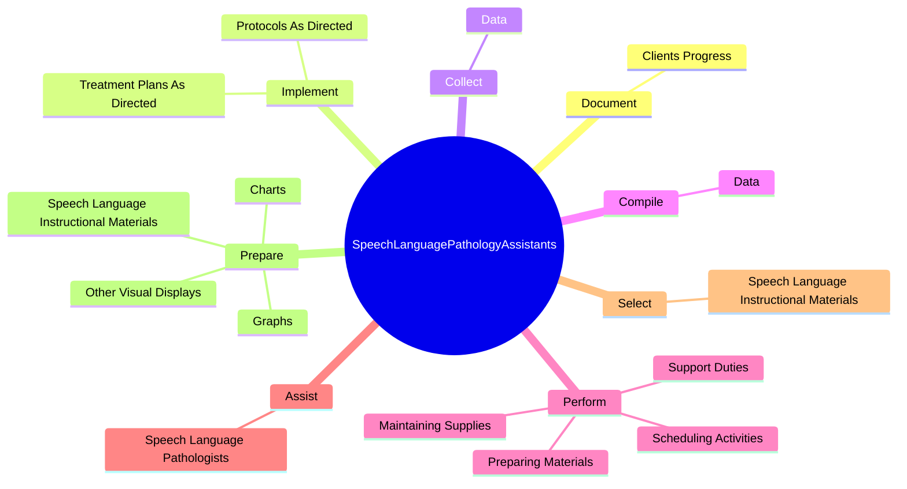
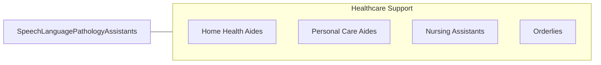

# Speech-Language Pathology Assistants

> Assist speech-language pathologists in the assessment and treatment of speech, language, voice, and fluency disorders. Implement speech and language programs or activities as planned and directed by speech-language pathologists. Monitor the use of alternative communication devices and systems.

## Overview

Speech-Language Pathology Assistants is a specialized variant within the Healthcare Support category. Assist speech-language pathologists in the assessment and treatment of speech, language, voice, and fluency disorders. Implement speech and language programs or activities as planned and directed by speech-language pathologists.

## Classification Hierarchy

## Key Statistics

| Metric | Value |
|--------|-------|
| SOC Code | 31-9099.01 |
| Category | [Healthcare Support](/occupations/HealthcareSupport) |
| Task Count | 29 |
| Source | O*NET |

## Core Tasks

### document.ClientsProgress

Speech-Language Pathology Assistants document clients progress as part of their core responsibilities.

**Actions:**
- `document.ClientsProgress.toward.MeetingEstablishedTreatmentObjectives`

### implement.TreatmentPlansAsDirected

Speech-Language Pathology Assistants implement treatment plans as directed as part of their core responsibilities.

**Actions:**
- `implement.TreatmentPlansAsDirected.by.SpeechLanguagePathologists`
- `implement.ProtocolsAsDirected.by.SpeechLanguagePathologists`

### collect.Data

Speech-Language Pathology Assistants collect data as part of their core responsibilities.

**Actions:**
- `collect.Data.to.document.ClientsPerformance`
- `collect.Data.to.assess.ProgramQuality`

## Skills & Competencies

### Technical Skills
- **Patient Care** - Advanced
- **Medical Terminology** - Intermediate
- **Health Records** - Intermediate

### Soft Skills
- **Communication** - Essential
- **Problem Solving** - Essential
- **Critical Thinking** - Important
- **Teamwork** - Important
- **Adaptability** - Important

## Related Occupations

## Industries

This occupation is found across multiple industries. See [Industries](/industries) for sector-specific employment data.

## Career Progression

---

*Source: O*NET 31-9099.01 - ONETOccupation*
