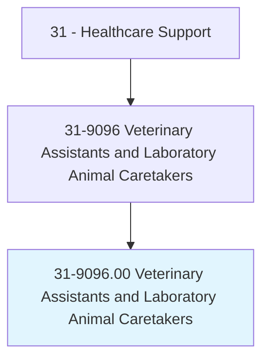
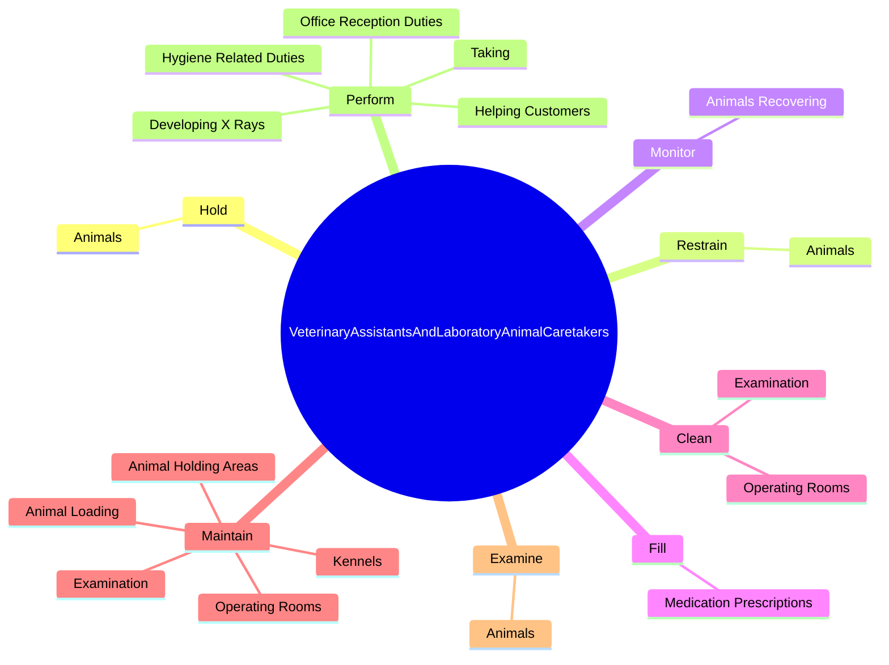
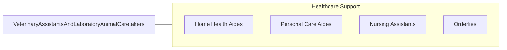

# Veterinary Assistants and Laboratory Animal Caretakers

> Feed, water, and examine pets and other nonfarm animals for signs of illness, disease, or injury in laboratories and animal hospitals and clinics. Clean and disinfect cages and work areas, and sterilize laboratory and surgical equipment. May provide routine postoperative care, administer medication orally or topically, or prepare samples for laboratory examination under the supervision of veterinary or laboratory animal technologists or technicians, veterinarians, or scientists.

## Overview

Veterinary Assistants and Laboratory Animal Caretakers is an occupation within the Healthcare Support category. Feed, water, and examine pets and other nonfarm animals for signs of illness, disease, or injury in laboratories and animal hospitals and clinics. Clean and disinfect cages and work areas, and sterilize laboratory and surgical equipment.

## Classification Hierarchy

## Key Statistics

| Metric | Value |
|--------|-------|
| SOC Code | 31-9096.00 |
| Category | [Healthcare Support](/occupations/HealthcareSupport/index) |
| Task Count | 80 |
| Source | O*NET |

## Core Tasks

### hold.Animals

Veterinary Assistants and Laboratory Animal Caretakers hold animals as part of their core responsibilities.

**Actions:**
- `hold.Animals.during.VeterinaryProcedures`

### restrain.Animals

Veterinary Assistants and Laboratory Animal Caretakers restrain animals as part of their core responsibilities.

**Actions:**
- `restrain.Animals.during.VeterinaryProcedures`

### monitor.AnimalsRecovering

Veterinary Assistants and Laboratory Animal Caretakers monitor animals recovering as part of their core responsibilities.

**Actions:**
- `monitor.AnimalsRecovering.from.Surgery`
- `monitor.AnimalsRecovering.from.NotifyVeterinarians.of.UnusualChanges`
- `monitor.AnimalsRecovering.from.Symptoms`

## Skills & Competencies

### Technical Skills
- **Patient Care** - Advanced
- **Medical Terminology** - Intermediate
- **Health Records** - Intermediate

### Soft Skills
- **Communication** - Essential
- **Problem Solving** - Essential
- **Critical Thinking** - Important
- **Teamwork** - Important
- **Adaptability** - Important

## Related Occupations

## Industries

This occupation is found across multiple industries. See [Industries](/industries) for sector-specific employment data.

## Career Progression

---

*Source: O*NET 31-9096.00 - ONETOccupation*
