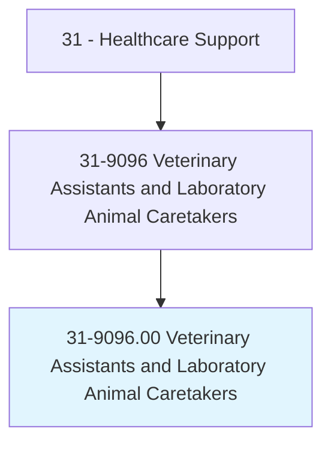
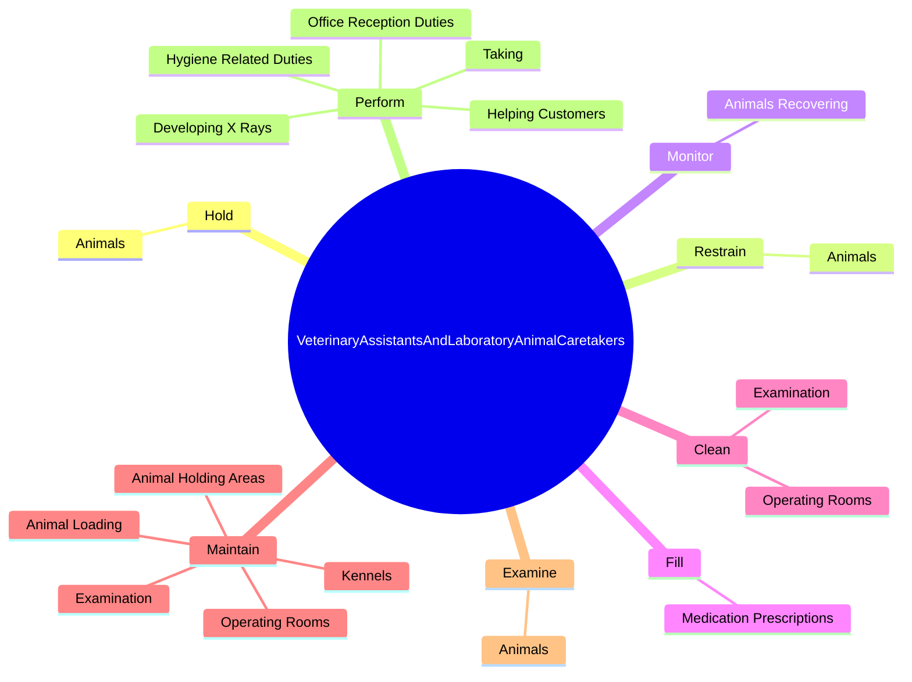
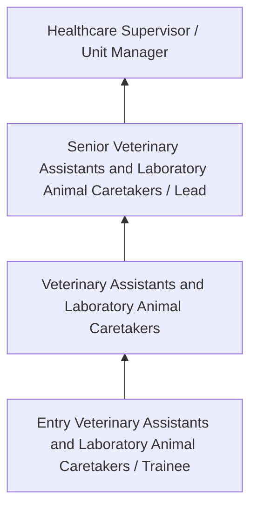
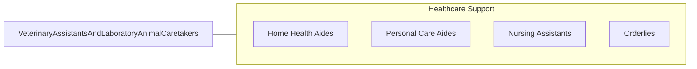

# Veterinary Assistants and Laboratory Animal Caretakers

> Feed, water, and examine pets and other nonfarm animals for signs of illness, disease, or injury in laboratories and animal hospitals and clinics. Clean and disinfect cages and work areas, and sterilize laboratory and surgical equipment. May provide routine postoperative care, administer medication orally or topically, or prepare samples for laboratory examination under the supervision of veterinary or laboratory animal technologists or technicians, veterinarians, or scientists.

## Overview

Veterinary Assistants and Laboratory Animal Caretakers professionals feed, water, and examine pets and other nonfarm animals for signs of illness, disease, or injury in laboratories and animal hospitals and clinics. This occupation falls within the Healthcare Support category and requires a combination of specialized knowledge, technical skills, and practical experience.

These professionals work across diverse settings and organizational contexts, applying their expertise to meet the demands of their field. They must stay current with industry standards, emerging practices, and regulatory requirements that affect their work. The role demands both independent judgment and collaborative skills, as practitioners regularly interact with colleagues, stakeholders, and the public.

As the field continues to evolve, Veterinary Assistants and Laboratory Animal Caretakers professionals increasingly leverage technology and data-driven approaches to enhance their effectiveness. Career opportunities span the public and private sectors, with demand influenced by economic conditions, demographic shifts, and technological advancement.

## Classification Hierarchy



## Key Statistics

| Metric | Value |
|--------|-------|
| SOC Code | 31-9096.00 |
| Job Zone | N/A |
| Category | [Healthcare Support](/occupations/HealthcareSupport/index) |
| Core Tasks | N/A+ |
| Salary Range | $28,000 - $55,000 |
| Median Salary | $38,000 |
| Growth Outlook | 15% (Much faster than average) |
| Source | O*NET |

## Core Tasks



### hold.Animals

Veterinary Assistants and Laboratory Animal Caretakers hold animals as part of their core responsibilities.

**Actions:**
- `hold.Animals.during.VeterinaryProcedures`

### restrain.Animals

Veterinary Assistants and Laboratory Animal Caretakers restrain animals as part of their core responsibilities.

**Actions:**
- `restrain.Animals.during.VeterinaryProcedures`

### monitor.AnimalsRecovering

Veterinary Assistants and Laboratory Animal Caretakers monitor animals recovering as part of their core responsibilities.

**Actions:**
- `monitor.AnimalsRecovering.from.Surgery`
- `monitor.AnimalsRecovering.from.NotifyVeterinarians.of.UnusualChanges`
- `monitor.AnimalsRecovering.from.Symptoms`

### Technical Skills
- **Patient Care** - Advanced
- **Medical Terminology** - Intermediate
- **Health Records** - Intermediate

### Soft Skills
- **Communication** - Essential
- **Problem Solving** - Essential
- **Critical Thinking** - Important
- **Teamwork** - Important
- **Adaptability** - Important


## Skills & Competencies

### Technical Skills
- **Patient Care** - Advanced
- **Vital Signs Monitoring** - Advanced
- **Infection Control** - Advanced
- **Medical Terminology** - Proficient
- **Patient Safety** - Proficient
- **Electronic Health Records** - Proficient

### Soft Skills
- **Compassion** - Critical
- **Communication** - Critical
- **Physical Stamina** - Essential
- **Attention to Detail** - Essential
- **Emotional Resilience** - Essential

## Education & Certifications

| Requirement | Details |
|-------------|---------|
| Typical Education | Post-secondary certificate or associate degree |
| Work Experience | 0-1 years clinical experience |
| On-the-Job Training | Moderate - clinical procedures and patient care |
| Certifications | CNA, CPR/BLS, state-specific healthcare certifications |

## Career Progression



## Industry Variations

### Hospital Settings
Acute care support in hospital environments. Veterinary Assistants and Laboratory Animal Caretakers professionals assist with direct patient care under nursing supervision.

### Long-Term Care
Extended care in nursing homes and assisted living facilities. Emphasis on daily living assistance and ongoing patient relationships.

### Home Health
In-home patient care services. Requires independence and ability to work with minimal supervision in patient homes.

### Rehabilitation Services
Support for physical, occupational, or speech therapy. Focus on helping patients recover function and independence.

## Technology & Tools

- **Electronic health records (EHR)**
- **Patient monitoring equipment**
- **Medical devices and assistive technology**
- **Vital signs measurement tools**
- **Healthcare information systems**

## Related Occupations



## Industries

- [Hospitals](/industries/Hospitals) - High Employment
- Nursing Care Facilities - High Employment
- Home Health Services - High Employment
- Outpatient Care Centers - Moderate Employment

## Departments

This occupation typically works in:
- Patient Care
- Nursing Services
- Clinical Support

## GraphDL Semantic Structure

```graphdl
Veterinary Assistants and Laboratory Animal Caretakers perform:
- assist.Patients.with.DailyActivities
- monitor.VitalSigns.for.PatientHealth
- maintain.Equipment.for.PatientCare
- follow.Procedures.for.InfectionControl
- document.Care.in.PatientRecords
```

---

*Source: O*NET 31-9096.00 - ONETOccupation*
