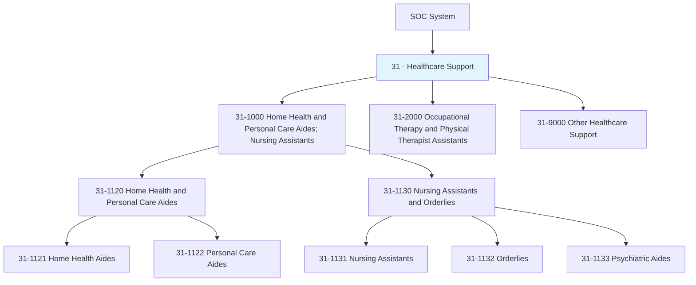
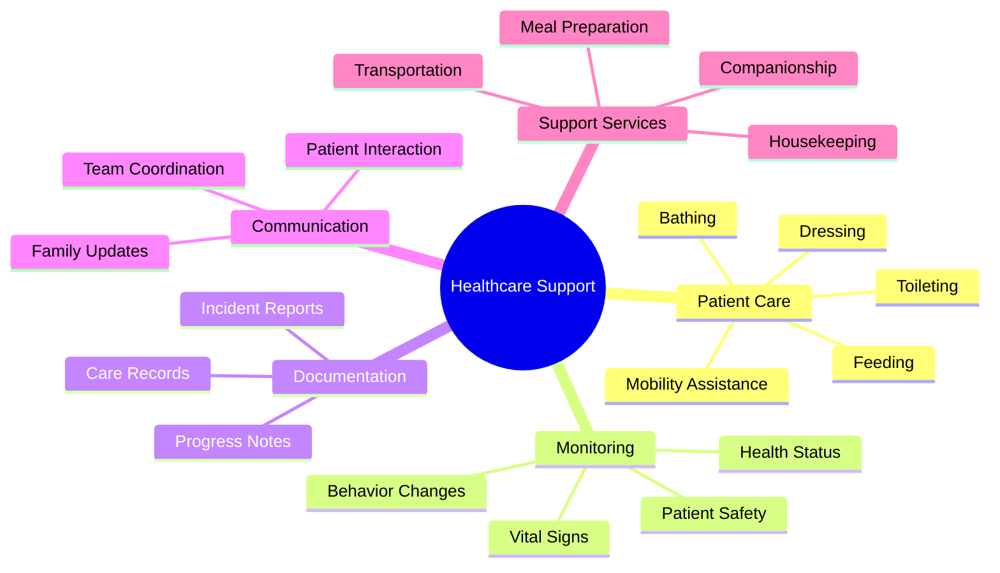
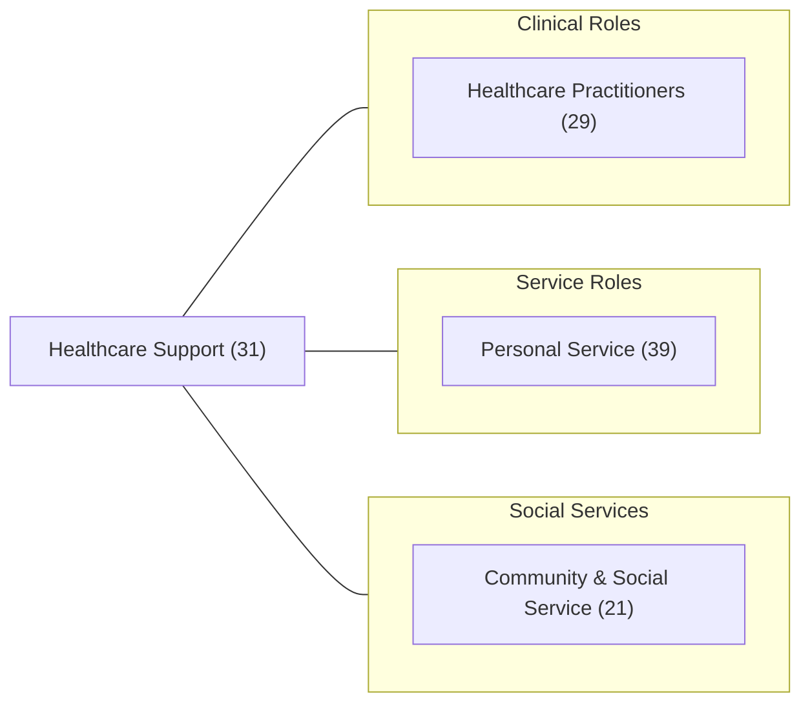
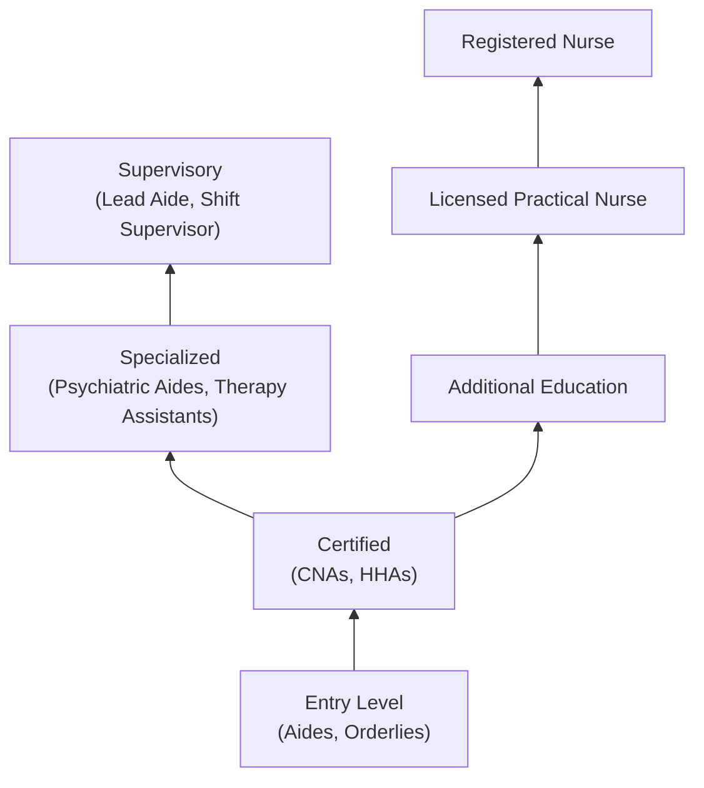

# Healthcare Support

> Healthcare support workers provide essential patient care assistance, helping individuals with daily living activities, monitoring health status, and supporting clinical staff in delivering quality healthcare services.

## Overview

Healthcare Support occupations (SOC Major Group 31) include workers who provide direct patient care under the supervision of licensed healthcare professionals. These roles are critical to the healthcare system, providing hands-on assistance with daily activities, basic medical care, and emotional support to patients in various settings including hospitals, nursing homes, private residences, and assisted living facilities.

## Classification Hierarchy

## Key Statistics

| Metric | Value |
|--------|-------|
| SOC Code | 31-0000 |
| Major Group | Healthcare Support |
| Occupation Groups | 3 |
| Total Occupations | 20+ |
| Education Range | High School to Associate's |

## Occupations in this Category

### Home Health and Personal Care
- [Home Health Aides](./HomeHealthAides.mdx) - In-home medical assistance
- [Personal Care Aides](./PersonalCareAides.mdx) - Daily living support

### Nursing Support
- [Nursing Assistants](./NursingAssistants.mdx) - Clinical nursing support
- [Orderlies](./Orderlies.mdx) - Patient transport and facility support
- [Psychiatric Aides](./PsychiatricAides.mdx) - Mental health patient care

### Therapy Support
- Occupational Therapy Assistants
- Occupational Therapy Aides
- Physical Therapist Assistants
- Physical Therapist Aides
- Massage Therapists

## Core Competency Areas

## Related Categories

## Industries

- Nursing Care Facilities - Primary employment
- Home Healthcare Services - Growing sector
- [Hospitals](/industries/Healthcare/Hospitals/index) - Acute care settings
- [Residential Care Facilities](/industries/ResidentialCare) - Long-term care
- Individual and Family Services - Community support

## Education & Certification Requirements

| Level | Typical Occupations | Requirements |
|-------|---------------------|--------------|
| Certificate | Nursing Assistants | State-approved CNA program |
| High School | Home Health Aides, Personal Care Aides | On-the-job training |
| Associate's | Occupational/Physical Therapy Assistants | 2-year program |
| Certification | Various | CPR, First Aid, specialty certifications |

## Career Progression

## Work Environment

Healthcare support workers operate in diverse settings:

| Setting | Characteristics |
|---------|-----------------|
| Nursing Homes | 24/7 care, team-based, structured routines |
| Private Homes | Independent work, varied environments, travel |
| Hospitals | Fast-paced, specialized units, shift work |
| Assisted Living | Semi-independent residents, activity-focused |
| Psychiatric Facilities | Specialized training, safety protocols |

---

*Source: O*NET SOC Category 31 - Healthcare Support*
