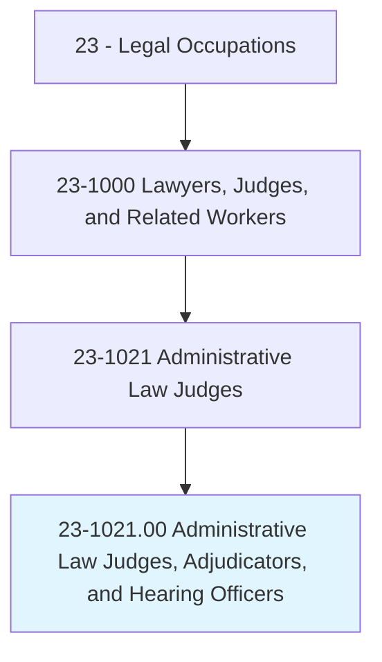
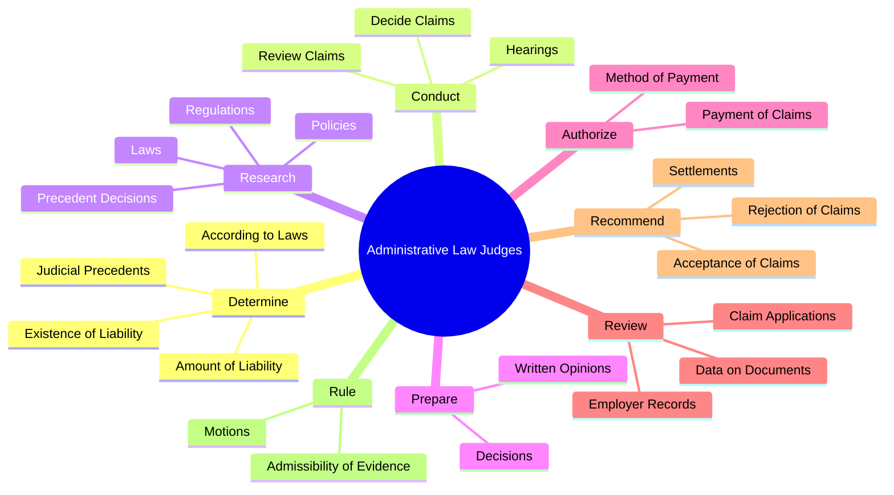
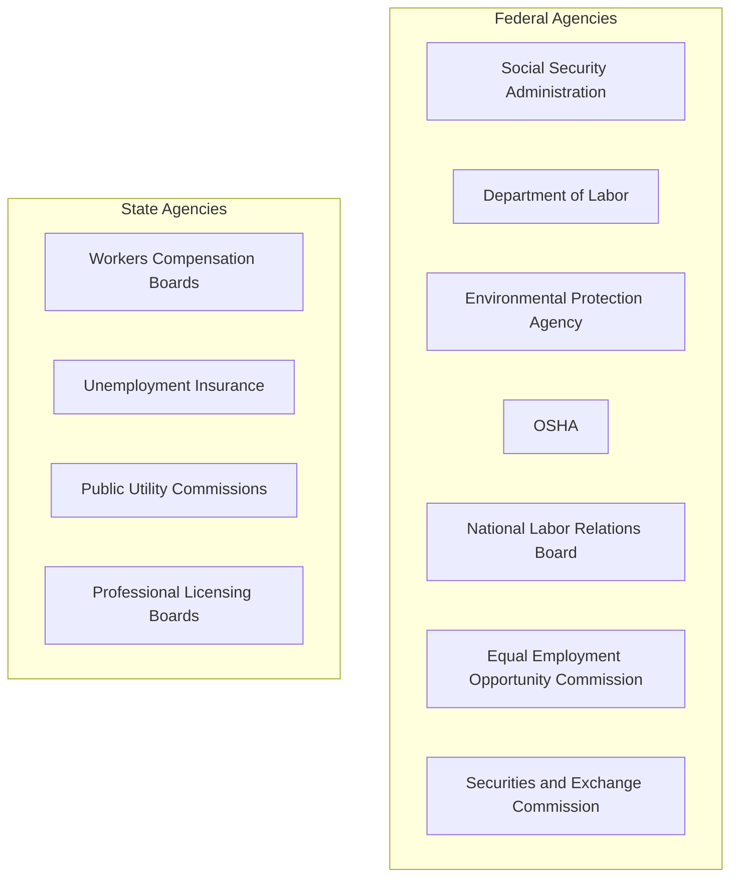
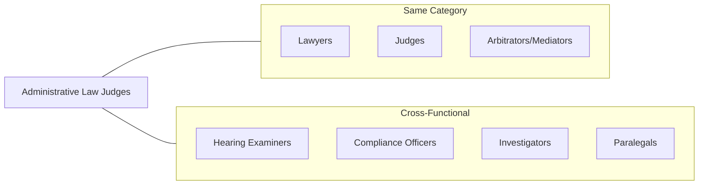
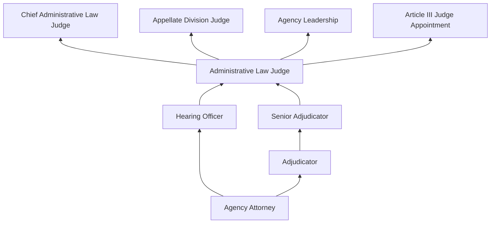

# Administrative Law Judges, Adjudicators, and Hearing Officers

> Conduct hearings to recommend or make decisions on claims concerning government programs or other government-related matters. Determine liability, sanctions, or penalties, or recommend the acceptance or rejection of claims or settlements.

## Overview

Administrative Law Judges (ALJs), Adjudicators, and Hearing Officers are judicial officers who preside over administrative proceedings involving government programs and regulatory matters. They conduct formal hearings, evaluate evidence, apply relevant laws and regulations, and issue decisions on matters ranging from Social Security disability claims to environmental enforcement actions. Unlike traditional judges, they operate within executive branch agencies and specialize in specific regulatory domains. This role requires deep expertise in administrative law, the ability to conduct fair and impartial hearings, and skill in synthesizing complex factual and legal issues into clear, well-reasoned decisions.

## Classification Hierarchy

## Key Statistics

| Metric | Value |
|--------|-------|
| SOC Code | 23-1021.00 |
| Job Zone | 5 (Extensive Preparation) |
| Category | [Legal](/occupations/Legal) |
| Core Tasks | 15+ |
| Source | O*NET |

## Core Tasks

### determine.Existence

ALJs determine liability based on applicable legal standards and evidence.

**Actions:**
- `determine.Existence.of.LiabilityAccordingToCurrentLaws` - Assess whether liability exists under applicable statutes
- `determine.Existence.of.JudicialPrecedents` - Apply controlling case law to findings
- `determine.Existence.of.AvailableEvidence` - Weigh evidence to determine liability
- `determine.Amount.of.LiabilityAccordingToCurrentLaws` - Calculate appropriate damages or penalties
- `determine.Amount.of.JudicialPrecedents` - Apply precedent to damage calculations
- `determine.Amount.of.AvailableEvidence` - Quantify liability based on evidence

### conduct.Hearings

ALJs preside over formal administrative hearings on government-related matters.

**Actions:**
- `conduct.Hearings.to.review.ClaimsRegardingIssues` - Hold hearings to examine claims
- `conduct.Hearings.to.decide.ClaimsRegardingIssues` - Render decisions on disputed claims
- `conduct.Hearings.to.SocialProgramEligibility` - Adjudicate benefits eligibility cases
- `conduct.Hearings.to.EnvironmentalProtection` - Hear environmental enforcement matters
- `conduct.Hearings.to.EnforcementOfHealth` - Preside over health regulation cases
- `conduct.Hearings.to.SafetyRegulations` - Adjudicate workplace safety matters

### research.Laws

ALJs research legal authorities to support decision-making.

**Actions:**
- `research.Laws.to.prepare.ForHearingsDetermineConclusions` - Study applicable statutes before hearings
- `research.Laws.to.ToDetermineConclusions` - Apply legal research to reach conclusions
- `research.Regulations.to.prepare.ForHearingsDetermineConclusions` - Review agency regulations
- `research.Policies.to.prepare.ForHearingsDetermineConclusions` - Examine agency policy guidance
- `research.PrecedentDecisions.to.prepare.ForHearingsDetermineConclusions` - Study prior administrative decisions
- `analyze.Laws.to.prepare.ForHearingsDetermineConclusions` - Interpret statutory provisions
- `analyze.Regulations.to.ToDetermineConclusions` - Apply regulatory requirements
- `analyze.PrecedentDecisions.to.ToDetermineConclusions` - Follow or distinguish prior rulings

### prepare.WrittenOpinions

ALJs document their findings and conclusions in formal written decisions.

**Actions:**
- `prepare.WrittenOpinions` - Draft detailed opinions explaining legal reasoning
- `prepare.Decisions` - Issue formal decisions disposing of matters

### authorize.Payment

ALJs approve valid claims and determine appropriate payment methods.

**Actions:**
- `authorize.Payment.of.ValidClaims` - Order payment of approved claims
- `authorize.Payment.of.DetermineMethod.of.Payment` - Specify payment methodology

### review.Data

ALJs examine documentary evidence in support of claims.

**Actions:**
- `review.Data.on.Documents` - Analyze documentary evidence
- `review.Data.on.ClaimApplications` - Examine claim filings for completeness
- `review.Data.on.Birth` - Verify vital records in eligibility matters
- `review.Data.on.DeathCertificates` - Review death certificates for survivor claims
- `review.Data.on.Physician` - Evaluate medical evidence
- `review.Data.on.EmployerRecords` - Examine employment documentation
- `evaluate.Data.on.Documents` - Assess probative value of evidence
- `evaluate.Data.on.ClaimApplications` - Determine claim merit

### recommend.Acceptance

ALJs recommend disposition of claims based on findings.

**Actions:**
- `recommend.Acceptance.of.ClaimsSettlementsAccording.to.Laws` - Approve meritorious claims
- `recommend.Acceptance.of.CompromiseSettlementsAccording.to.Laws` - Endorse settlement agreements
- `recommend.Rejection.of.ClaimsSettlementsAccording.to.Laws` - Deny unmeritorious claims
- `recommend.Rejection.of.CompromiseSettlementsAccording.to.Laws` - Reject inadequate settlements

### rule.Motions

ALJs resolve procedural and evidentiary disputes during hearings.

**Actions:**
- `rule.Motions.of.Evidence` - Decide motions regarding evidence
- `rule.Admissibility.of.Evidence` - Determine what evidence may be considered
- `issue.SubpoenasOaths.in.Preparation.for.FormalHearings` - Issue subpoenas to compel testimony
- `issue.AdministerOaths.in.Preparation.for.FormalHearings` - Swear in witnesses

## Skills & Competencies

### Technical Skills
- **Administrative Law** - Expert
- **Evidence Evaluation** - Expert
- **Legal Research** - Expert
- **Legal Writing** - Expert
- **Hearing Management** - Expert
- **Regulatory Interpretation** - Expert
- **Record Development** - Advanced

### Soft Skills
- **Impartiality** - Critical
- **Active Listening** - Critical
- **Critical Thinking** - Critical
- **Written Communication** - Critical
- **Oral Communication** - Essential
- **Decisiveness** - Essential
- **Patience** - Essential

## Agency Jurisdictions

## Case Type Specializations

| Domain | Example Matters | Key Laws |
|--------|-----------------|----------|
| Social Security | Disability claims, retirement benefits | Social Security Act |
| Labor | Unfair labor practices, wage disputes | NLRA, FLSA |
| Environmental | Permit appeals, enforcement actions | Clean Air Act, Clean Water Act |
| Employment | Discrimination claims, whistleblower protection | Title VII, ADA, OSHA |
| Immigration | Deportation hearings, asylum claims | INA |
| Securities | Enforcement actions, registration issues | Securities Act, Exchange Act |
| Tax | Deficiency determinations, penalty appeals | Internal Revenue Code |

## Related Occupations

## Industries

- [Government - Federal](/industries/FederalGovernment) - Primary Employment
- [Government - State](/industries/StateGovernment) - Significant Employment
- [Government - Local](/industries/LocalGovernment) - Moderate Employment

## Career Progression

## Appointment Process

| Level | Appointment Authority | Selection Process |
|-------|----------------------|-------------------|
| Federal ALJ | OPM/Agency | Competitive examination, merit selection |
| State ALJ | Governor/Agency | Varies by state |
| Hearing Officer | Agency | Agency hiring process |
| Adjudicator | Agency | Civil service examination |

## Education & Training

| Requirement | Details |
|-------------|---------|
| Typical Education | Juris Doctor (J.D.) |
| Licensure | Bar admission in at least one jurisdiction |
| Work Experience | 7+ years as practicing attorney |
| Specialized Training | Administrative law, hearing procedures |
| Selection | Competitive examination for federal ALJs |

## Key Differences from Article III Judges

| Aspect | Administrative Law Judge | Article III Judge |
|--------|-------------------------|-------------------|
| Appointment | Merit-based or agency selection | Presidential nomination, Senate confirmation |
| Tenure | Varies; some have removal protections | Lifetime |
| Jurisdiction | Agency-specific matters | Constitutional and federal law |
| Appeals | Agency review, then federal courts | Direct to appellate courts |
| Independence | Protected by APA | Constitutional separation of powers |

## Departments

This occupation typically works in:
- [Office of Hearings](/departments/Hearings)
- [Administrative Courts](/departments/AdminCourts)
- [Agency Adjudication Division](/departments/Adjudication)

## Professional Associations

- Federal Administrative Law Judges Conference
- National Association of Administrative Law Judiciary
- American Bar Association Administrative Law Section
- State administrative law judge associations

---

*Source: O*NET 23-1021.00 - ONETOccupation*
