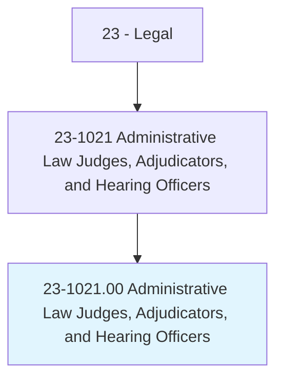
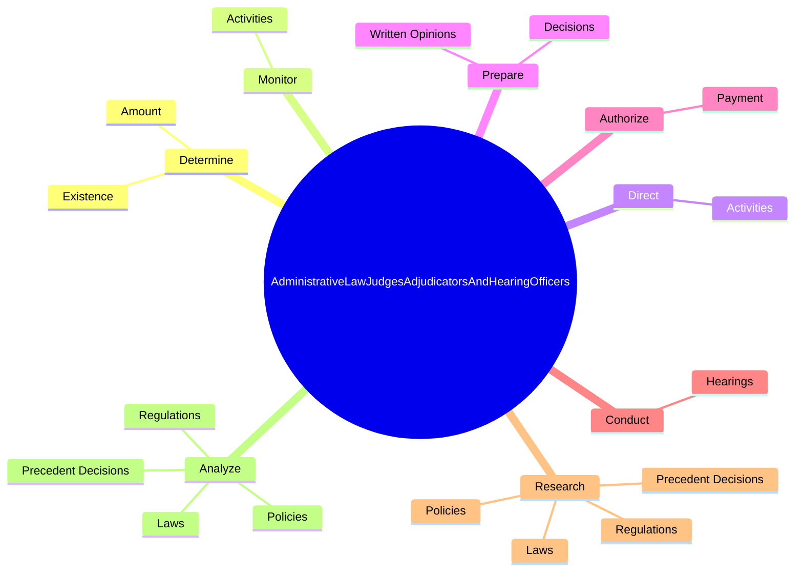

# Administrative Law Judges, Adjudicators, and Hearing Officers

> Conduct hearings to recommend or make decisions on claims concerning government programs or other government-related matters. Determine liability, sanctions, or penalties, or recommend the acceptance or rejection of claims or settlements.

## Overview

Administrative Law Judges, Adjudicators, and Hearing Officers is an occupation within the Legal category. Conduct hearings to recommend or make decisions on claims concerning government programs or other government-related matters. 

## Classification Hierarchy

## Key Statistics

| Metric | Value |
|--------|-------|
| SOC Code | 23-1021.00 |
| Category | [Legal](/occupations/Legal/index) |
| Task Count | 68 |
| Source | O*NET |

## Core Tasks

### determine.Existence

Administrative Law Judges, Adjudicators, and Hearing Officers determine existence as part of their core responsibilities.

**Actions:**
- `determine.Existence.of.LiabilityAccordingToCurrentLaws`
- `determine.Existence.of.Administrative`
- `determine.Existence.of.JudicialPrecedents`
- `determine.Existence.of.AvailableEvidence`

### monitor.Activities

Administrative Law Judges, Adjudicators, and Hearing Officers monitor activities as part of their core responsibilities.

**Actions:**
- `monitor.Activities.of.Trials.to.ensure.TheyAreConductedFairlyCourtsAdministerJusticeWhileSafeguardingLegalRightsOfInvolvedParties`
- `monitor.Activities.of.Hearings.to.ensure.TheyAreConductedFairlyCourtsAdministerJusticeWhileSafeguardingLegalRightsOfInvolvedParties`

### direct.Activities

Administrative Law Judges, Adjudicators, and Hearing Officers direct activities as part of their core responsibilities.

**Actions:**
- `direct.Activities.of.Trials.to.ensure.TheyAreConductedFairlyCourtsAdministerJusticeWhileSafeguardingLegalRightsOfInvolvedParties`
- `direct.Activities.of.Hearings.to.ensure.TheyAreConductedFairlyCourtsAdministerJusticeWhileSafeguardingLegalRightsOfInvolvedParties`

## Skills & Competencies

### Technical Skills
- **Legal Research** - Advanced
- **Legal Writing** - Advanced
- **Regulatory Knowledge** - Advanced

### Soft Skills
- **Communication** - Essential
- **Problem Solving** - Essential
- **Critical Thinking** - Important
- **Teamwork** - Important
- **Adaptability** - Important

## Related Occupations

## Industries

This occupation is found across multiple industries. See [Industries](/industries) for sector-specific employment data.

## Career Progression

---

*Source: O*NET 23-1021.00 - ONETOccupation*
