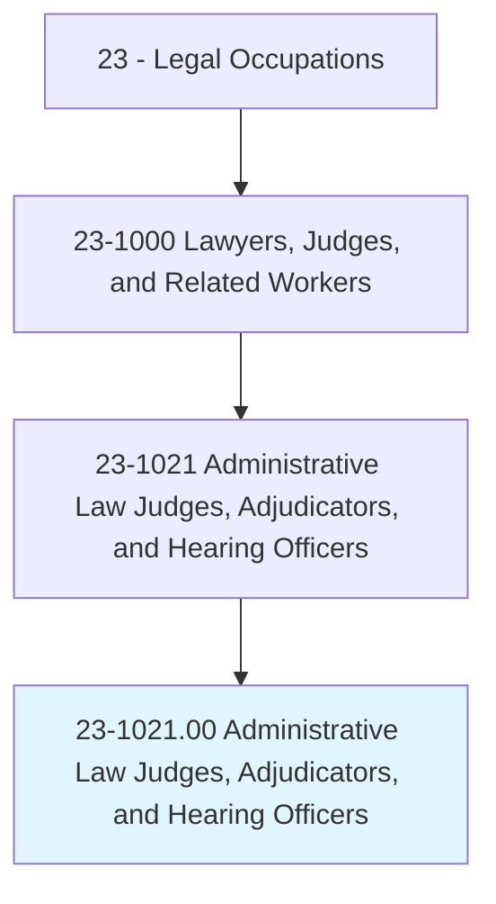
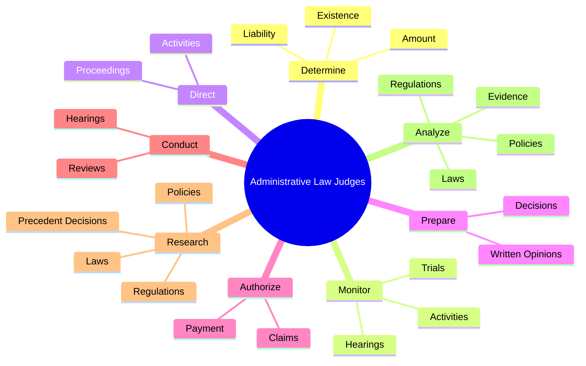
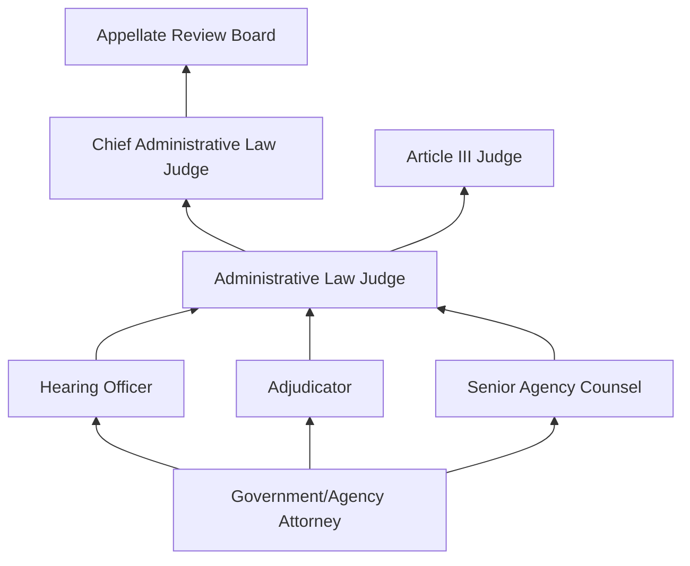
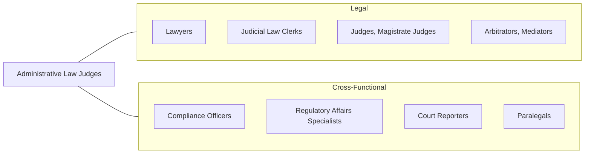

# Administrative Law Judges, Adjudicators, and Hearing Officers

> Conduct hearings to recommend or make decisions on claims concerning government programs or other government-related matters. Determine liability, sanctions, or penalties, or recommend the acceptance or rejection of claims or settlements.

## Overview

Administrative Law Judges (ALJs), Adjudicators, and Hearing Officers serve as quasi-judicial decision-makers within government agencies and regulatory bodies. Unlike traditional judges who preside over courts of general jurisdiction, these professionals conduct formal hearings on matters involving government programs, regulatory compliance, and administrative disputes. They evaluate evidence, hear testimony, apply relevant statutes and regulations, and issue binding or advisory decisions on matters such as Social Security disability claims, workers' compensation disputes, environmental violations, and immigration cases.

The role requires a deep understanding of administrative law, agency-specific regulations, and the rules of evidence as applied in administrative proceedings. ALJs must balance the interests of government programs with the rights of individuals and organizations, ensuring due process while efficiently managing often heavy caseloads. Their decisions can profoundly affect individuals' livelihoods, corporate operations, and the implementation of public policy. The position demands analytical rigor, impartiality, and the ability to render well-reasoned written decisions that withstand appellate review.

Administrative hearings differ from traditional court proceedings in several important ways: the rules of evidence are typically more relaxed, proceedings may be less formal, and ALJs often have specialized expertise in the subject matter of the cases they hear. Many ALJs are appointed through merit-based selection processes governed by the Administrative Procedure Act or similar state legislation, which provides protections for their decisional independence.

## Classification Hierarchy

## Key Statistics

| Metric | Value |
|--------|-------|
| SOC Code | 23-1021.00 |
| Job Zone | 5 (Extensive Preparation) |
| Category | [Legal](/occupations/Legal/index) |
| Median Annual Salary | $107,000 |
| Employment | ~15,500 |
| Projected Growth | 3% (slower than average) |
| Core Tasks | 68 |
| Source | O*NET |

## Core Tasks

### determine.Existence

Administrative Law Judges determine the existence and extent of liability based on evidence and law.

**Actions:**
- `determine.Existence.of.LiabilityAccordingToCurrentLaws` - Assess legal liability under applicable statutes
- `determine.Existence.of.Administrative.Violations` - Identify regulatory non-compliance
- `determine.Existence.of.JudicialPrecedents` - Apply prior rulings to current cases
- `determine.Existence.of.AvailableEvidence` - Evaluate sufficiency of evidence presented

### monitor.Activities

Administrative Law Judges oversee hearings and proceedings to ensure fair administration of justice.

**Actions:**
- `monitor.Activities.of.Trials.to.ensure.FairConduct` - Oversee trial proceedings for procedural compliance
- `monitor.Activities.of.Hearings.to.ensure.DueProcess` - Safeguard legal rights of all parties

### direct.Activities

Administrative Law Judges direct the conduct of hearings and manage proceedings.

**Actions:**
- `direct.Activities.of.Trials.to.ensure.OrderlyProceedings` - Manage trial flow and procedure
- `direct.Activities.of.Hearings.to.ensure.EfficientResolution` - Guide hearings toward timely conclusions

### prepare.WrittenOpinions

Administrative Law Judges author formal written opinions supporting their decisions.

**Actions:**
- `prepare.WrittenOpinions.regarding.Cases` - Draft comprehensive legal opinions
- `prepare.Decisions.regarding.Claims` - Issue formal determinations on claims
- `prepare.Findings.of.FactAndConclusionsOfLaw` - Document factual findings and legal conclusions

### conduct.Hearings

Administrative Law Judges preside over formal administrative hearings.

**Actions:**
- `conduct.Hearings.to.obtain.InformationRelativeToDispositionOfClaims` - Gather testimony and evidence
- `conduct.Hearings.to.evaluate.EvidenceRelativeToDispositionOfClaims` - Assess evidentiary submissions

### research.Laws

Administrative Law Judges research applicable legal authorities to support their decisions.

**Actions:**
- `research.Laws.to.inform.Decisions` - Examine relevant statutory provisions
- `research.Regulations.to.apply.ToCurrentCases` - Study applicable regulatory frameworks
- `research.Policies.to.ensure.ConsistentApplication` - Review agency policy guidance
- `research.PrecedentDecisions.to.maintain.Consistency` - Analyze prior rulings for guidance

## Skills & Competencies

### Technical Skills
- **Administrative Law** - Expert
- **Evidence Evaluation** - Expert
- **Statutory Interpretation** - Expert
- **Legal Writing** - Expert
- **Agency-Specific Regulations** - Advanced
- **Case Management** - Advanced
- **Constitutional Law (Due Process)** - Advanced

### Soft Skills
- **Impartiality** - Critical
- **Analytical Thinking** - Critical
- **Active Listening** - Critical
- **Written Communication** - Critical
- **Decisiveness** - Essential
- **Patience** - Essential
- **Integrity** - Critical
- **Oral Communication** - Essential

## Education & Certifications

| Requirement | Details |
|-------------|---------|
| Typical Education | Juris Doctor (J.D.) |
| Bar Admission | Required in most jurisdictions |
| Work Experience | 7-10+ years of legal practice, often in administrative or government law |
| Federal ALJ Selection | Competitive process through OPM (Office of Personnel Management) |
| State ALJ Selection | Varies; merit selection, gubernatorial appointment, or civil service exam |
| Continuing Education | Judicial conferences, administrative law seminars |
| Specialized Training | Agency-specific training on program rules and procedures |

## Career Progression

## Industry Variations

| Setting | Focus | Unique Aspects |
|---------|-------|----------------|
| Social Security Administration | Disability claims | Highest volume; non-adversarial hearings; claimant-focused |
| Department of Labor | Workers' comp, OSHA, wage disputes | Employment law expertise; union involvement |
| Environmental Protection Agency | Environmental violations | Technical scientific evidence; remediation orders |
| Immigration Courts | Deportation, asylum | EOIR system; high-stakes humanitarian decisions |
| State Public Utility Commissions | Rate-making, utility regulation | Economic analysis; public interest balancing |
| Securities & Exchange Commission | Securities violations | Financial expertise; complex fraud cases |

## Technology & Tools

- **Case Management Systems** - CPMS, eCAT, agency-specific platforms
- **Legal Research** - Westlaw, LexisNexis, agency regulatory databases
- **Document Management** - Electronic filing systems, document review tools
- **Video Conferencing** - Remote hearing platforms (VTC, Webex, Zoom Gov)
- **Audio Recording** - Digital court recording systems for hearing transcription
- **Decision Templates** - Agency-specific writing tools and decision frameworks
- **Docket Management** - Electronic docketing and scheduling systems

## Related Occupations

## Departments

This occupation typically works in:
- [Legal Department](/departments/Legal) - Agency legal divisions
- [Regulatory Affairs](/departments/RegulatoryAffairs) - Compliance enforcement
- [Government Administration](/departments/GovernmentAdmin) - Federal and state agencies
- [Human Resources](/departments/HumanResources) - Employment dispute resolution

---

*Source: O*NET 23-1021.00 - ONETOccupation*
