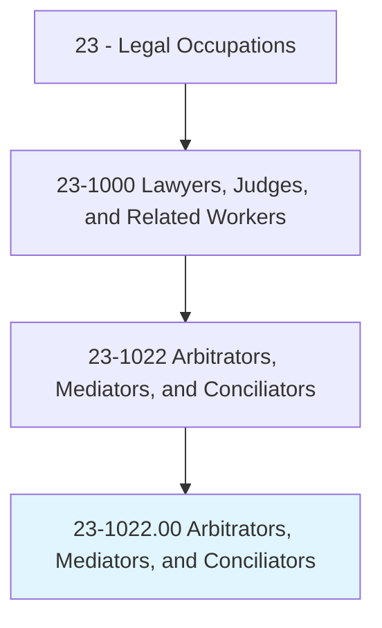
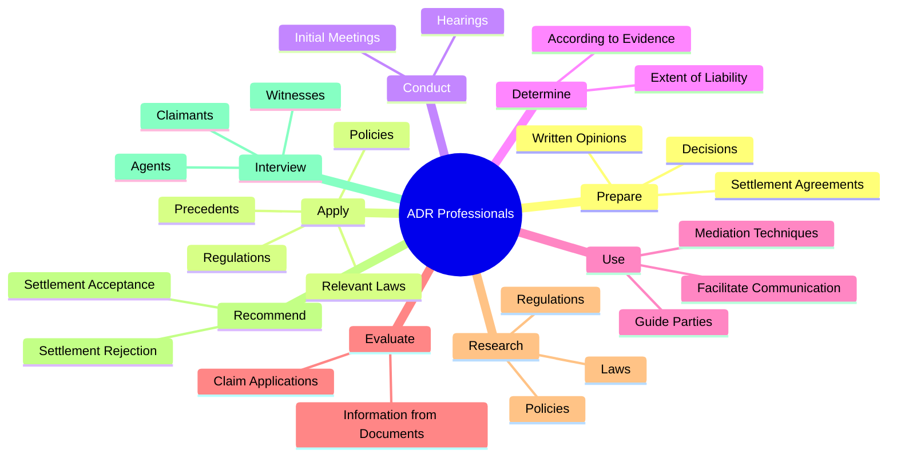
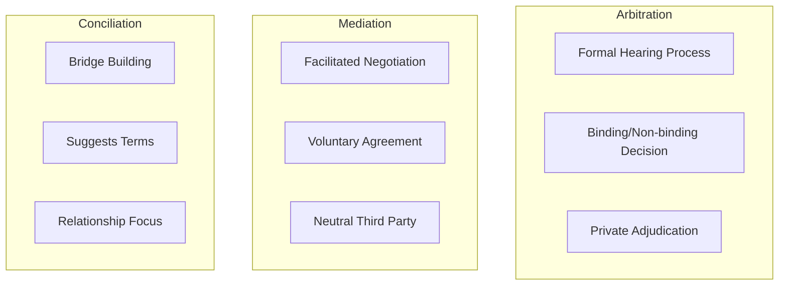
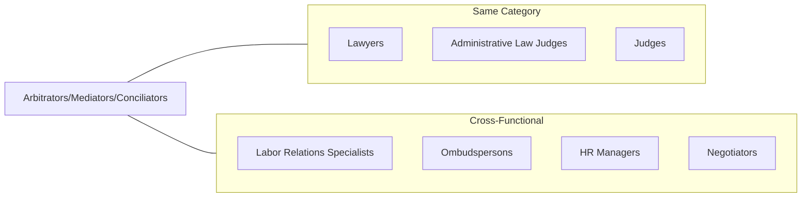
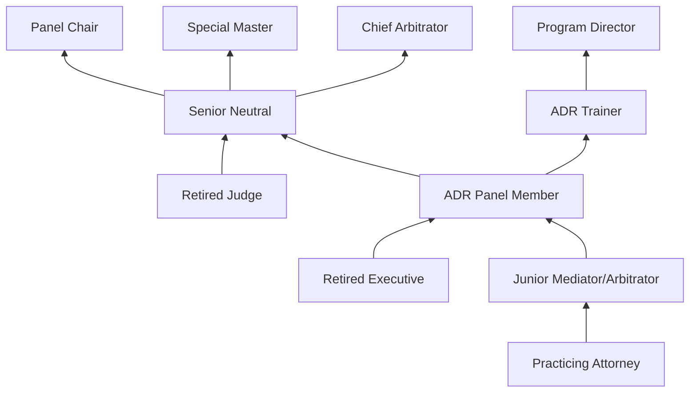

# Arbitrators, Mediators, and Conciliators

> Facilitate negotiation and conflict resolution through dialogue. Resolve conflicts outside of the court system by mutual consent of parties involved.

## Overview

Arbitrators, Mediators, and Conciliators are dispute resolution professionals who help parties resolve conflicts without traditional litigation. Arbitrators conduct formal hearings and render binding or non-binding decisions, operating similarly to private judges. Mediators facilitate communication between disputing parties to help them reach voluntary agreements without rendering judgments. Conciliators work to bring parties together and may suggest terms of settlement. These alternative dispute resolution (ADR) professionals are increasingly important in managing legal costs, preserving business relationships, and unclogging court dockets, serving in domains ranging from commercial disputes to family matters to labor relations.

## Classification Hierarchy

## Key Statistics

| Metric | Value |
|--------|-------|
| SOC Code | 23-1022.00 |
| Job Zone | 5 (Extensive Preparation) |
| Category | [Legal](/occupations/Legal/index) |
| Core Tasks | 15+ |
| Source | O*NET |

## Core Tasks

### prepare.WrittenOpinions

ADR professionals document their findings and decisions in formal written form.

**Actions:**
- `prepare.WrittenOpinions.regarding.Cases` - Draft reasoned opinions explaining conclusions
- `prepare.Decisions.regarding.Cases` - Issue binding or advisory decisions
- `prepare.SettlementAgreements.for.Disputants.to.Sign` - Memorialize agreed-upon resolutions

### apply.RelevantLaws

ADR professionals apply legal principles to reach fair conclusions.

**Actions:**
- `apply.RelevantLaws.to.reach.Conclusions` - Apply statutory and common law to disputes
- `apply.Regulations.to.reach.Conclusions` - Consider regulatory requirements
- `apply.Policies.to.reach.Conclusions` - Apply organizational policies as appropriate
- `apply.Precedents.to.reach.Conclusions` - Follow established ADR precedents

### conduct.Hearings

ADR professionals preside over formal dispute resolution proceedings.

**Actions:**
- `conduct.Hearings.to.obtain.InformationRelativeToDispositionOfClaims` - Gather evidence through formal hearings
- `conduct.Hearings.to.EvidenceRelativeToDispositionOfClaims` - Receive testimony and exhibits
- `conduct.InitialMeetings.with.Disputants.to.outline.ArbitrationProcess` - Explain procedures to parties
- `conduct.InitialMeetings.with.SettleProceduralMatters` - Resolve preliminary issues
- `conduct.InitialMeetings.with.Fees` - Discuss fee arrangements
- `conduct.InitialMeetings.with.DetermineDetails` - Establish hearing logistics
- `conduct.InitialMeetings.with.SuchAsWitnessNumbers` - Set witness limitations
- `conduct.InitialMeetings.with.TimeRequirements` - Establish schedules

### determine.Extent

ADR professionals assess liability and damages based on evidence and law.

**Actions:**
- `determine.Extent.of.LiabilityAccording.to.Evidence` - Evaluate liability based on proof
- `determine.Extent.of.Laws` - Apply legal standards to liability findings
- `determine.Extent.of.AdministrativePrecedents` - Consider prior administrative decisions
- `determine.Extent.of.JudicialPrecedents` - Follow applicable case law

### use.MediationTechniques

Mediators employ specialized techniques to facilitate resolution.

**Actions:**
- `use.MediationTechniques.to.facilitate.CommunicationBetweenDisputants` - Enable productive dialogue
- `use.MediationTechniques.to.ToFurtherPartiesUnderstandingOfDifferentPerspectives` - Build mutual understanding
- `use.MediationTechniques.to.ToGuidePartiesTowardMutualAgreement` - Lead parties toward resolution

### evaluate.Information

ADR professionals assess documentary evidence and claims.

**Actions:**
- `evaluate.Information.from.Documents` - Review documentary evidence
- `evaluate.Information.from.ClaimApplications` - Analyze claim filings
- `evaluate.Information.from.Birth` - Verify vital records when relevant
- `evaluate.Information.from.DeathCertificates` - Examine death certificates in estate matters
- `evaluate.Information.from.Physician` - Consider medical records and testimony
- `evaluate.Information.from.EmployerRecords` - Review employment documentation

### research.Laws

ADR professionals research applicable legal authorities.

**Actions:**
- `research.Laws.to.prepare.ForHearings` - Study relevant statutes
- `research.Regulations.to.prepare.ForHearings` - Review applicable regulations
- `research.Policies.to.prepare.ForHearings` - Examine organizational policies
- `research.PrecedentDecisions.to.prepare.ForHearings` - Analyze prior ADR decisions

### recommend.Acceptance

ADR professionals advise on settlement offers.

**Actions:**
- `recommend.Acceptance.of.CompromiseSettlementOffers` - Endorse favorable settlements
- `recommend.Rejection.of.CompromiseSettlementOffers` - Advise against inadequate offers
- `issue.SubpoenasOaths.to.prepare.ForFormalHearings` - Compel witness attendance
- `issue.AdministerOaths.to.prepare.ForFormalHearings` - Swear in witnesses

### interview.Claimants

ADR professionals gather information through interviews.

**Actions:**
- `interview.Claimants.to.obtain.InformationAboutDisputedIssues` - Interview disputing parties
- `interview.Agents.to.obtain.InformationAboutDisputedIssues` - Speak with representatives
- `interview.Witnesses.to.obtain.InformationAboutDisputedIssues` - Take witness statements

## ADR Method Comparison

## Skills & Competencies

### Technical Skills
- **Dispute Resolution Techniques** - Expert
- **Legal Analysis** - Advanced
- **Evidence Evaluation** - Advanced
- **Contract Interpretation** - Advanced
- **Hearing Management** - Advanced
- **Settlement Drafting** - Advanced

### Soft Skills
- **Active Listening** - Critical
- **Impartiality** - Critical
- **Communication** - Critical
- **Patience** - Critical
- **Emotional Intelligence** - Critical
- **Negotiation** - Essential
- **Problem Solving** - Essential
- **Conflict Management** - Expert

## Practice Specializations

| Domain | Description | Typical Issues |
|--------|-------------|----------------|
| Commercial | Business disputes | Contract breaches, partnership disputes |
| Construction | Building industry | Payment disputes, defect claims |
| Employment | Workplace matters | Discrimination, wrongful termination |
| Family | Domestic relations | Divorce, custody, estate disputes |
| Labor | Union relations | Grievances, contract interpretation |
| Securities | Financial disputes | Investor claims, broker disputes |
| International | Cross-border | Trade disputes, investment arbitration |
| Consumer | B2C disputes | Product issues, service complaints |
| Environmental | Natural resources | Resource allocation, pollution disputes |

## Related Occupations

## Industries

- [Legal Services](/industries/LegalServices) - High Employment (ADR firms, independent practice)
- [Government](/industries/Government) - Moderate Employment (Court-annexed programs)
- [Professional Services](/industries/ProfessionalServices) - Moderate Employment (Corporate ADR)
- [Finance and Insurance](/industries/FinanceInsurance) - Moderate Employment (FINRA arbitration)
- [Labor Organizations](/industries/LaborOrganizations) - Moderate Employment (Labor arbitration)

## Career Progression

## ADR Organization Panels

| Organization | Focus | Type |
|--------------|-------|------|
| AAA/ICDR | Commercial, construction, employment | Arbitration & Mediation |
| JAMS | Complex commercial, employment | Arbitration & Mediation |
| FINRA | Securities disputes | Arbitration |
| NAM | General commercial | Arbitration & Mediation |
| CPR | Complex commercial | Arbitration & Mediation |
| ICC | International commercial | Arbitration |
| WIPO | Intellectual property | Arbitration & Mediation |
| Federal Mediation | Labor disputes | Mediation & Conciliation |

## Education & Training

| Requirement | Details |
|-------------|---------|
| Typical Education | Juris Doctor (J.D.) or extensive subject matter expertise |
| Licensure | Bar admission helpful but not always required |
| Work Experience | 10+ years in relevant legal or industry practice |
| Certification | Various (AAA, JAMS, state programs) |
| Training | 40+ hour mediation training; arbitrator training programs |

## Certification Programs

- Certified Mediator (various state programs)
- AAA Commercial Arbitrator
- FINRA Arbitrator
- JAMS Panel Member
- IMI Certified Mediator (International)
- National Conflict Resolution Center Certification
- Family Mediation Certification

## Industry Variations

| Setting | Primary Role | Compensation Model |
|---------|--------------|-------------------|
| Independent Practice | Full-service ADR | Hourly/per case fees |
| ADR Organizations | Panel neutrals | Case assignments, fees |
| Court-Annexed | Settlement facilitation | Per diem or volunteer |
| Corporate | Internal dispute resolution | Salary |
| Labor Relations | Grievance arbitration | Per case fees |

## Departments

This occupation typically works in:
- [Dispute Resolution](/departments/DisputeResolution)
- [Legal Department](/departments/Legal/index)
- [Human Resources](/departments/HR/index)
- [Labor Relations](/departments/LaborRelations)

## Professional Associations

- American Arbitration Association (AAA)
- Association for Conflict Resolution (ACR)
- International Mediation Institute (IMI)
- Society of Professionals in Dispute Resolution (SPIDR)
- National Academy of Arbitrators
- College of Commercial Arbitrators
- CPR Institute

---

*Source: O*NET 23-1022.00 - ONETOccupation*
