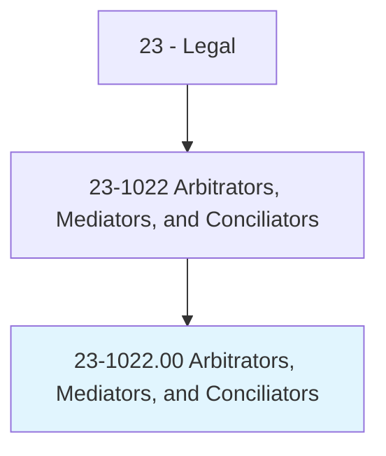
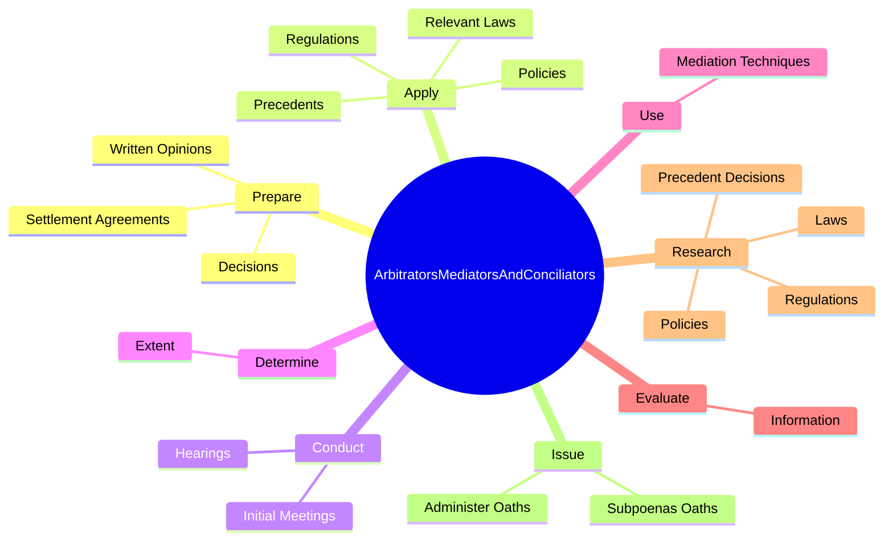
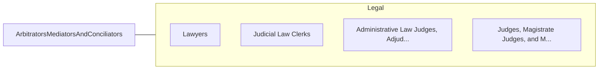

# Arbitrators, Mediators, and Conciliators

> Facilitate negotiation and conflict resolution through dialogue. Resolve conflicts outside of the court system by mutual consent of parties involved.

## Overview

Arbitrators, Mediators, and Conciliators is an occupation within the Legal category. Facilitate negotiation and conflict resolution through dialogue. 

## Classification Hierarchy

## Key Statistics

| Metric | Value |
|--------|-------|
| SOC Code | 23-1022.00 |
| Category | [Legal](/occupations/Legal/index) |
| Task Count | 50 |
| Source | O*NET |

## Core Tasks

### prepare.WrittenOpinions

Arbitrators, Mediators, and Conciliators prepare written opinions as part of their core responsibilities.

**Actions:**
- `prepare.WrittenOpinions.regarding.Cases`
- `prepare.Decisions.regarding.Cases`
- `prepare.SettlementAgreements.for.Disputants.to.Sign`

### apply.RelevantLaws

Arbitrators, Mediators, and Conciliators apply relevant laws as part of their core responsibilities.

**Actions:**
- `apply.RelevantLaws.to.reach.Conclusions`
- `apply.Regulations.to.reach.Conclusions`
- `apply.Policies.to.reach.Conclusions`
- `apply.Precedents.to.reach.Conclusions`

### conduct.Hearings

Arbitrators, Mediators, and Conciliators conduct hearings as part of their core responsibilities.

**Actions:**
- `conduct.Hearings.to.obtain.InformationRelativeToDispositionOfClaims`
- `conduct.Hearings.to.EvidenceRelativeToDispositionOfClaims`
- `conduct.InitialMeetings.with.Disputants.to.outline.ArbitrationProcess`
- `conduct.InitialMeetings.with.SettleProceduralMatters`

## Skills & Competencies

### Technical Skills
- **Legal Research** - Advanced
- **Legal Writing** - Advanced
- **Regulatory Knowledge** - Advanced

### Soft Skills
- **Communication** - Essential
- **Problem Solving** - Essential
- **Critical Thinking** - Important
- **Teamwork** - Important
- **Adaptability** - Important

## Related Occupations

## Industries

This occupation is found across multiple industries. See [Industries](/industries) for sector-specific employment data.

## Career Progression

---

*Source: O*NET 23-1022.00 - ONETOccupation*
