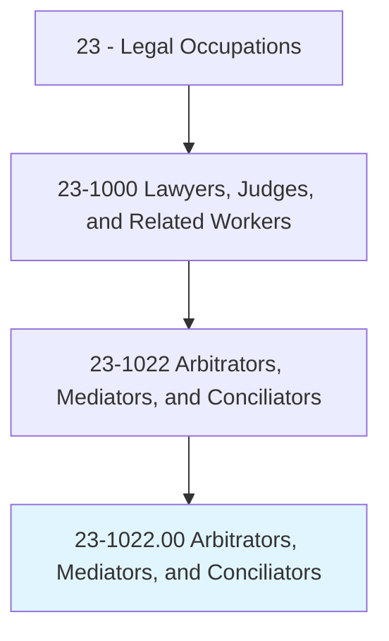
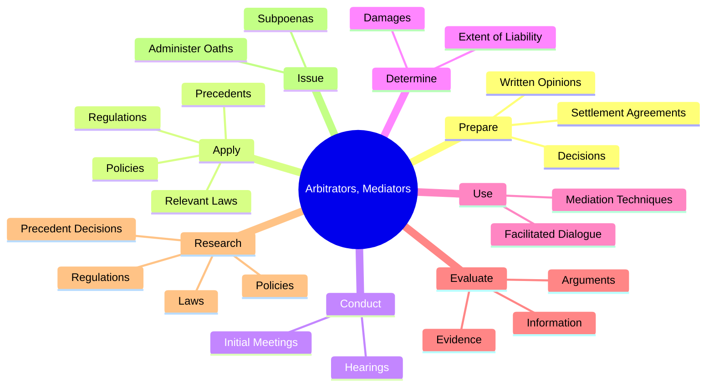
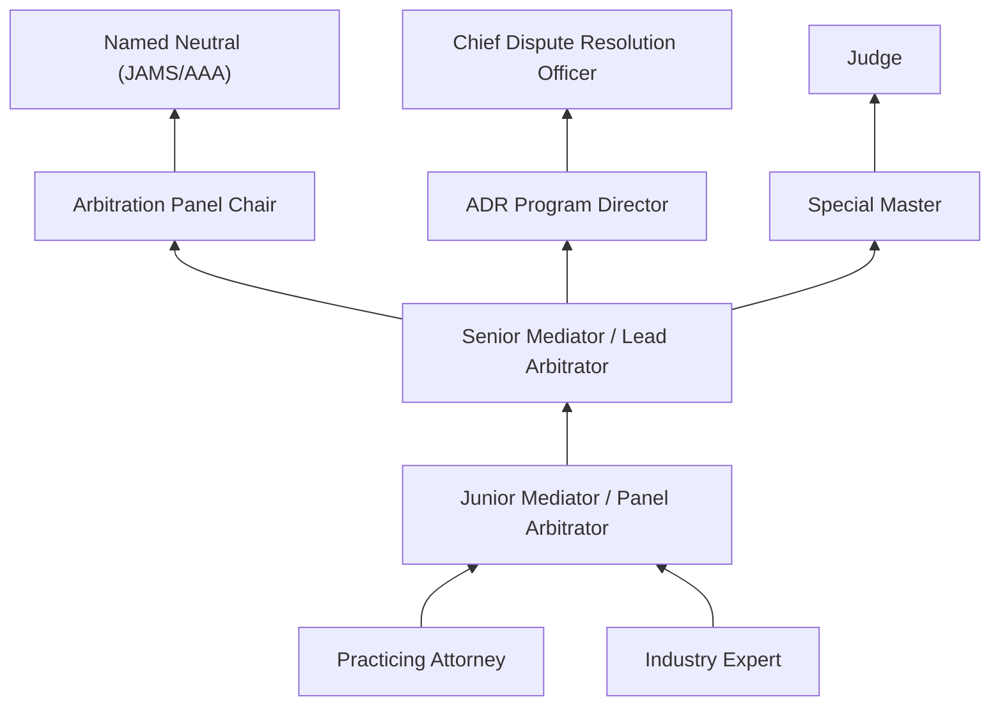
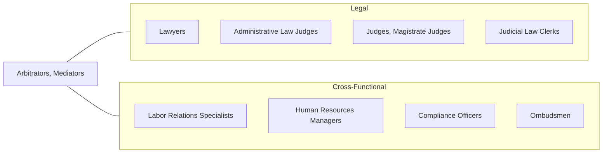

# Arbitrators, Mediators, and Conciliators

> Facilitate negotiation and conflict resolution through dialogue. Resolve conflicts outside of the court system by mutual consent of parties involved.

## Overview

Arbitrators, Mediators, and Conciliators are alternative dispute resolution (ADR) professionals who help parties resolve conflicts without resorting to traditional litigation. These professionals use a variety of techniques -- from facilitated dialogue to binding adjudication -- to bring disputing parties to mutually acceptable resolutions. Mediators serve as neutral facilitators who guide discussions but do not impose decisions, while arbitrators function more like private judges who hear evidence and render binding or non-binding awards. Conciliators often work to restore relationships and find common ground, particularly in labor and international disputes.

The demand for ADR professionals has grown substantially as courts, businesses, and government agencies increasingly recognize the benefits of resolving disputes more quickly, privately, and cost-effectively than traditional litigation allows. Many contracts now include mandatory arbitration clauses, and courts frequently require mediation before trial. ADR is used across a vast range of disputes including commercial contracts, employment matters, family law, construction claims, international trade, and personal injury cases. Professionals in this field must combine legal knowledge with exceptional interpersonal skills, emotional intelligence, and creative problem-solving ability.

The field attracts practitioners from diverse backgrounds. While many arbitrators and mediators are attorneys, others come from specialized industries such as construction, finance, healthcare, or technology, bringing subject-matter expertise that enhances their effectiveness. Professional certification and training are available through organizations such as the American Arbitration Association (AAA), JAMS, and various state mediation certification programs.

## Classification Hierarchy

## Key Statistics

| Metric | Value |
|--------|-------|
| SOC Code | 23-1022.00 |
| Job Zone | 5 (Extensive Preparation) |
| Category | [Legal](/occupations/Legal/index) |
| Median Annual Salary | $64,000 |
| Employment | ~7,800 |
| Projected Growth | 6% (faster than average) |
| Core Tasks | 50 |
| Source | O*NET |

## Core Tasks

### prepare.WrittenOpinions

Arbitrators prepare formal written opinions and decisions supporting their rulings.

**Actions:**
- `prepare.WrittenOpinions.regarding.Cases` - Author reasoned opinions explaining arbitral awards
- `prepare.Decisions.regarding.Cases` - Issue formal awards or determinations
- `prepare.SettlementAgreements.for.Disputants.to.Sign` - Draft binding settlement documents

### apply.RelevantLaws

ADR professionals apply applicable legal standards to the facts of disputes.

**Actions:**
- `apply.RelevantLaws.to.reach.Conclusions` - Apply statutory provisions to case facts
- `apply.Regulations.to.reach.Conclusions` - Apply regulatory requirements
- `apply.Policies.to.reach.Conclusions` - Consider organizational and industry policies
- `apply.Precedents.to.reach.Conclusions` - Reference prior awards and case law

### conduct.Hearings

ADR professionals conduct hearings and facilitated sessions to resolve disputes.

**Actions:**
- `conduct.Hearings.to.obtain.InformationRelativeToDispositionOfClaims` - Hear testimony and review evidence
- `conduct.Hearings.to.evaluate.EvidenceRelativeToDispositionOfClaims` - Assess evidentiary submissions
- `conduct.InitialMeetings.with.Disputants.to.outline.ArbitrationProcess` - Establish ground rules and procedures
- `conduct.InitialMeetings.with.Disputants.to.settle.ProceduralMatters` - Address preliminary issues

### use.MediationTechniques

Mediators employ specialized techniques to facilitate resolution.

**Actions:**
- `use.MediationTechniques.to.facilitate.Communication` - Open channels of dialogue between parties
- `use.MediationTechniques.to.identify.CommonGround` - Discover shared interests and goals
- `use.MediationTechniques.to.generate.Options` - Develop creative resolution alternatives

## Skills & Competencies

### Technical Skills
- **Dispute Resolution Theory** - Expert
- **Contract Interpretation** - Expert
- **Evidence Evaluation** - Advanced
- **Legal Research** - Advanced
- **Legal Writing** - Advanced
- **Negotiation Strategy** - Expert
- **Procedural Rules (AAA, JAMS, UNCITRAL)** - Advanced

### Soft Skills
- **Active Listening** - Critical
- **Neutrality and Impartiality** - Critical
- **Emotional Intelligence** - Critical
- **Facilitation** - Critical
- **Persuasion** - Essential
- **Patience** - Essential
- **Cultural Sensitivity** - Essential
- **Creative Problem-Solving** - Essential

## Education & Certifications

| Requirement | Details |
|-------------|---------|
| Typical Education | Juris Doctor (J.D.) or Master's degree in related field |
| Bar Admission | Preferred but not always required |
| Mediation Training | 40-hour basic mediation training (state-specific requirements) |
| Arbitrator Training | AAA, JAMS, or FINRA arbitrator training programs |
| Certifications | Certified Mediator (state-specific), AAA Panel Member, JAMS Neutral |
| Industry Specialization | Subject-matter expertise in construction, employment, securities, etc. |
| Continuing Education | Ongoing ADR training, ethics courses |

## Career Progression

## Industry Variations

| Setting | Focus | Unique Aspects |
|---------|-------|----------------|
| Commercial Arbitration | Contract disputes, business conflicts | High-value cases; complex evidence; panel arbitrations |
| Labor Relations | Union grievances, collective bargaining | FMCS panels; labor law expertise; ongoing relationships |
| Family Mediation | Divorce, custody, estate disputes | Emotional dynamics; child welfare focus; therapeutic approach |
| International Arbitration | Cross-border trade, investment disputes | ICC/ICSID rules; multiple legal systems; treaty interpretation |
| Securities Arbitration | Investor-broker disputes | FINRA panels; financial expertise; mandatory arbitration |
| Construction Disputes | Project delays, defect claims | Technical construction knowledge; multi-party disputes |

## Technology & Tools

- **Case Management** - AAA WebFile, JAMS ADR Center, ICC NetCase
- **Video Conferencing** - Zoom, Webex, dedicated virtual hearing platforms
- **Legal Research** - Westlaw, LexisNexis, ADR databases
- **Document Sharing** - Secure document exchange platforms
- **Scheduling Tools** - Online calendaring and availability systems
- **Virtual Hearing Rooms** - Dedicated ADR videoconference platforms
- **Award Drafting** - Decision writing templates and tools

## Related Occupations

## Departments

This occupation typically works in:
- [Legal Department](/departments/Legal) - In-house ADR programs
- Human Resources - Employee dispute resolution
- Compliance - Regulatory mediation
- Risk Management - Claims arbitration

---

*Source: O*NET 23-1022.00 - ONETOccupation*
