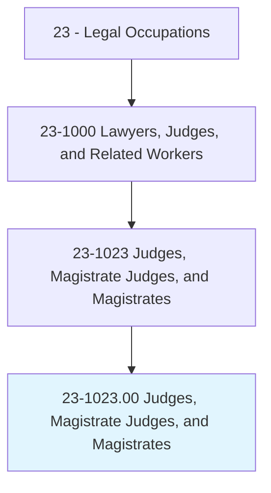
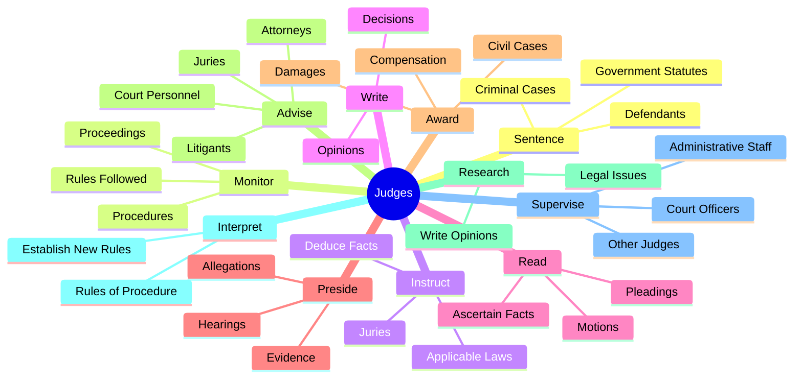
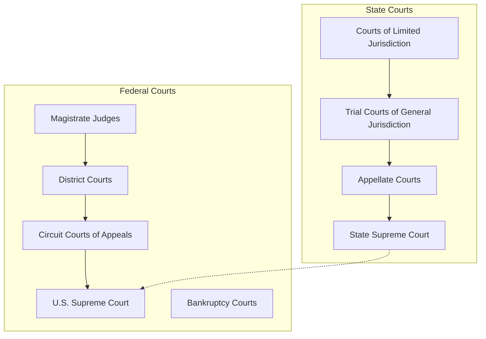
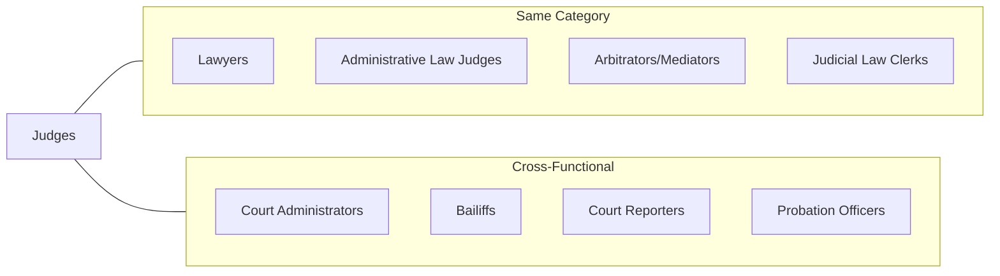
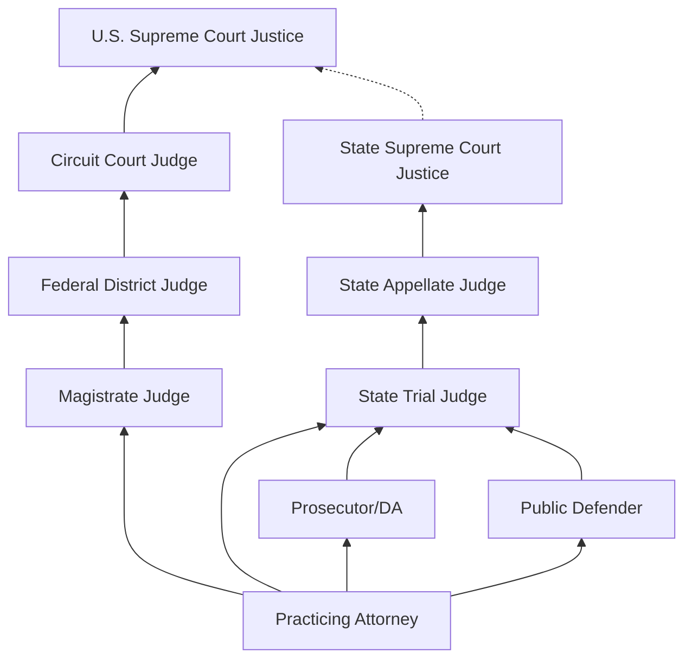

# Judges, Magistrate Judges, and Magistrates

> Arbitrate, advise, adjudicate, or administer justice in a court of law. May sentence defendant in criminal cases according to government statutes or sentencing guidelines. May determine liability of defendant in civil cases. May perform wedding ceremonies.

## Overview

Judges, Magistrate Judges, and Magistrates are judicial officers who preside over courtrooms, administer justice, and serve as the ultimate arbiters of legal disputes. They interpret and apply the law, ensure fair trial proceedings, rule on motions and evidentiary issues, instruct juries, and render verdicts or sentences in cases tried without juries. Judges operate at all levels of the court system, from municipal and magistrate courts handling minor matters to state supreme courts and the federal judiciary deciding cases with far-reaching implications. This role demands exceptional legal knowledge, unwavering integrity, judicial temperament, and the ability to make difficult decisions that profoundly affect individuals and society.

## Classification Hierarchy

## Key Statistics

| Metric | Value |
|--------|-------|
| SOC Code | 23-1023.00 |
| Job Zone | 5 (Extensive Preparation) |
| Category | [Legal](/occupations/Legal/index) |
| Core Tasks | 20+ |
| Source | O*NET |

## Core Tasks

### sentence.Defendants

Judges impose sentences on convicted defendants according to applicable law.

**Actions:**
- `sentence.Defendants.in.CriminalCases` - Pronounce sentences in criminal matters
- `sentence.Defendants.in.OnConvictionByJury` - Sentence following jury verdicts
- `sentence.Defendants.in.AccordingToApplicableGovernmentStatutes` - Apply sentencing guidelines and statutes

### monitor.Proceedings

Judges oversee courtroom proceedings to ensure proper conduct.

**Actions:**
- `monitor.Proceedings.to.ensure.ApplicableRulesAreFollowed` - Enforce rules of procedure
- `monitor.Proceedings.to.ProceduresAreFollowed` - Maintain orderly proceedings

### instruct.Juries

Judges provide legal guidance to juries on applicable law.

**Actions:**
- `instruct.Juries.on.ApplicableLaws` - Explain relevant legal standards to jurors
- `instruct.Juries.on.DirectJuriesToDeduceFactsFromEvidencePresented` - Guide jury fact-finding
- `instruct.Juries.on.HearVerdicts` - Receive and record jury verdicts

### write.Decisions

Judges author written decisions explaining their rulings.

**Actions:**
- `write.Decisions.on.Cases` - Draft formal judicial decisions
- `research.LegalIssues.on.Issues` - Research legal questions presented
- `research.WriteOpinions.on.Issues` - Prepare written opinions

### read.Documents

Judges review case filings to understand issues and facts.

**Actions:**
- `read.Documents.on.Pleadings.to.ascertain.FactsIssues` - Examine pleadings for factual and legal issues
- `read.Documents.on.Motions.to.ascertain.FactsIssues` - Review motions and supporting materials

### preside.Hearings

Judges conduct hearings and evaluate evidence presented.

**Actions:**
- `preside.Listen.to.AllegationsMadeByPlaintiffsToDetermineWhetherEvidenceSupportsCharges` - Hear and evaluate allegations

### award.Compensation

Judges determine damages in civil cases.

**Actions:**
- `award.Compensation.for.DamagesToLitigantsInCivilCasesInRelationToFindingsByJuriesCourt` - Award damages based on findings
- `award.Compensation.for.ByCourt` - Issue bench-determined awards

### advise.Parties

Judges provide guidance to court participants on conduct and procedure.

**Actions:**
- `advise.Attorneys` - Guide counsel on procedural matters
- `advise.Juries` - Instruct juries on their duties
- `advise.Litigants` - Inform parties of their rights and obligations
- `advise.CourtPersonnel.regarding.Conduct` - Direct court staff
- `advise.Issues` - Clarify issues before the court
- `advise.Proceedings` - Explain procedural matters

### interpret.Rules

Judges interpret and apply procedural rules.

**Actions:**
- `interpret.Rules.of.Procedure` - Construe rules governing proceedings
- `interpret.Rules.of.EstablishNewRules.in.SituationsWhereThereAreProceduresAlreadyEstablishedByLaw` - Create procedures where none exist
- `enforce.Rules.of.Procedure` - Enforce procedural requirements
- `enforce.Rules.of.EstablishNewRules.in.SituationsWhereThereAreProceduresAlreadyEstablishedByLaw` - Apply newly established rules

### supervise.Court

Judges oversee court operations and personnel.

**Actions:**
- `supervise.OtherJudges` - Direct junior judicial officers
- `supervise.CourtOfficers` - Oversee court staff
- `supervise.CourtsAdministrativeStaff` - Manage administrative personnel
- `issue.ArrestWarrants` - Issue warrants based on probable cause
- `settle.Disputes.between.OpposingAttorneys` - Resolve disputes between counsel
- `impose.Restrictions.upon.Parties.in.CivilCasesUntilTrialsCanBeHeld` - Issue preliminary injunctions

### rule.Family

Judges handle family court matters.

**Actions:**
- `rule.AccessDisputes.of.Children` - Decide custody and visitation matters
- `rule.EnforceCourtOrders.regarding.Custody.of.Children` - Enforce custody orders
- `rule.Support.of.Children` - Determine child support obligations
- `grant.Divorces` - Issue divorce decrees
- `grant.DivideAssets.between.Spouses` - Divide marital property

### conduct.PreliminaryHearings

Judges conduct preliminary proceedings in criminal cases.

**Actions:**
- `conduct.PreliminaryHearings.to.decide.Issues` - Hold preliminary hearings
- `conduct.PreliminaryHearings.to.WhetherThereIsReasonable` - Determine probable cause
- `conduct.PreliminaryHearings.to.ProbableCauseToHoldDefendantsInFelonyCases` - Bind over defendants for trial

### provide.Information

Judges engage with the public on legal system matters.

**Actions:**
- `provide.Information.regarding.JudicialSystemLegalIssuesThroughMediaSpeeches` - Educate public on legal system
- `provide.PublicSpeeches` - Deliver public addresses
- `provide.OtherLegalIssues.through.MediaSpeeches` - Discuss legal matters publicly
- `perform.WeddingCeremonies` - Officiate marriages

## Court Hierarchy

## Skills & Competencies

### Technical Skills
- **Legal Analysis** - Expert
- **Evidence Evaluation** - Expert
- **Statutory Interpretation** - Expert
- **Legal Writing** - Expert
- **Trial Management** - Expert
- **Sentencing Guidelines** - Advanced
- **Constitutional Law** - Advanced

### Soft Skills
- **Impartiality** - Critical
- **Judicial Temperament** - Critical
- **Decisiveness** - Critical
- **Active Listening** - Critical
- **Critical Thinking** - Critical
- **Written Communication** - Critical
- **Oral Communication** - Essential
- **Patience** - Essential
- **Integrity** - Critical

## Types of Courts and Judges

| Court Type | Jurisdiction | Typical Cases |
|------------|--------------|---------------|
| Supreme Court | Final appellate review | Constitutional issues, major legal questions |
| Appellate Courts | Review of trial court decisions | Appeals, legal interpretation |
| District/Superior Courts | General trial jurisdiction | Felonies, civil cases over threshold |
| Family Courts | Domestic relations | Divorce, custody, juvenile matters |
| Criminal Courts | Criminal matters | Felonies, misdemeanors |
| Probate Courts | Estate matters | Wills, estates, guardianships |
| Magistrate Courts | Limited jurisdiction | Preliminary hearings, minor offenses |
| Municipal Courts | Local matters | Traffic, ordinance violations |
| Bankruptcy Courts | Debtor matters | Chapter 7, 11, 13 cases |

## Related Occupations

## Industries

- Government - Federal - Federal Judiciary
- Government - State - State Court Systems
- Government - Local - Municipal Courts

## Career Progression

## Selection Methods

| Level | Federal | State (Varies) |
|-------|---------|----------------|
| Supreme Court | Presidential nomination, Senate confirmation | Election, gubernatorial appointment, or merit selection |
| Appellate | Presidential nomination, Senate confirmation | Election, gubernatorial appointment, or merit selection |
| Trial/District | Presidential nomination, Senate confirmation | Election, gubernatorial appointment, or merit selection |
| Magistrate | Court appointment | Varies by jurisdiction |
| Municipal | Court or local appointment | Local election or appointment |

## Education & Training

| Requirement | Details |
|-------------|---------|
| Typical Education | Juris Doctor (J.D.) |
| Licensure | Bar admission required |
| Work Experience | Extensive legal practice (typically 10+ years) |
| Prior Positions | Private practice, prosecution, public defender, government counsel |
| Judicial Training | Judicial college, continuing education |

## Federal Judicial Appointment Process

1. Nomination by President
2. ABA evaluation (traditionally)
3. Senate Judiciary Committee hearing
4. Committee vote
5. Full Senate confirmation vote
6. Presidential commission

## Judicial Ethics and Independence

| Principle | Description |
|-----------|-------------|
| Impartiality | Decide cases without bias or prejudice |
| Independence | Free from external pressure or influence |
| Integrity | Maintain high ethical standards |
| Recusal | Withdraw from cases with conflicts of interest |
| Propriety | Avoid appearance of impropriety |
| Diligence | Handle cases promptly and fairly |

## Industry Variations

| Setting | Focus | Unique Aspects |
|---------|-------|----------------|
| Federal Trial | Complex litigation, federal questions | Life tenure, Article III protections |
| Federal Appellate | Legal error review | Panel decisions, precedent-setting |
| State Trial | General jurisdiction | Elected in most states, diverse caseload |
| State Appellate | State law interpretation | State constitutional issues |
| Magistrate | Preliminary matters | Limited authority, supports district judges |
| Family Court | Domestic relations | Specialized jurisdiction, therapeutic focus |
| Juvenile Court | Minor offenders | Rehabilitative focus |

## Departments

This occupation typically works in:
- Judicial Branch
- Court Administration
- Trial Courts
- Appellate Courts

## Professional Associations

- American Judges Association
- Federal Judges Association
- National Association of Women Judges
- National Council of Juvenile and Family Court Judges
- Conference of Chief Justices
- State judicial associations

---

*Source: O*NET 23-1023.00 - ONETOccupation*
