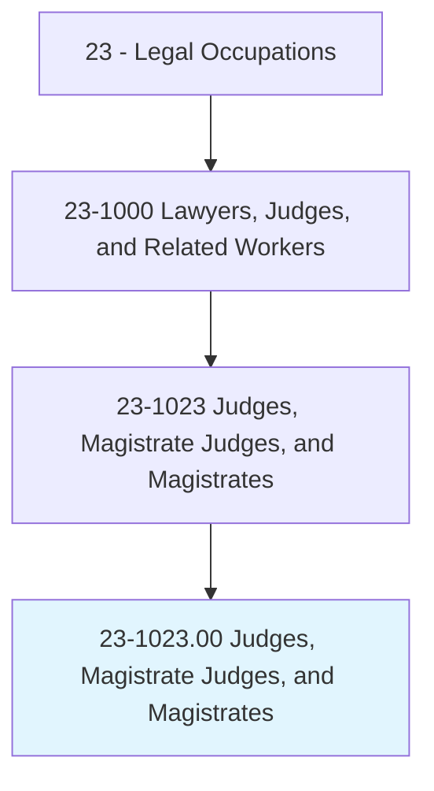
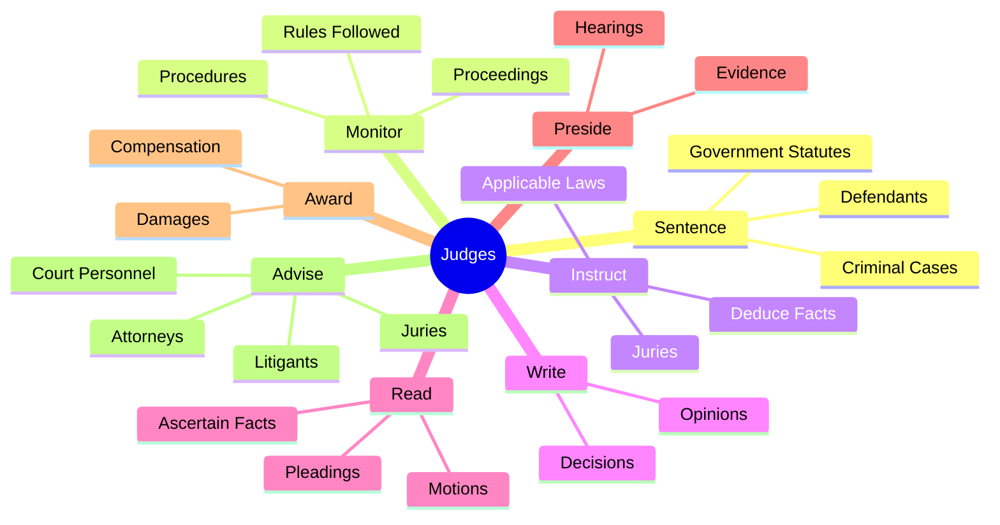
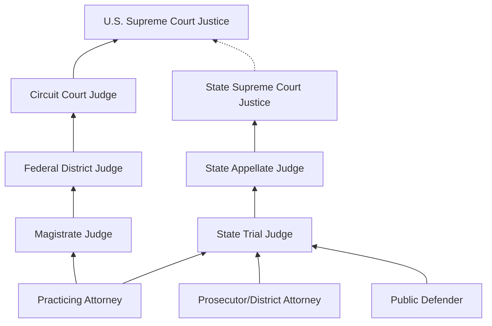
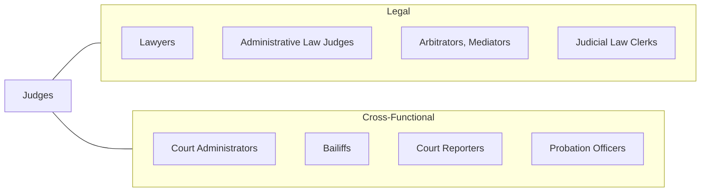

# Judges, Magistrate Judges, and Magistrates

> Arbitrate, advise, adjudicate, or administer justice in a court of law. May sentence defendant in criminal cases according to government statutes or sentencing guidelines. May determine liability of defendant in civil cases. May perform wedding ceremonies.

## Overview

Judges, Magistrate Judges, and Magistrates are the cornerstone of the judicial system, presiding over courts at every level of government to interpret and apply the law. They oversee trials, rule on motions, evaluate evidence, instruct juries, sentence convicted defendants, and render verdicts in both criminal and civil matters. Their decisions shape legal precedent, protect individual rights, and maintain the rule of law. The role demands extraordinary legal acumen, unwavering impartiality, and the temperament to make consequential decisions under scrutiny.

The judiciary encompasses a broad spectrum of positions, from municipal magistrates handling traffic violations and small claims to federal circuit judges deciding constitutional questions with nationwide implications. State trial judges manage the largest volume of cases, handling everything from felony criminal prosecutions to complex civil litigation, family law matters, and probate proceedings. Federal judges, appointed for life under Article III of the Constitution, enjoy protections designed to ensure judicial independence. Magistrate judges, while serving under the authority of district courts, handle critical pre-trial matters, consent cases, and preliminary hearings.

Becoming a judge typically requires extensive legal experience, often a decade or more of practice, prosecution, or government service. Selection methods vary widely: federal judges are nominated by the President and confirmed by the Senate, while state judges may be elected, appointed by governors, or selected through merit-based commission processes. Regardless of the path to the bench, all judges must uphold rigorous ethical standards codified in judicial conduct rules and maintain public confidence in the integrity and independence of the judiciary.

## Classification Hierarchy

## Key Statistics

| Metric | Value |
|--------|-------|
| SOC Code | 23-1023.00 |
| Job Zone | 5 (Extensive Preparation) |
| Category | [Legal](/occupations/Legal/index) |
| Median Annual Salary | $148,000 |
| Employment | ~28,500 |
| Projected Growth | 2% (slower than average) |
| Core Tasks | 44 |
| Source | O*NET |

## Core Tasks

### sentence.Defendants

Judges impose sentences on convicted defendants according to applicable law and guidelines.

**Actions:**
- `sentence.Defendants.in.CriminalCases` - Pronounce sentences in criminal matters
- `sentence.Defendants.in.OnConvictionByJury` - Sentence following jury verdicts
- `sentence.Defendants.in.AccordingToApplicableGovernmentStatutes` - Apply sentencing guidelines and statutes

### monitor.Proceedings

Judges oversee courtroom proceedings to ensure compliance with rules and due process.

**Actions:**
- `monitor.Proceedings.to.ensure.ApplicableRulesAreFollowed` - Enforce rules of procedure
- `monitor.Proceedings.to.ensure.ProceduresAreFollowed` - Maintain orderly proceedings

### instruct.Juries

Judges provide legal instructions to juries on applicable law and their duties.

**Actions:**
- `instruct.Juries.on.ApplicableLaws` - Explain relevant legal standards to jurors
- `instruct.Juries.on.DirectJuriesToDeduceFactsFromEvidencePresented` - Guide jury fact-finding
- `instruct.Juries.on.HearVerdicts` - Receive and record jury verdicts

### write.Decisions

Judges author written decisions and opinions explaining their rulings.

**Actions:**
- `write.Decisions.on.Cases` - Draft formal judicial decisions
- `write.Opinions.on.LegalIssues` - Prepare written opinions establishing reasoning

### advise.Parties

Judges provide guidance to court participants on conduct and procedure.

**Actions:**
- `advise.Attorneys.on.Procedure` - Guide counsel on procedural matters
- `advise.Juries.on.Duties` - Instruct juries on their responsibilities
- `advise.Litigants.on.Rights` - Inform parties of their rights and obligations
- `advise.CourtPersonnel.regarding.Conduct` - Direct court staff operations

## Skills & Competencies

### Technical Skills
- **Legal Analysis** - Expert
- **Evidence Evaluation** - Expert
- **Statutory Interpretation** - Expert
- **Legal Writing** - Expert
- **Trial Management** - Expert
- **Sentencing Guidelines** - Advanced
- **Constitutional Law** - Advanced
- **Judicial Ethics** - Expert

### Soft Skills
- **Impartiality** - Critical
- **Judicial Temperament** - Critical
- **Decisiveness** - Critical
- **Active Listening** - Critical
- **Critical Thinking** - Critical
- **Written Communication** - Critical
- **Oral Communication** - Essential
- **Patience** - Essential
- **Integrity** - Critical

## Education & Certifications

| Requirement | Details |
|-------------|---------|
| Typical Education | Juris Doctor (J.D.) |
| Bar Admission | Required in all jurisdictions |
| Work Experience | 10+ years of legal practice (typical) |
| Federal Selection | Presidential nomination, Senate confirmation |
| State Selection | Election, gubernatorial appointment, or merit selection (varies by state) |
| Judicial Training | National Judicial College, Federal Judicial Center |
| Continuing Education | Annual judicial conferences, ethics seminars |
| Prior Positions | Private practice, prosecution, public defense, government counsel |

## Career Progression

## Industry Variations

| Setting | Focus | Unique Aspects |
|---------|-------|----------------|
| Federal District Courts | Federal civil and criminal cases | Life tenure; Article III protections; complex litigation |
| Federal Appellate Courts | Review of trial court decisions | Panel decisions; precedent-setting opinions |
| State Trial Courts | General jurisdiction | Elected in most states; diverse caseloads; highest volume |
| Family Courts | Divorce, custody, juvenile | Specialized jurisdiction; therapeutic and rehabilitative focus |
| Bankruptcy Courts | Debtor-creditor matters | Technical financial analysis; Chapter 7, 11, 13 proceedings |
| Municipal Courts | Local ordinances, traffic | Limited jurisdiction; high volume; community-facing |

## Technology & Tools

- **Case Management Systems** - CM/ECF (federal), state-specific CMS platforms
- **Legal Research** - Westlaw, LexisNexis, judicial research databases
- **Court Recording** - Digital audio/video recording systems
- **Electronic Filing** - PACER (federal), state e-filing portals
- **Jury Management** - Electronic jury selection and management systems
- **Sentencing Tools** - Federal sentencing guidelines calculators
- **Opinion Drafting** - Judicial writing tools, template systems

## Related Occupations

## Departments

This occupation typically works in:
- [Judicial Branch](/departments/Judiciary) - Federal and state court systems
- [Court Administration](/departments/CourtAdmin) - Court management and operations
- [Trial Courts](/departments/TrialCourts) - Courts of general jurisdiction
- [Appellate Courts](/departments/AppellateCourts) - Review and appeals courts

---

*Source: O*NET 23-1023.00 - ONETOccupation*
