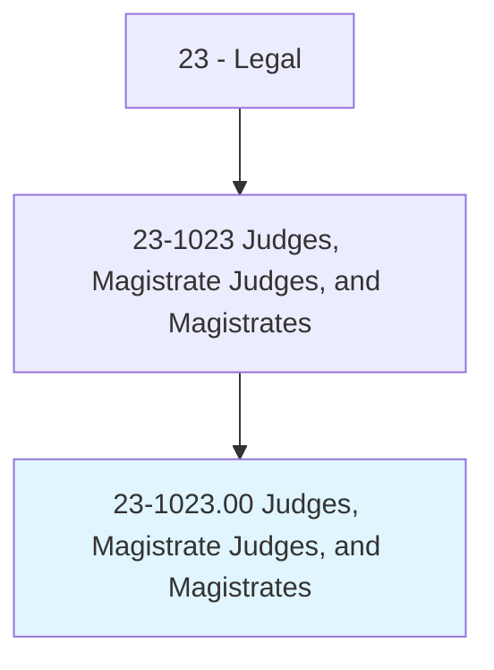
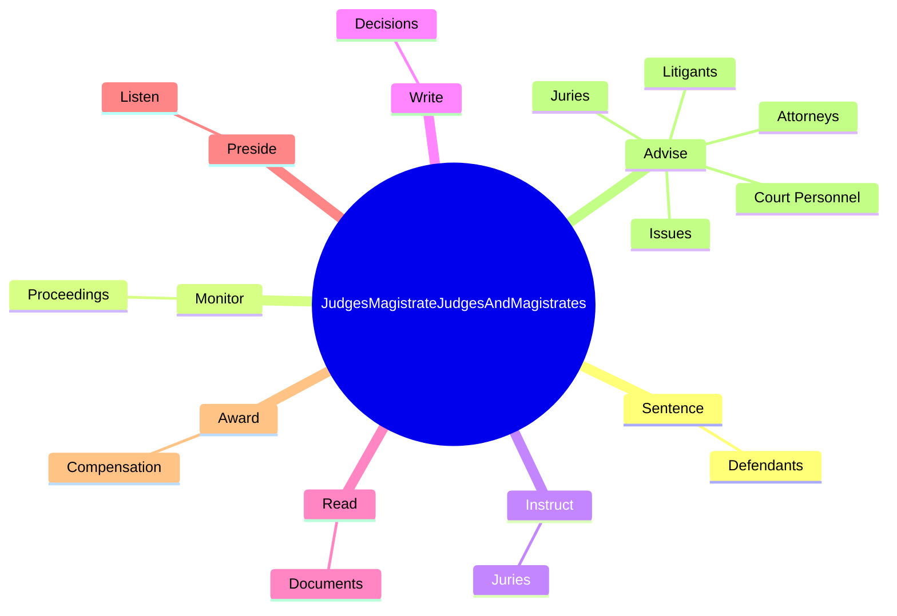
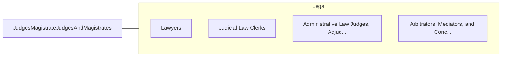

# Judges, Magistrate Judges, and Magistrates

> Arbitrate, advise, adjudicate, or administer justice in a court of law. May sentence defendant in criminal cases according to government statutes or sentencing guidelines. May determine liability of defendant in civil cases. May perform wedding ceremonies.

## Overview

Judges, Magistrate Judges, and Magistrates is an occupation within the Legal category. Arbitrate, advise, adjudicate, or administer justice in a court of law. May sentence defendant in criminal cases according to government statutes or sentencing guidelines.

## Classification Hierarchy

## Key Statistics

| Metric | Value |
|--------|-------|
| SOC Code | 23-1023.00 |
| Category | [Legal](/occupations/Legal/index) |
| Task Count | 44 |
| Source | O*NET |

## Core Tasks

### sentence.Defendants

Judges, Magistrate Judges, and Magistrates sentence defendants as part of their core responsibilities.

**Actions:**
- `sentence.Defendants.in.CriminalCases`
- `sentence.Defendants.in.OnConvictionByJury`
- `sentence.Defendants.in.AccordingToApplicableGovernmentStatutes`

### monitor.Proceedings

Judges, Magistrate Judges, and Magistrates monitor proceedings as part of their core responsibilities.

**Actions:**
- `monitor.Proceedings.to.ensure.ApplicableRulesAreFollowed`
- `monitor.Proceedings.to.ProceduresAreFollowed`

### instruct.Juries

Judges, Magistrate Judges, and Magistrates instruct juries as part of their core responsibilities.

**Actions:**
- `instruct.Juries.on.ApplicableLaws`
- `instruct.Juries.on.DirectJuriesToDeduceFactsFromEvidencePresented`
- `instruct.Juries.on.HearVerdicts`

## Skills & Competencies

### Technical Skills
- **Legal Research** - Advanced
- **Legal Writing** - Advanced
- **Regulatory Knowledge** - Advanced

### Soft Skills
- **Communication** - Essential
- **Problem Solving** - Essential
- **Critical Thinking** - Important
- **Teamwork** - Important
- **Adaptability** - Important

## Related Occupations

## Industries

This occupation is found across multiple industries. See [Industries](/industries) for sector-specific employment data.

## Career Progression

---

*Source: O*NET 23-1023.00 - ONETOccupation*
