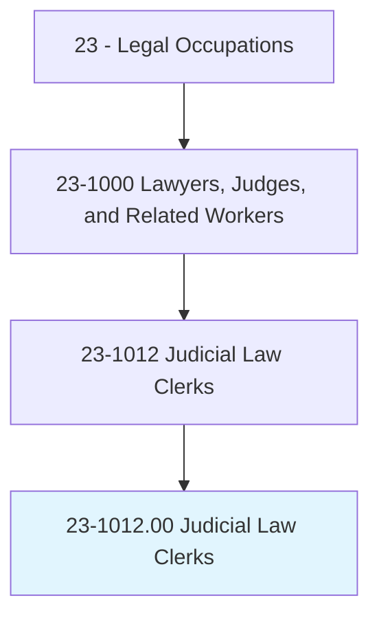
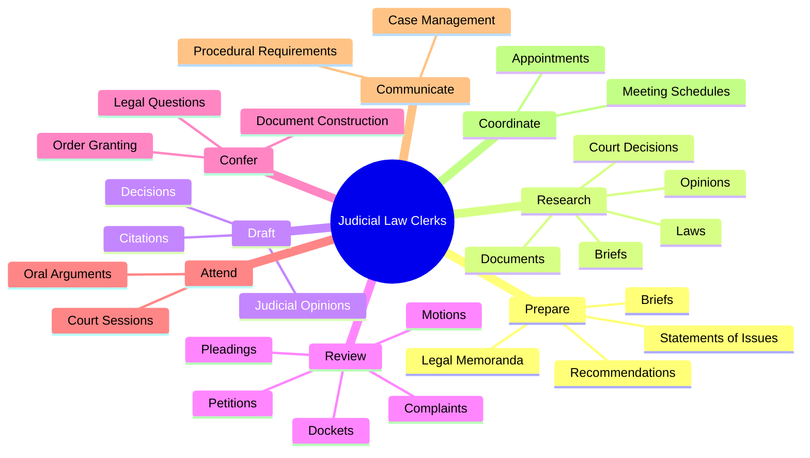
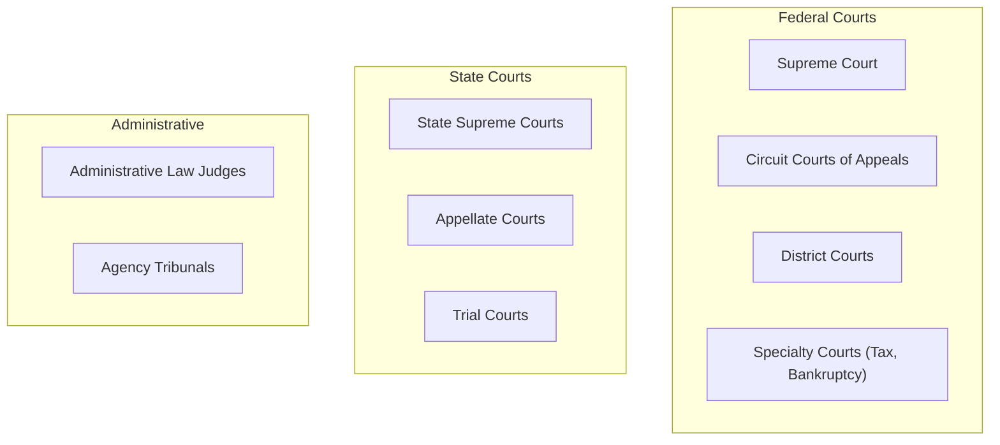
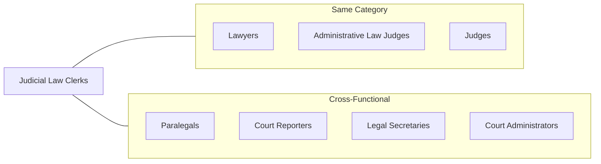
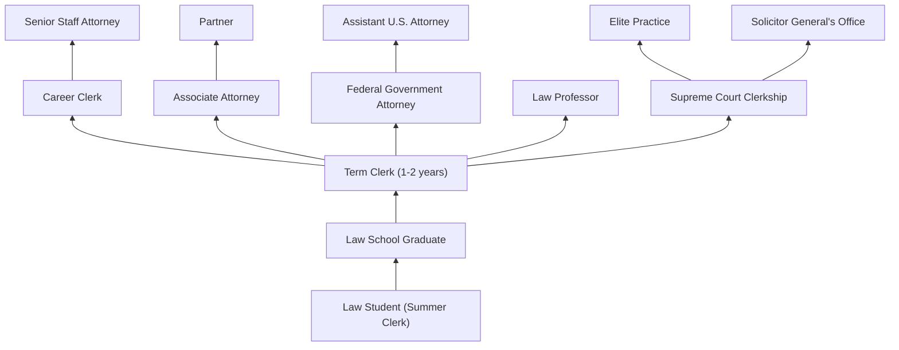

# Judicial Law Clerks

> Assist judges in court or by conducting research or preparing legal documents.

## Overview

Judicial Law Clerks serve as essential support to judges at all levels of the court system, from trial courts to the Supreme Court. They conduct comprehensive legal research, draft judicial opinions and orders, analyze case law and legal briefs, and help manage court proceedings. This position is highly competitive and often serves as a prestigious stepping stone to careers in private practice, government, or the judiciary. Law clerks gain invaluable insight into judicial decision-making while honing their legal research and writing skills under the mentorship of experienced judges.

## Classification Hierarchy

## Key Statistics

| Metric | Value |
|--------|-------|
| SOC Code | 23-1012.00 |
| Job Zone | 5 (Extensive Preparation) |
| Category | [Legal](/occupations/Legal/index) |
| Core Tasks | 15+ |
| Source | O*NET |

## Core Tasks

### prepare.Briefs

Law clerks synthesize complex legal issues into clear, actionable memoranda for judges.

**Actions:**
- `prepare.Briefs.of.Issues.involved.in.Cases` - Summarize key legal issues presented in pending cases
- `prepare.Briefs.of.IncludingAppropriateSuggestions` - Provide recommended approaches for judicial consideration
- `prepare.Briefs.of.Recommendations` - Offer analysis-based recommendations on case disposition
- `prepare.LegalMemoranda.of.Issues.involved.in.Cases` - Draft detailed research memoranda
- `prepare.LegalMemoranda.of.Recommendations` - Include disposition recommendations in legal memos
- `prepare.Statements.of.Issues.involved.in.Cases` - Articulate legal questions requiring resolution

### research.Laws

Law clerks conduct exhaustive legal research to support judicial decision-making.

**Actions:**
- `research.Laws.to.cases.BeforeCourt` - Research applicable statutes and regulations
- `research.CourtDecisions.to.cases.BeforeCourt` - Analyze relevant case law and precedents
- `research.Documents.to.cases.BeforeCourt` - Examine documentary evidence and exhibits
- `research.Opinions.to.cases.BeforeCourt` - Study prior judicial opinions for guidance
- `research.Briefs.to.cases.BeforeCourt` - Analyze party submissions and arguments
- `research.OtherInformationRelated.to.cases.BeforeCourt` - Gather supplementary information

### draft.JudicialOpinions

Law clerks prepare initial drafts of judicial opinions and orders for judge review.

**Actions:**
- `draft.JudicialOpinions` - Write draft opinions explaining legal reasoning and conclusions
- `draft.Decisions` - Prepare written decisions on motions and cases
- `draft.Citations` - Ensure proper citation format and accuracy
- `proofread.JudicialOpinions` - Review and refine draft opinions
- `proofread.Decisions` - Verify accuracy of written decisions
- `proofread.Citations` - Check citation accuracy and format

### review.Complaints

Law clerks analyze filings to identify issues and basis for requested relief.

**Actions:**
- `review.Complaints.to.determine.IssuesInvolvedForRelief` - Analyze complaints for legal sufficiency
- `review.Complaints.to.BasisForRelief` - Identify grounds for requested remedies
- `review.Petitions.to.determine.IssuesInvolvedForRelief` - Examine petitions for legal merit
- `review.Motions.to.determine.IssuesInvolvedForRelief` - Analyze motion practice
- `review.Motions.to.BasisForRelief` - Evaluate motion arguments
- `review.PleadingsHaveBeenFiled.to.determine.IssuesInvolvedForRelief` - Screen pleadings for completeness
- `review.Dockets.of.PendingLitigation.to.ensure.AdequateProgress` - Monitor case progress and deadlines

### confer.Construction

Law clerks discuss legal questions and document interpretation with judges.

**Actions:**
- `confer.Construction.of.Documents` - Discuss document interpretation issues
- `confer.Construction.of.Granting.of.Orders` - Advise on order drafting and granting

### attend.CourtSessions

Law clerks participate in court proceedings to support judicial functions.

**Actions:**
- `attend.CourtSessions.to.hear.OralArguments` - Observe oral arguments for case understanding
- `attend.CourtSessions.to.record.NecessaryCaseInformation` - Document relevant proceeding details
- `participate.Discussions.between.TrialAttorneys` - Engage in conferences with counsel
- `perform.CourtroomDuties.in.JuryPanels` - Assist with courtroom administration
- `perform.Swearing.in.Witnesses` - Administer oaths when required

### keep.Abreast

Law clerks stay current on legal developments affecting pending matters.

**Actions:**
- `keep.Abreast.of.Changes.in.Law` - Monitor legal developments and new precedents
- `keep.Abreast.of.InformJudgesWhenCasesAreAffected.by.SuchChanges` - Alert judges to relevant legal changes

### communicate.ProceduralRequirements

Law clerks facilitate communication regarding case management.

**Actions:**
- `communicate.ProceduralRequirements` - Convey procedural rules to counsel
- `coordinate.JudgesMeetingSchedules` - Manage judicial calendars
- `coordinate.AppointmentSchedules` - Arrange conferences and hearings

## Skills & Competencies

### Technical Skills
- **Legal Research** - Expert
- **Legal Writing** - Expert
- **Case Analysis** - Advanced
- **Citation Verification** - Expert
- **Document Review** - Advanced
- **Legal Database Proficiency** (Westlaw, LexisNexis) - Expert

### Soft Skills
- **Attention to Detail** - Critical
- **Written Communication** - Critical
- **Critical Thinking** - Critical
- **Time Management** - Essential
- **Discretion & Confidentiality** - Critical
- **Organization** - Essential
- **Analytical Reasoning** - Critical

## Types of Clerkships

## Related Occupations

## Industries

- [Government](/industries/Government) - Primary Employment (Federal & State Courts)
- [Legal Services](/industries/LegalServices) - Occasional (Private Judges, Arbitration Panels)

## Career Progression

## Clerkship Prestige Hierarchy

| Court Level | Duration | Competitiveness | Career Impact |
|-------------|----------|-----------------|---------------|
| U.S. Supreme Court | 1 year | Extremely High | Exceptional |
| Federal Circuit Courts | 1-2 years | Very High | Significant |
| Federal District Courts | 1-2 years | High | Strong |
| State Supreme Courts | 1-2 years | Moderate-High | Strong |
| State Appellate Courts | 1-2 years | Moderate | Good |
| State Trial Courts | 1-2 years | Moderate | Good |

## Education & Training

| Requirement | Details |
|-------------|---------|
| Typical Education | Juris Doctor (J.D.) or current law student |
| Prerequisites | Strong academic record, law review/journal preferred |
| Work Experience | Summer associate, legal internships |
| On-the-Job Training | Judge mentorship, chambers training |
| Selection Process | Competitive application, interviews with judges |

## Application Timeline

- **Federal Clerkships**: OSCAR (Online System for Clerkship Application and Review)
- **State Clerkships**: Direct application to courts
- **Timing**: Typically 1-2 years before start date
- **Criteria**: Academic excellence, writing samples, recommendations

## Departments

This occupation typically works in:
- [Judicial Chambers](/departments/Chambers)
- [Court Administration](/departments/CourtAdmin)

## Key Competencies by Court Level

| Competency | Trial Court | Appellate Court | Supreme Court |
|------------|-------------|-----------------|---------------|
| Legal Research | High | Very High | Expert |
| Opinion Drafting | Moderate | High | Expert |
| Oral Argument Analysis | Low | High | Expert |
| Procedural Knowledge | High | Moderate | Moderate |
| Case Management | High | Low | Low |

---

*Source: O*NET 23-1012.00 - ONETOccupation*
