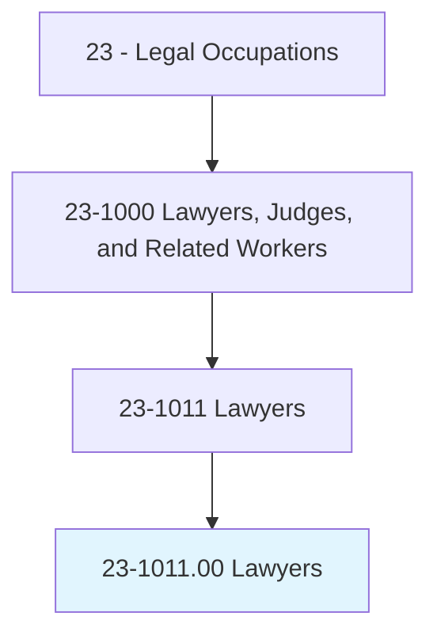
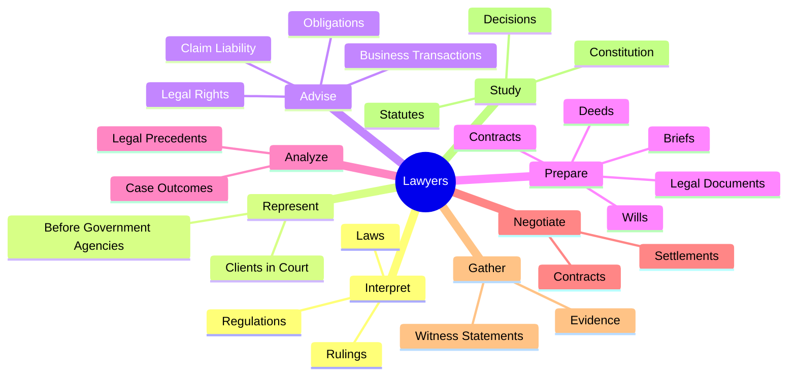
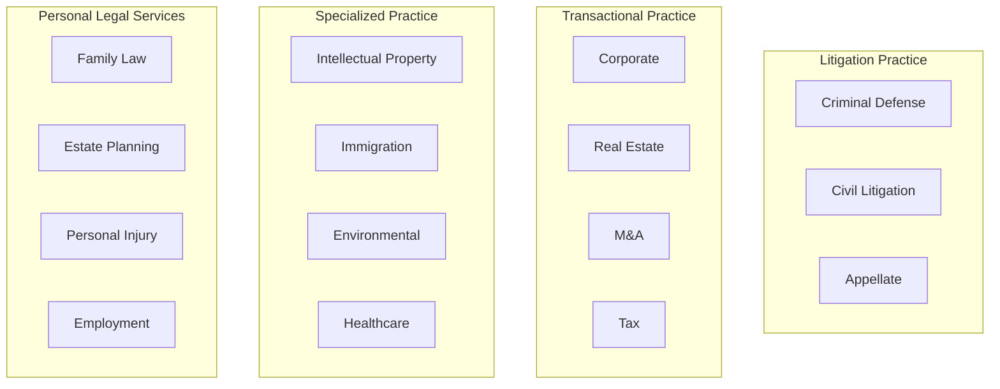
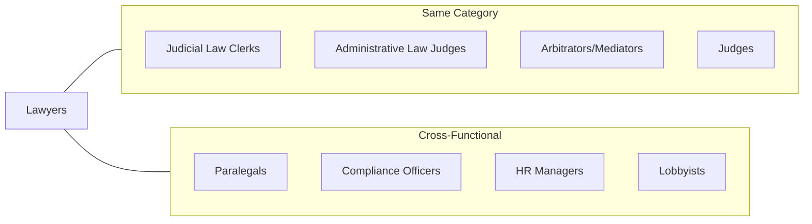
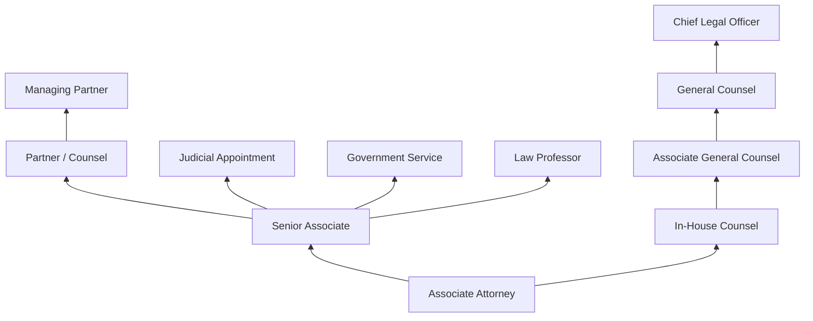

# Lawyers

> Represent clients in criminal and civil litigation and other legal proceedings, draw up legal documents, or manage or advise clients on legal transactions. May specialize in a single area or may practice broadly in many areas of law.

## Overview

Lawyers serve as advocates and advisors for individuals, businesses, and organizations navigating the legal system. They interpret laws and regulations, represent clients in courtrooms and before government agencies, draft and review legal documents, and provide strategic counsel on legal matters. The profession encompasses numerous specializations including corporate law, criminal defense, intellectual property, family law, real estate, tax law, and many others. Lawyers must balance analytical rigor with persuasive communication, maintaining high ethical standards while zealously advocating for their clients' interests.

## Classification Hierarchy

## Key Statistics

| Metric | Value |
|--------|-------|
| SOC Code | 23-1011.00 |
| Job Zone | 5 (Extensive Preparation) |
| Category | [Legal](/occupations/Legal/index) |
| Core Tasks | 20+ |
| Source | O*NET |

## Core Tasks

### interpret.Laws

Lawyers translate complex legal frameworks into actionable guidance for clients.

**Actions:**
- `interpret.Laws.for.Individuals` - Explain legal requirements and implications to individual clients
- `interpret.Laws.for.Businesses` - Advise business entities on regulatory compliance
- `interpret.Rulings.for.Individuals` - Analyze court rulings affecting client matters
- `interpret.Rulings.for.Businesses` - Apply case law to business operations
- `interpret.Regulations.for.Individuals` - Guide compliance with regulatory requirements
- `interpret.Regulations.for.Businesses` - Develop corporate compliance strategies

### represent.Clients

Lawyers advocate for clients in formal legal proceedings and before regulatory bodies.

**Actions:**
- `represent.Clients.in.CourtGovernmentAgencies` - Appear before courts and tribunals on behalf of clients
- `represent.Clients.in.BeforeGovernmentAgencies` - Handle administrative proceedings and regulatory matters
- `present.Cases.to.judges` - Deliver oral arguments to judicial officers
- `present.Cases.to.Juries` - Present evidence and arguments to jury panels
- `present.Evidence.to.DefendClientsDefendantsInCriminalCivilLitigation` - Submit evidence supporting client positions

### advise.Clients

Lawyers provide strategic counsel on legal matters affecting clients' interests.

**Actions:**
- `advise.Clients.concerning.BusinessTransactions.of.LegalRights` - Counsel on transactional matters
- `advise.Clients.concerning.BusinessTransactions.of.Obligations` - Explain contractual and legal duties
- `advise.ClaimLiability.of.ProsecutingLawsuits` - Assess merits of potential litigation
- `advise.ClaimLiability.of.DefendingLawsuits` - Evaluate defense strategies and settlement options
- `advise.Advisability.of.ProsecutingLawsuits` - Recommend litigation strategies

### prepare.LegalDocuments

Lawyers draft, review, and finalize legal instruments that protect client interests.

**Actions:**
- `prepare.LegalDocuments` - Create binding legal instruments
- `prepare.Wills` - Draft testamentary documents for estate planning
- `draft.Contracts` - Prepare agreements governing business relationships
- `draft.Deeds` - Create property transfer documents
- `draft.PatentApplications` - Prepare intellectual property filings
- `draft.LegalDocuments` - Author various legal instruments
- `review.Contracts` - Analyze agreements for client protection
- `review.LegalDocuments` - Examine documents for legal sufficiency

### analyze.ProbableOutcomes

Lawyers evaluate case strength and potential results to guide strategy.

**Actions:**
- `analyze.ProbableOutcomes.of.Cases` - Assess likely case results
- `analyze.ProbableOutcomes.of.UsingKnowledge.of.LegalPrecedents` - Apply precedent analysis to predictions
- `examine.LegalData.to.determine.AdvisabilityOfDefendingLawsuit` - Evaluate defense options
- `examine.LegalData.to.ProsecutingLawsuit` - Assess prosecution viability

### negotiate.Settlements

Lawyers work to resolve disputes through negotiation when appropriate.

**Actions:**
- `negotiate.Settlements.of.CivilDisputes` - Reach agreements without trial
- `negotiate.ContractualAgreements` - Negotiate business deals and contracts
- `select.Jurors.with.Judges` - Participate in jury selection process

### gather.Evidence

Lawyers collect and organize information supporting client positions.

**Actions:**
- `gather.Evidence.to.formulate.DefenseInitiateLegalActionsBySuchMeansAsInterviewingClientsWitnessesToAscertainFactsOfCase` - Develop case through investigation
- `gather.Evidence.to.ToInitiateLegalActionsBySuchMeansAsInterviewingClientsWitnessesToAscertainFactsOfCase` - Build evidentiary foundation

### study.Constitution

Lawyers research foundational legal sources to support arguments.

**Actions:**
- `study.Constitution.of.QuasiJudicialBodies.to.determine.RamificationsForCases` - Analyze constitutional implications
- `study.Statutes.of.QuasiJudicialBodies.to.determine.RamificationsForCases` - Research statutory authority
- `study.Decisions.of.QuasiJudicialBodies.to.determine.RamificationsForCases` - Examine administrative rulings
- `study.Regulations.of.QuasiJudicialBodies.to.determine.RamificationsForCases` - Understand regulatory frameworks

## Skills & Competencies

### Technical Skills
- **Legal Research** - Expert
- **Legal Writing** - Expert
- **Litigation & Trial Practice** - Advanced
- **Contract Drafting** - Advanced
- **Regulatory Compliance** - Advanced
- **Due Diligence** - Advanced
- **Discovery & E-Discovery** - Advanced

### Soft Skills
- **Critical Thinking** - Critical
- **Oral Communication** - Critical
- **Written Communication** - Critical
- **Persuasion** - Essential
- **Negotiation** - Essential
- **Active Listening** - Essential
- **Problem Solving** - Essential
- **Ethical Judgment** - Critical

## Legal Practice Areas

## Related Occupations

## Industries

- [Legal Services](/industries/LegalServices) - High Employment (Law Firms)
- [Government](/industries/PublicAdministration) - High Employment (Prosecutors, Public Defenders, Agency Counsel)
- [Finance and Insurance](/industries/Finance) - Moderate Employment (In-house Counsel)
- [Management of Companies](/industries/ManagementServices) - Moderate Employment (Corporate Legal Departments)
- [Healthcare](/industries/Healthcare/index) - Moderate Employment (Healthcare Law)

## Industry Variations

| Industry | Focus Areas | Typical Settings |
|----------|-------------|------------------|
| Law Firms | Client representation, billable hours | Private practice, partnerships |
| Corporate | Business transactions, compliance | In-house legal departments |
| Government | Public interest, prosecution/defense | DA offices, public defender, agencies |
| Nonprofit | Advocacy, civil rights | Legal aid organizations |
| Academia | Teaching, scholarship | Law schools |

## Career Progression

## Education & Training

| Requirement | Details |
|-------------|---------|
| Typical Education | Juris Doctor (J.D.) from ABA-accredited law school |
| Prerequisites | Bachelor's degree, LSAT |
| Licensure | State bar examination and admission |
| Work Experience | Clerkships, internships, associate positions |
| On-the-Job Training | Supervised practice, mentorship, CLE |
| Continuing Education | Mandatory Continuing Legal Education (CLE) credits |

## Professional Certifications

- State Bar Admission (required)
- Board Certification in Specialty Areas (optional)
- Patent Bar (for patent attorneys)
- Certified Fraud Examiner (CFE)
- Certified Information Privacy Professional (CIPP)

## Departments

This occupation typically works in:
- [Legal Department](/departments/Legal/index)
- Compliance
- Corporate Counsel
- Risk Management

## Professional Associations

- American Bar Association (ABA)
- State and local bar associations
- Specialty bar associations (IP, Family Law, Criminal Defense, etc.)
- American Association for Justice
- Defense Research Institute

---

*Source: O*NET 23-1011.00 - ONETOccupation*
