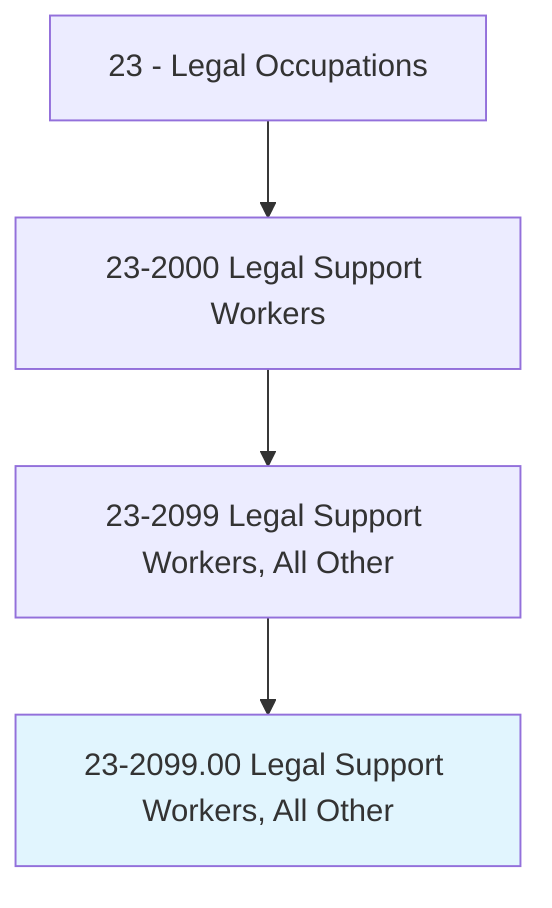
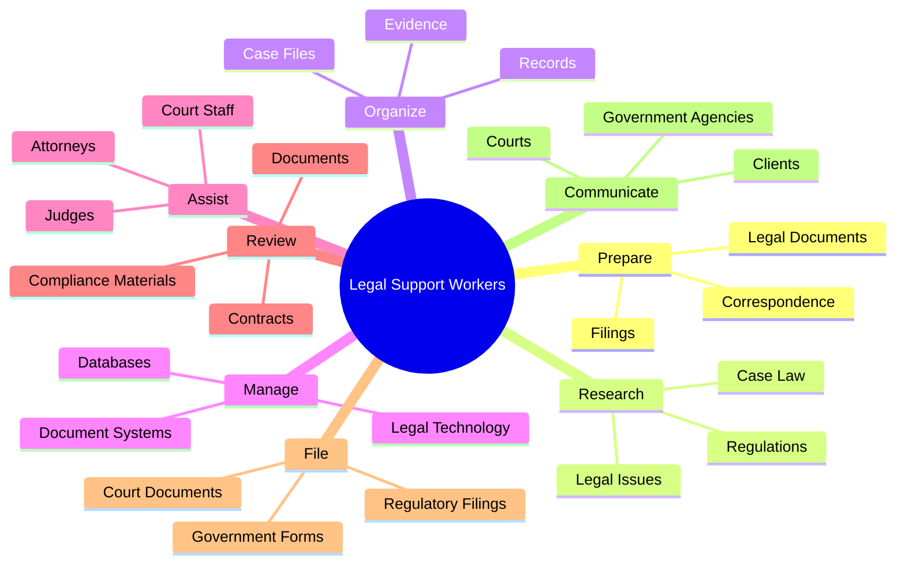
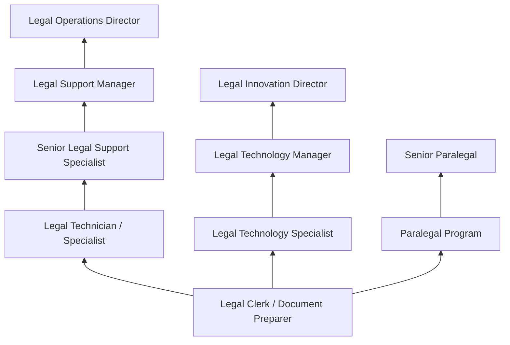
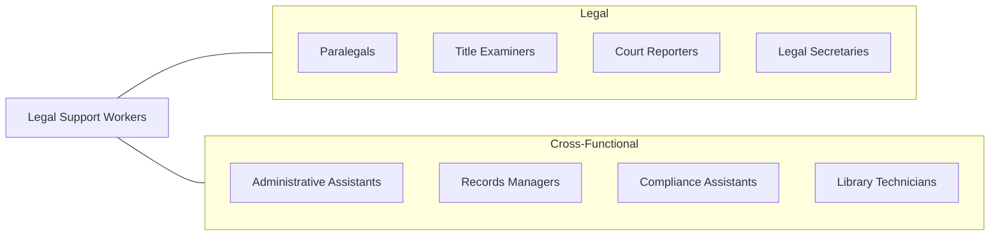

# Legal Support Workers, All Other

> All legal support workers not listed separately.

## Overview

Legal Support Workers encompasses a broad category of paraprofessional and support roles within the legal field that do not fall neatly into other classified occupations such as paralegals, title examiners, or court reporters. These professionals provide essential operational, administrative, and substantive support to attorneys, judges, and legal organizations. Roles in this category include legal document preparers, law librarians, legal technicians, notaries public, patent agents, compliance assistants, and specialized legal technology professionals.

The diversity of this category reflects the legal profession's increasing complexity and specialization. As law firms, corporate legal departments, and government agencies adopt new technologies and expand their service models, new support roles continue to emerge. Legal technology specialists who manage e-discovery platforms, contract management systems, and legal analytics tools represent a growing segment. Similarly, document review specialists who work on large-scale litigation projects have become indispensable in modern legal practice. Many positions in this category require a combination of legal knowledge and specialized technical or administrative skills.

Entry requirements vary considerably across the roles within this category. Some positions require only a high school diploma with on-the-job training, while others demand paralegal certificates, specialized technology credentials, or advanced degrees in library science or information management. The common thread is direct involvement in the legal process in a support capacity, contributing to the efficient delivery of legal services.

## Classification Hierarchy

## Key Statistics

| Metric | Value |
|--------|-------|
| SOC Code | 23-2099.00 |
| Job Zone | 3-4 (Medium to Considerable Preparation) |
| Category | [Legal](/occupations/Legal/index) |
| Median Annual Salary | $52,000 |
| Employment | ~75,000 |
| Projected Growth | 5% (average) |
| Core Tasks | Varies by specialty |
| Source | O*NET |

## Core Tasks

### prepare.LegalDocuments

Legal Support Workers prepare various documents for legal proceedings and transactions.

**Actions:**
- `prepare.LegalDocuments.for.Filing` - Draft standardized legal forms and filings
- `prepare.Filings.for.CourtSubmission` - Prepare court submissions
- `prepare.Correspondence.for.Clients` - Draft client communications

### research.LegalIssues

Legal Support Workers conduct research to assist attorneys and other legal professionals.

**Actions:**
- `research.LegalIssues.for.CaseSupport` - Investigate legal questions
- `research.Regulations.for.ComplianceAnalysis` - Research regulatory requirements
- `research.CaseLaw.for.LegalArguments` - Identify relevant precedents

### manage.DocumentSystems

Legal Support Workers manage records and technology systems.

**Actions:**
- `manage.DocumentSystems.for.CaseOrganization` - Maintain filing and retrieval systems
- `manage.LegalTechnology.for.FirmOperations` - Support legal technology platforms
- `manage.Databases.for.InformationRetrieval` - Maintain legal research databases

## Skills & Competencies

### Technical Skills
- **Legal Document Preparation** - Advanced
- **Legal Research** - Intermediate to Advanced
- **Records Management** - Advanced
- **Legal Technology Platforms** - Intermediate to Advanced
- **Court Filing Procedures** - Intermediate
- **Regulatory Compliance** - Intermediate
- **Database Management** - Intermediate

### Soft Skills
- **Attention to Detail** - Critical
- **Organizational Skills** - Critical
- **Written Communication** - Essential
- **Confidentiality** - Critical
- **Time Management** - Essential
- **Adaptability** - Essential
- **Teamwork** - Important
- **Problem Solving** - Important

## Education & Certifications

| Requirement | Details |
|-------------|---------|
| Typical Education | High school diploma to bachelor's degree (varies by role) |
| Paralegal Certificate | Beneficial for document preparation roles |
| Notary Public Commission | Required for notarial services |
| Legal Technology Certifications | Relativity Certified Administrator, CEDS (e-Discovery) |
| Library Science Degree | Required for law librarian roles (MLS/MLIS) |
| Patent Agent Registration | Required for patent agent work (USPTO exam) |
| Continuing Education | Varies by specialty and certification |

## Career Progression

## Industry Variations

| Setting | Focus | Unique Aspects |
|---------|-------|----------------|
| Law Firms | Document preparation, filing, research | Billable support; deadline-driven; multiple practice areas |
| Corporate Legal | Contract management, compliance support | Business integration; vendor management; process optimization |
| Government | Regulatory filings, public records | Civil service positions; benefits; agency-specific procedures |
| Legal Technology Companies | Software support, implementation | Technical expertise; vendor-side; product knowledge |

## Technology & Tools

- **Document Management** - iManage, NetDocuments, SharePoint
- **e-Discovery Platforms** - Relativity, Everlaw, Logikcull
- **Legal Research** - Westlaw, LexisNexis, Bloomberg Law
- **Contract Management** - Ironclad, Agiloft, ContractPodAi
- **Court Filing** - PACER, CM/ECF, state e-filing systems
- **Office Productivity** - Microsoft Office, Adobe Acrobat Pro
- **Communication** - Client portals, secure messaging platforms

## Related Occupations

## Departments

This occupation typically works in:
- [Legal Department](/departments/Legal) - Core legal support
- Compliance - Regulatory support
- Administration - Operational support
- [Information Technology](/departments/Technology) - Legal technology management

---

*Source: O*NET 23-2099.00 - ONETOccupation*
