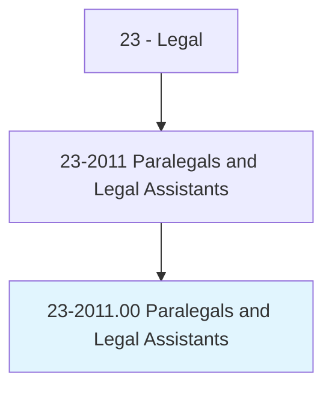
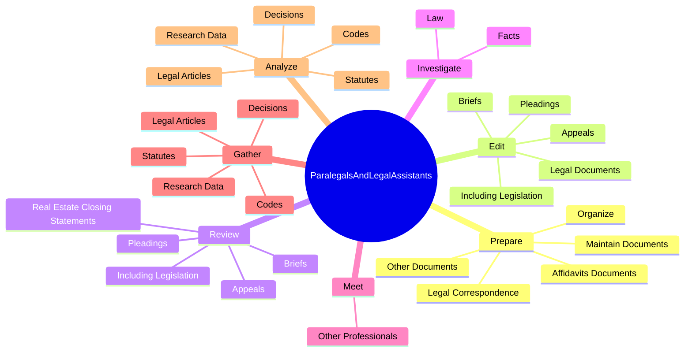
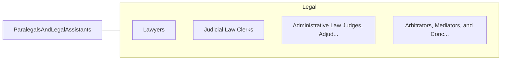

# Paralegals and Legal Assistants

> Assist lawyers by investigating facts, preparing legal documents, or researching legal precedent. Conduct research to support a legal proceeding, to formulate a defense, or to initiate legal action.

## Overview

Paralegals and Legal Assistants is an occupation within the Legal category. Assist lawyers by investigating facts, preparing legal documents, or researching legal precedent. 

## Classification Hierarchy

## Key Statistics

| Metric | Value |
|--------|-------|
| SOC Code | 23-2011.00 |
| Category | [Legal](/occupations/Legal/index) |
| Task Count | 68 |
| Source | O*NET |

## Core Tasks

### prepare.AffidavitsDocuments

Paralegals and Legal Assistants prepare affidavits documents as part of their core responsibilities.

**Actions:**
- `prepare.AffidavitsDocuments.in.PaperFilingSystem`
- `prepare.AffidavitsDocuments.in.ElectronicFilingSystem`
- `prepare.OtherDocuments.in.PaperFilingSystem`
- `prepare.OtherDocuments.in.ElectronicFilingSystem`

### edit.LegalDocuments

Paralegals and Legal Assistants edit legal documents as part of their core responsibilities.

**Actions:**
- `edit.LegalDocuments`
- `edit.IncludingLegislation`
- `edit.Briefs`
- `edit.Pleadings`

### review.IncludingLegislation

Paralegals and Legal Assistants review including legislation as part of their core responsibilities.

**Actions:**
- `review.IncludingLegislation`
- `review.Briefs`
- `review.Pleadings`
- `review.Appeals`

## Skills & Competencies

### Technical Skills
- **Legal Research** - Advanced
- **Legal Writing** - Advanced
- **Regulatory Knowledge** - Advanced

### Soft Skills
- **Communication** - Essential
- **Problem Solving** - Essential
- **Critical Thinking** - Important
- **Teamwork** - Important
- **Adaptability** - Important

## Related Occupations

## Industries

This occupation is found across multiple industries. See [Industries](/industries) for sector-specific employment data.

## Career Progression

---

*Source: O*NET 23-2011.00 - ONETOccupation*
