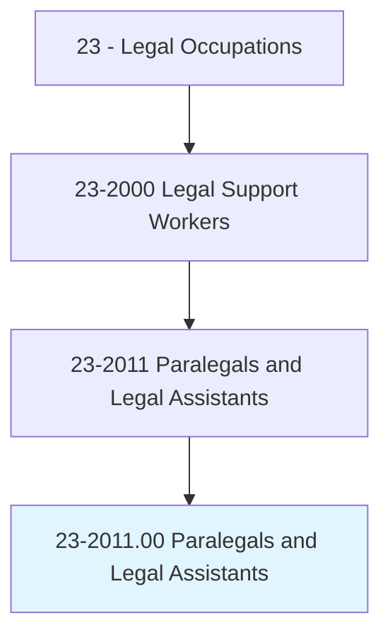
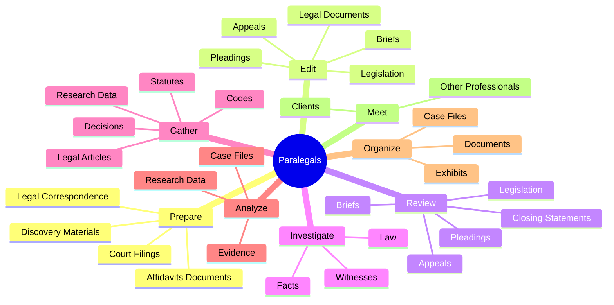
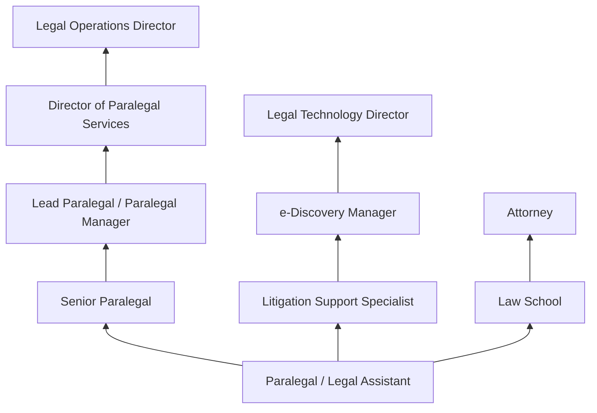
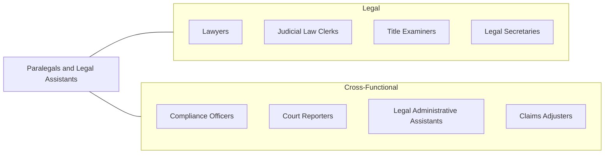

# Paralegals and Legal Assistants

> Assist lawyers by investigating facts, preparing legal documents, or researching legal precedent. Conduct research to support a legal proceeding, to formulate a defense, or to initiate legal action.

## Overview

Paralegals and Legal Assistants are essential members of legal teams who perform substantive legal work under the supervision of attorneys. They conduct legal research, draft documents, organize case files, interview witnesses, and manage the administrative complexities of litigation and transactional practice. While they cannot provide legal advice, represent clients in court, or set legal fees, paralegals handle much of the foundational work that enables attorneys to practice effectively and serve clients efficiently.

The paralegal profession has grown significantly as law firms, corporate legal departments, and government agencies have recognized the cost-effectiveness of delegating substantive legal tasks to qualified paraprofessionals. Modern paralegals often specialize in practice areas such as litigation, corporate law, real estate, intellectual property, family law, immigration, or bankruptcy. In each specialty, they develop deep procedural knowledge and subject-matter expertise that makes them indispensable to their legal teams. Some experienced paralegals manage entire case portfolios, coordinate with expert witnesses, and oversee document production in complex litigation.

The profession offers multiple pathways to entry, including associate's and bachelor's degree programs in paralegal studies, certificate programs approved by the American Bar Association, and on-the-job training. Professional certifications such as the Certified Paralegal (CP) from NALA or the Paralegal CORE Competency Exam from NFPA demonstrate competence and enhance career prospects.

## Classification Hierarchy

## Key Statistics

| Metric | Value |
|--------|-------|
| SOC Code | 23-2011.00 |
| Job Zone | 3 (Medium Preparation) |
| Category | [Legal](/occupations/Legal/index) |
| Median Annual Salary | $59,200 |
| Employment | ~345,000 |
| Projected Growth | 4% (as fast as average) |
| Core Tasks | 68 |
| Source | O*NET |

## Core Tasks

### prepare.AffidavitsDocuments

Paralegals prepare legal documents for filing and case management.

**Actions:**
- `prepare.AffidavitsDocuments.in.PaperFilingSystem` - Draft affidavits for physical filing
- `prepare.AffidavitsDocuments.in.ElectronicFilingSystem` - Prepare e-filed documents
- `prepare.OtherDocuments.in.PaperFilingSystem` - Create supporting legal documents
- `prepare.OtherDocuments.in.ElectronicFilingSystem` - File documents electronically
- `prepare.LegalCorrespondence.for.Attorneys` - Draft letters and communications

### edit.LegalDocuments

Paralegals review and edit legal documents for accuracy and compliance.

**Actions:**
- `edit.LegalDocuments` - Review and revise legal filings
- `edit.IncludingLegislation` - Edit legislative analysis documents
- `edit.Briefs` - Proofread and edit legal briefs
- `edit.Pleadings` - Refine pleadings and motions

### review.IncludingLegislation

Paralegals review legal materials to support case strategy.

**Actions:**
- `review.IncludingLegislation` - Analyze relevant statutory provisions
- `review.Briefs` - Evaluate opposing and supporting briefs
- `review.Pleadings` - Assess filed pleadings
- `review.Appeals` - Review appellate materials

### investigate.Facts

Paralegals conduct factual investigations to support legal proceedings.

**Actions:**
- `investigate.Facts.for.CasePreparation` - Research background information and evidence
- `investigate.Law.for.LegalStrategy` - Identify applicable legal authorities

### gather.ResearchData

Paralegals collect legal research materials and organize findings.

**Actions:**
- `gather.ResearchData.from.LegalDatabases` - Search Westlaw, LexisNexis, and other platforms
- `gather.Statutes.for.CaseAnalysis` - Compile relevant statutory provisions
- `gather.Decisions.for.Precedent` - Collect case law supporting legal arguments
- `gather.LegalArticles.for.Research` - Review secondary sources and commentary

## Skills & Competencies

### Technical Skills
- **Legal Research (Westlaw/LexisNexis)** - Expert
- **Legal Writing and Drafting** - Advanced
- **Document Management** - Advanced
- **E-Discovery and Litigation Support** - Advanced
- **Case Management Software** - Advanced
- **Court Filing Procedures** - Advanced
- **Citation and Bluebook Formatting** - Advanced
- **Deposition Preparation** - Intermediate

### Soft Skills
- **Attention to Detail** - Critical
- **Organizational Skills** - Critical
- **Written Communication** - Critical
- **Time Management** - Essential
- **Confidentiality** - Critical
- **Critical Thinking** - Essential
- **Teamwork** - Essential
- **Client Communication** - Important

## Education & Certifications

| Requirement | Details |
|-------------|---------|
| Typical Education | Associate's or Bachelor's degree in Paralegal Studies |
| ABA-Approved Programs | Preferred by many employers; ensures curriculum standards |
| Certified Paralegal (CP) | NALA certification; exam-based credential |
| PACE Certification | NFPA Paralegal CORE Competency Exam |
| Advanced Paralegal Certification | NALA specialty certifications (e-Discovery, contracts, etc.) |
| Continuing Education | CLE credits required for certification maintenance |
| State-Specific Requirements | Some states have registration or licensing requirements |

## Career Progression

## Industry Variations

| Setting | Focus | Unique Aspects |
|---------|-------|----------------|
| Law Firms (Large) | Litigation, corporate, IP | High specialization; complex multi-party cases; billable hours |
| Law Firms (Small) | General practice | Broad responsibilities; client-facing; diverse case types |
| Corporate Legal Departments | Contracts, compliance, governance | Business integration; regulatory focus; in-house culture |
| Government Agencies | Administrative law, prosecution | Public sector benefits; regulatory expertise; caseload management |
| Nonprofit / Legal Aid | Pro bono, public interest | Client advocacy; community engagement; resource constraints |

## Technology & Tools

- **Legal Research** - Westlaw, LexisNexis, Bloomberg Law, Fastcase
- **Case Management** - Clio, PracticePanther, MyCase, Litify
- **e-Discovery** - Relativity, Concordance, Logikcull, Everlaw
- **Document Management** - iManage, NetDocuments, SharePoint
- **Court Filing** - PACER, CM/ECF, state e-filing systems
- **Document Drafting** - HotDocs, Contract Express, MS Office Suite
- **Time and Billing** - TimeSolv, Bill4Time, LEDES billing
- **Communication** - Secure email, client portals, Teams/Slack

## Related Occupations

## Departments

This occupation typically works in:
- [Legal Department](/departments/Legal) - Core legal support function
- Compliance - Regulatory compliance support
- Risk Management - Contract and claims analysis
- Corporate Governance - Board and governance support

---

*Source: O*NET 23-2011.00 - ONETOccupation*
