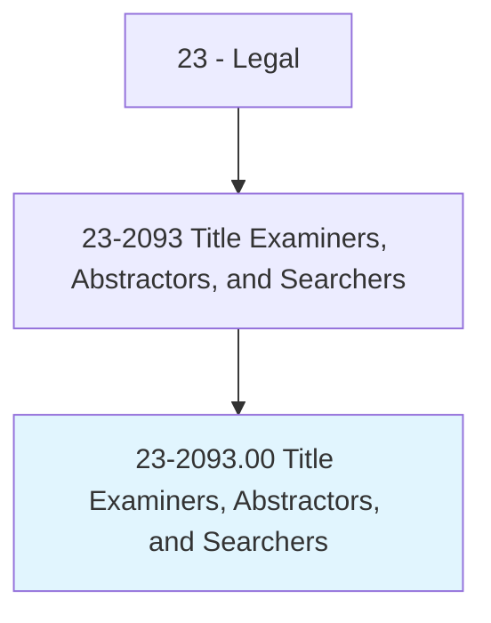
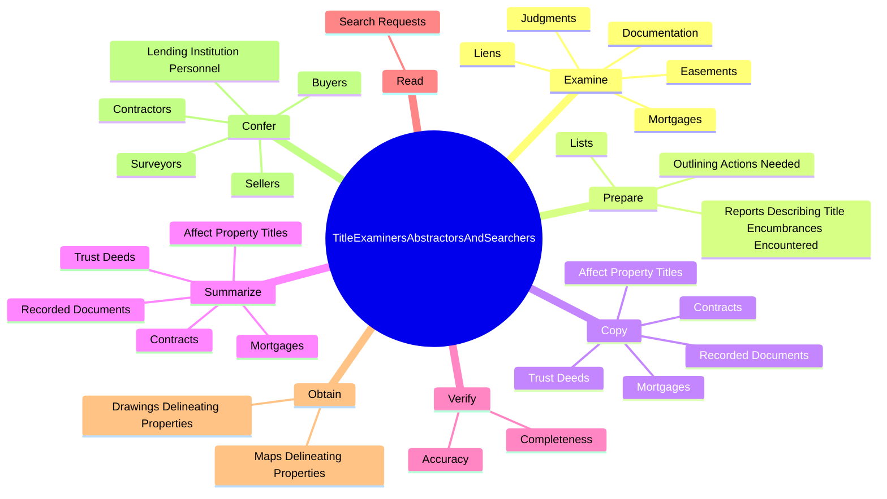
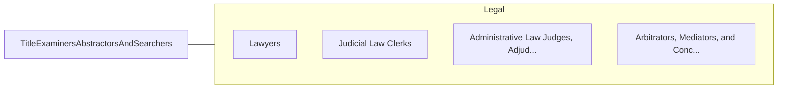

# Title Examiners, Abstractors, and Searchers

> Search real estate records, examine titles, or summarize pertinent legal or insurance documents or details for a variety of purposes. May compile lists of mortgages, contracts, and other instruments pertaining to titles by searching public and private records for law firms, real estate agencies, or title insurance companies.

## Overview

Title Examiners, Abstractors, and Searchers is an occupation within the Legal category. Search real estate records, examine titles, or summarize pertinent legal or insurance documents or details for a variety of purposes. 

## Classification Hierarchy

## Key Statistics

| Metric | Value |
|--------|-------|
| SOC Code | 23-2093.00 |
| Category | [Legal](/occupations/Legal/index) |
| Task Count | 104 |
| Source | O*NET |

## Core Tasks

### examine.Documentation

Title Examiners, Abstractors, and Searchers examine documentation as part of their core responsibilities.

**Actions:**
- `examine.Documentation.to.verify.Factors`
- `examine.Documentation.to.PropertiesLegalDescriptions`
- `examine.Documentation.to.Ownership`
- `examine.Documentation.to.Restrictions`

### prepare.ReportsDescribingTitleEncumbrancesEncountered

Title Examiners, Abstractors, and Searchers prepare reports describing title encumbrances encountered as part of their core responsibilities.

**Actions:**
- `prepare.ReportsDescribingTitleEncumbrancesEncountered.during.SearchingActivities.to.clear.Titles`
- `prepare.OutliningActionsNeeded.to.clear.Titles`
- `prepare.Lists.of.LegalInstrumentsApplyingToSpecificPieceOfLand`
- `prepare.Lists.of.Buildings.on.It`

### copy.RecordedDocuments

Title Examiners, Abstractors, and Searchers copy recorded documents as part of their core responsibilities.

**Actions:**
- `copy.RecordedDocuments`
- `copy.Mortgages`
- `copy.TrustDeeds`
- `copy.Contracts`

## Skills & Competencies

### Technical Skills
- **Legal Research** - Advanced
- **Legal Writing** - Advanced
- **Regulatory Knowledge** - Advanced

### Soft Skills
- **Communication** - Essential
- **Problem Solving** - Essential
- **Critical Thinking** - Important
- **Teamwork** - Important
- **Adaptability** - Important

## Related Occupations

## Industries

This occupation is found across multiple industries. See [Industries](/industries) for sector-specific employment data.

## Career Progression

---

*Source: O*NET 23-2093.00 - ONETOccupation*
