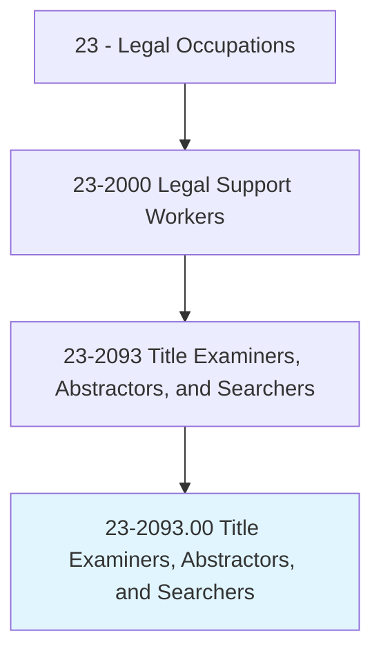
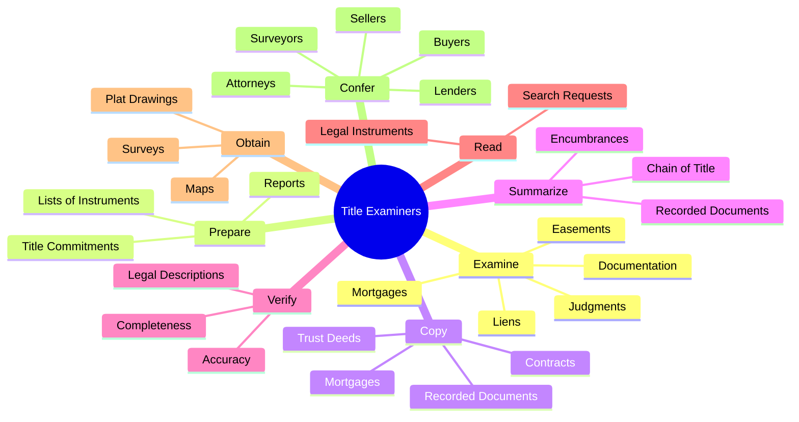
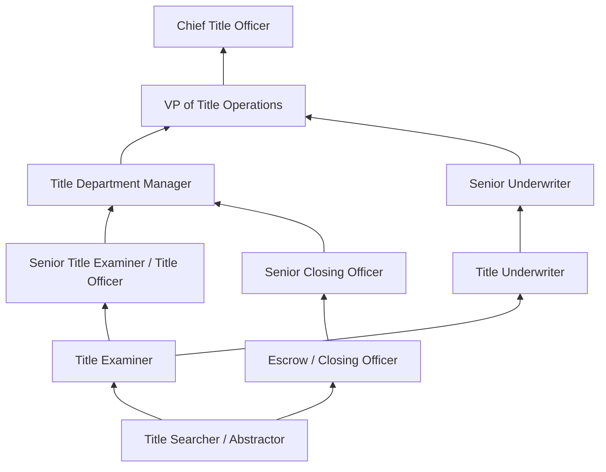
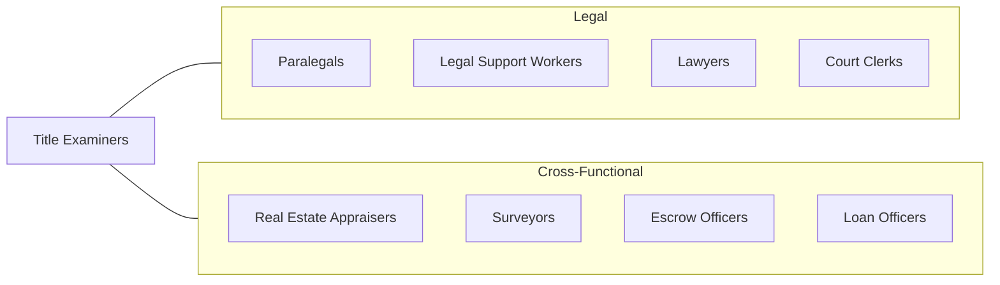

# Title Examiners, Abstractors, and Searchers

> Search real estate records, examine titles, or summarize pertinent legal or insurance documents or details for a variety of purposes. May compile lists of mortgages, contracts, and other instruments pertaining to titles by searching public and private records for law firms, real estate agencies, or title insurance companies.

## Overview

Title Examiners, Abstractors, and Searchers play a critical role in real estate transactions by ensuring that property titles are clear, valid, and free of encumbrances that could impair ownership rights. They search public records at county recorder offices, courts, and government agencies to trace the chain of title for real property, identifying mortgages, liens, easements, judgments, tax obligations, and other claims that may affect a property's marketability. Their work is essential to every real estate closing, refinancing, and title insurance policy issuance.

These professionals examine historical documents spanning decades or even centuries of property ownership, creating abstracts of title that summarize all recorded instruments affecting a parcel. They verify legal descriptions, confirm boundary surveys, and identify potential defects that must be resolved before a transaction can close. In cases where title issues arise, they work closely with attorneys, lenders, real estate agents, and property owners to clear defects through curative documents, quiet title actions, or other remedies. The accuracy of their work directly protects buyers, lenders, and title insurance companies from financial losses due to undiscovered claims.

The profession has evolved significantly with the digitization of public records and the advent of automated title search platforms. While technology has accelerated the search process, the interpretive skills required to evaluate complex title histories, understand legal instruments, and identify potential risks remain fundamentally human capabilities. Title professionals must understand real property law, recording statutes, and the nuances of conveyancing in their jurisdictions.

## Classification Hierarchy

## Key Statistics

| Metric | Value |
|--------|-------|
| SOC Code | 23-2093.00 |
| Job Zone | 3 (Medium Preparation) |
| Category | [Legal](/occupations/Legal/index) |
| Median Annual Salary | $48,500 |
| Employment | ~57,000 |
| Projected Growth | 1% (slower than average) |
| Core Tasks | 104 |
| Source | O*NET |

## Core Tasks

### examine.Documentation

Title Examiners review property records to verify ownership and identify encumbrances.

**Actions:**
- `examine.Documentation.to.verify.LegalDescriptions` - Confirm property boundary descriptions
- `examine.Documentation.to.verify.Ownership` - Trace chain of title
- `examine.Documentation.to.verify.Restrictions` - Identify covenants and restrictions
- `examine.Mortgages.to.identify.Liens` - Locate outstanding mortgage obligations
- `examine.Judgments.to.identify.Claims` - Find judgment liens against property

### prepare.Reports

Title Examiners create reports documenting their findings and recommendations.

**Actions:**
- `prepare.ReportsDescribingTitleEncumbrancesEncountered.during.SearchingActivities.to.clear.Titles` - Document title defects found
- `prepare.OutliningActionsNeeded.to.clear.Titles` - Recommend curative measures
- `prepare.Lists.of.LegalInstrumentsApplyingToSpecificPieceOfLand` - Compile instrument inventories
- `prepare.TitleCommitments.for.InsuranceIssuance` - Draft title insurance commitments

### copy.RecordedDocuments

Title Examiners collect copies of relevant recorded instruments.

**Actions:**
- `copy.RecordedDocuments` - Obtain copies from public records
- `copy.Mortgages` - Reproduce mortgage documents
- `copy.TrustDeeds` - Duplicate trust deed records
- `copy.Contracts` - Copy relevant contract documents

### verify.Accuracy

Title Examiners confirm the accuracy and completeness of title information.

**Actions:**
- `verify.Accuracy.of.TitleInformation` - Cross-check data across multiple sources
- `verify.Completeness.of.SearchResults` - Ensure all relevant records are captured
- `verify.LegalDescriptions.against.Surveys` - Compare legal descriptions to survey data

## Skills & Competencies

### Technical Skills
- **Real Property Law** - Expert
- **Title Search Methodology** - Expert
- **Legal Description Interpretation** - Expert
- **Recording Statutes** - Advanced
- **Title Insurance Underwriting** - Advanced
- **Public Records Research** - Expert
- **Survey and Plat Reading** - Advanced
- **Mortgage and Lien Analysis** - Advanced

### Soft Skills
- **Attention to Detail** - Critical
- **Analytical Thinking** - Critical
- **Research Persistence** - Essential
- **Written Communication** - Essential
- **Time Management** - Essential
- **Problem Solving** - Essential
- **Organizational Skills** - Critical
- **Client Communication** - Important

## Education & Certifications

| Requirement | Details |
|-------------|---------|
| Typical Education | Associate's or Bachelor's degree (business, paralegal studies, or related) |
| On-the-Job Training | Extensive; often 1-2 years of supervised search experience |
| Certified Title Examiner | American Land Title Association (ALTA) certification programs |
| State Licensing | Some states require title agent licensing |
| National Title Professional (NTP) | ALTA designation for experienced professionals |
| Continuing Education | Title industry seminars, ALTA conventions, state association courses |
| Title Insurance License | Required in many states for title insurance issuance |

## Career Progression

## Industry Variations

| Setting | Focus | Unique Aspects |
|---------|-------|----------------|
| Title Insurance Companies | Underwriting, risk assessment | High volume; automated search tools; claims prevention focus |
| Law Firms (Real Estate) | Transactional support, litigation | Opinion letters; quiet title actions; complex title issues |
| Real Estate Agencies | Transaction support, closing coordination | Client-facing; deadline-driven; market-cycle sensitivity |
| Government (County Recorder) | Public records management | Record indexing; grantor-grantee maintenance; public service |
| Lending Institutions | Mortgage origination support | Lender requirements; regulatory compliance; secondary market standards |

## Technology & Tools

- **Title Search Platforms** - TitlePoint, DataTrace, RamQuest, SoftPro
- **Public Records Access** - County recorder online portals, ALTA registry
- **GIS and Mapping** - ArcGIS, Google Earth Pro, county GIS portals
- **Document Management** - TitleExpress, ResWare, Qualia
- **Title Production Software** - SoftPro, RamQuest, StreamLine
- **Legal Research** - Westlaw, state property law databases
- **Communication** - Secure email, client portals, closing management platforms

## Related Occupations

## Departments

This occupation typically works in:
- [Legal Department](/departments/Legal) - Real estate legal support
- Title Operations - Search and examination
- Underwriting - Title risk assessment
- Closing / Settlement - Transaction closing support

---

*Source: O*NET 23-2093.00 - ONETOccupation*
