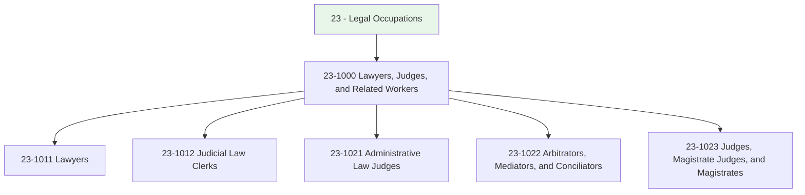
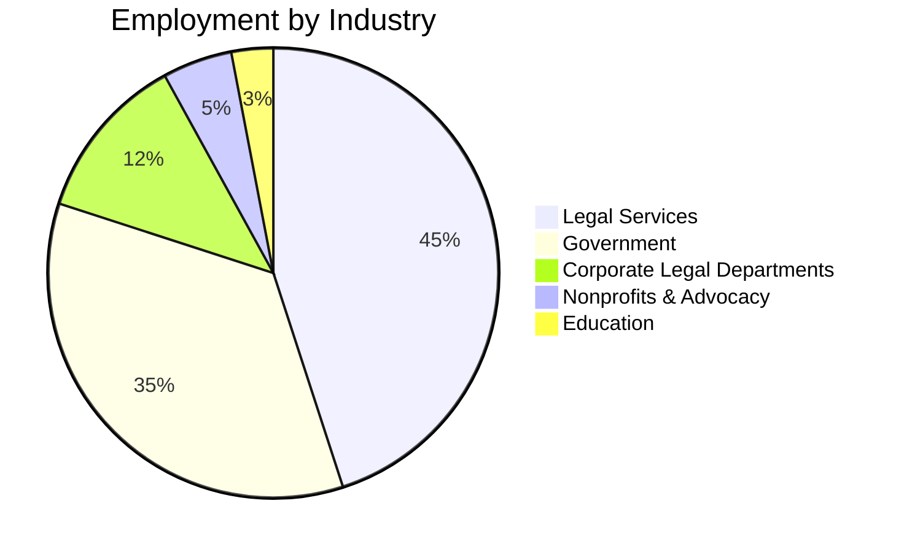
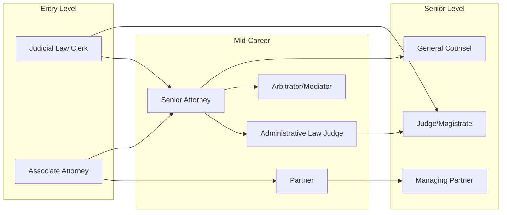

# Legal Occupations

> Occupations involved in providing legal services, administering justice, and resolving disputes through formal and alternative mechanisms.

## Overview

Legal occupations form the backbone of the justice system and provide essential services for individuals, businesses, and government entities. This category encompasses professionals who interpret and apply the law, adjudicate disputes, facilitate conflict resolution, and support judicial processes. These roles require extensive education, rigorous ethical standards, and deep knowledge of legal principles, precedents, and procedures.

## Classification Hierarchy

## Key Statistics

| Metric | Value |
|--------|-------|
| SOC Category | 23 |
| Total Occupations | 5 |
| Job Zone Range | 4-5 (Considerable to Extensive Preparation) |
| Primary Industries | Legal Services, Government, Corporate |

## Occupations in this Category

### Legal Practice

- [Lawyers](./Lawyers.mdx) - 23-1011.00
  - Represent clients in legal proceedings, draft documents, and provide legal counsel

### Judicial Support

- [Judicial Law Clerks](./JudicialLawClerks.mdx) - 23-1012.00
  - Assist judges with legal research and document preparation

### Adjudication

- [Administrative Law Judges, Adjudicators, and Hearing Officers](./AdminLawJudges.mdx) - 23-1021.00
  - Conduct hearings on government-related matters and claims

- [Arbitrators, Mediators, and Conciliators](./Arbitrators.mdx) - 23-1022.00
  - Facilitate dispute resolution outside the court system

- [Judges, Magistrate Judges, and Magistrates](./Judges.mdx) - 23-1023.00
  - Preside over court proceedings and administer justice

## Industry Distribution

## Career Pathways

## Common Skills Across Legal Occupations

### Technical Skills
- Legal Research and Analysis
- Legal Writing and Documentation
- Case Management
- Regulatory Compliance
- Contract Interpretation

### Soft Skills
- Critical Thinking
- Oral and Written Communication
- Ethical Judgment
- Active Listening
- Negotiation

## Related Categories

- [Management](/occupations/Management) - Legal Department Leadership
- [Business and Financial](/occupations/BusinessAndFinancial) - Compliance Officers
- [Community and Social Service](/occupations/SocialServices) - Legal Aid Workers

## Educational Requirements

| Occupation | Typical Education | Licensure |
|------------|------------------|-----------|
| Lawyers | Juris Doctor (J.D.) | State Bar Admission |
| Judicial Law Clerks | J.D. or in law school | None required |
| Administrative Law Judges | J.D. | Varies by jurisdiction |
| Arbitrators/Mediators | J.D. or specialized training | Certification preferred |
| Judges | J.D. + legal experience | Bar admission required |

---

*Source: O*NET Category 23 - Legal Occupations*
