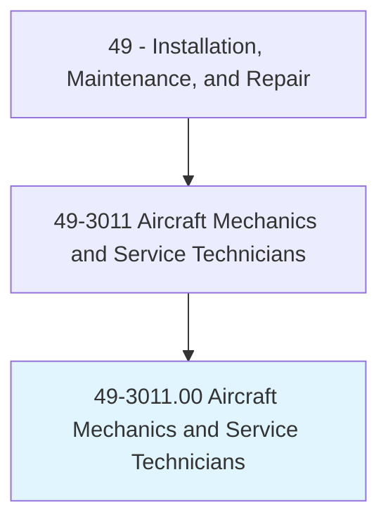
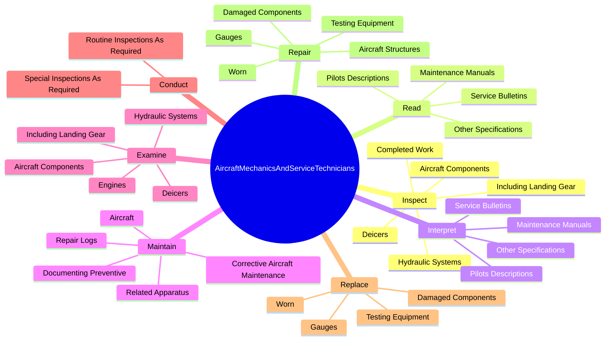
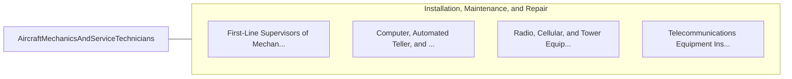

# Aircraft Mechanics and Service Technicians

> Diagnose, adjust, repair, or overhaul aircraft engines and assemblies, such as hydraulic and pneumatic systems.

## Overview

Aircraft Mechanics and Service Technicians is classified under Installation, Maintenance, and Repair (SOC 49). Diagnose, adjust, repair, or overhaul aircraft engines and assemblies, such as hydraulic and pneumatic systems.

## Classification Hierarchy

## Key Statistics

| Metric | Value |
|--------|-------|
| SOC Code | 49-3011.00 |
| Category | [Installation, Maintenance, and Repair](/occupations/Maintenance) |
| Task Count | 297 |
| Source | O*NET |

## Core Tasks

### inspect.CompletedWork

Aircraft Mechanics and Service Technicians inspect completed work as part of their core responsibilities.

**Actions:**
- `inspect.CompletedWork.to.certify.MaintenanceMeetsStandards`
- `inspect.CompletedWork.to.AircraftAreReadyForOperation`
- `inspect.AircraftComponents.to.locate.Cracks`
- `inspect.AircraftComponents.to.breaks`

### read.MaintenanceManuals

Aircraft Mechanics and Service Technicians read maintenance manuals as part of their core responsibilities.

**Actions:**
- `read.MaintenanceManuals.to.determine.FeasibilityOfRepairingReplacingMalfunctioningDamagedComponents`
- `read.MaintenanceManuals.to.MethodOfRepairingReplacingMalfunctioningDamagedComponents`
- `read.ServiceBulletins.to.determine.FeasibilityOfRepairingReplacingMalfunctioningDamagedComponents`
- `read.ServiceBulletins.to.MethodOfRepairingReplacingMalfunctioningDamagedComponents`

### interpret.MaintenanceManuals

Aircraft Mechanics and Service Technicians interpret maintenance manuals as part of their core responsibilities.

**Actions:**
- `interpret.MaintenanceManuals.to.determine.FeasibilityOfRepairingReplacingMalfunctioningDamagedComponents`
- `interpret.MaintenanceManuals.to.MethodOfRepairingReplacingMalfunctioningDamagedComponents`
- `interpret.ServiceBulletins.to.determine.FeasibilityOfRepairingReplacingMalfunctioningDamagedComponents`
- `interpret.ServiceBulletins.to.MethodOfRepairingReplacingMalfunctioningDamagedComponents`

## Skills & Competencies

### Technical Skills
- **Equipment Repair** - Advanced
- **Diagnostic Testing** - Advanced
- **Preventive Maintenance** - Advanced

### Soft Skills
- **Communication** - Essential
- **Problem Solving** - Essential
- **Critical Thinking** - Important
- **Teamwork** - Important
- **Adaptability** - Important

## Related Occupations

## Industries

This occupation is found across multiple industries. See [Industries](/industries) for sector-specific employment data.

## Career Progression

---

*Source: O*NET 49-3011.00 - ONETOccupation*
