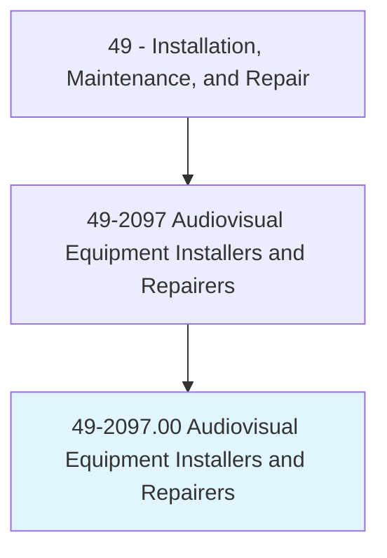
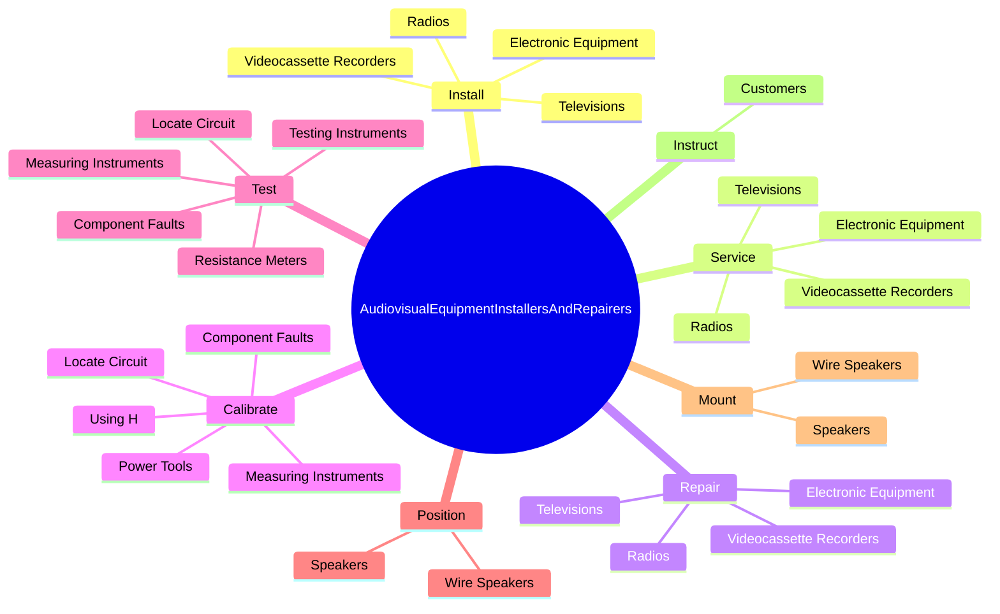
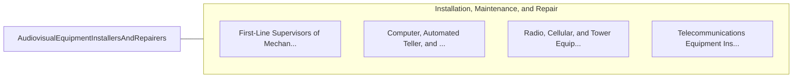

# Audiovisual Equipment Installers and Repairers

> Install, repair, or adjust audio or television receivers, stereo systems, camcorders, video systems, or other electronic entertainment equipment in homes or other venues. May perform routine maintenance.

## Overview

Audiovisual Equipment Installers and Repairers is an occupation within the Installation, Maintenance, and Repair category. Install, repair, or adjust audio or television receivers, stereo systems, camcorders, video systems, or other electronic entertainment equipment in homes or other venues. 

## Classification Hierarchy

## Key Statistics

| Metric | Value |
|--------|-------|
| SOC Code | 49-2097.00 |
| Category | [Installation, Maintenance, and Repair](/occupations/Maintenance/index) |
| Task Count | 75 |
| Source | O*NET |

## Core Tasks

### install.ElectronicEquipment

Audiovisual Equipment Installers and Repairers install electronic equipment as part of their core responsibilities.

**Actions:**
- `install.ElectronicEquipment`
- `install.Televisions`
- `install.Radios`
- `install.VideocassetteRecorders`

### service.ElectronicEquipment

Audiovisual Equipment Installers and Repairers service electronic equipment as part of their core responsibilities.

**Actions:**
- `service.ElectronicEquipment`
- `service.Televisions`
- `service.Radios`
- `service.VideocassetteRecorders`

### repair.ElectronicEquipment

Audiovisual Equipment Installers and Repairers repair electronic equipment as part of their core responsibilities.

**Actions:**
- `repair.ElectronicEquipment`
- `repair.Televisions`
- `repair.Radios`
- `repair.VideocassetteRecorders`

## Skills & Competencies

### Technical Skills
- **Equipment Repair** - Advanced
- **Diagnostic Testing** - Advanced
- **Preventive Maintenance** - Advanced

### Soft Skills
- **Communication** - Essential
- **Problem Solving** - Essential
- **Critical Thinking** - Important
- **Teamwork** - Important
- **Adaptability** - Important

## Related Occupations

## Industries

This occupation is found across multiple industries. See [Industries](/industries) for sector-specific employment data.

## Career Progression

---

*Source: O*NET 49-2097.00 - ONETOccupation*
