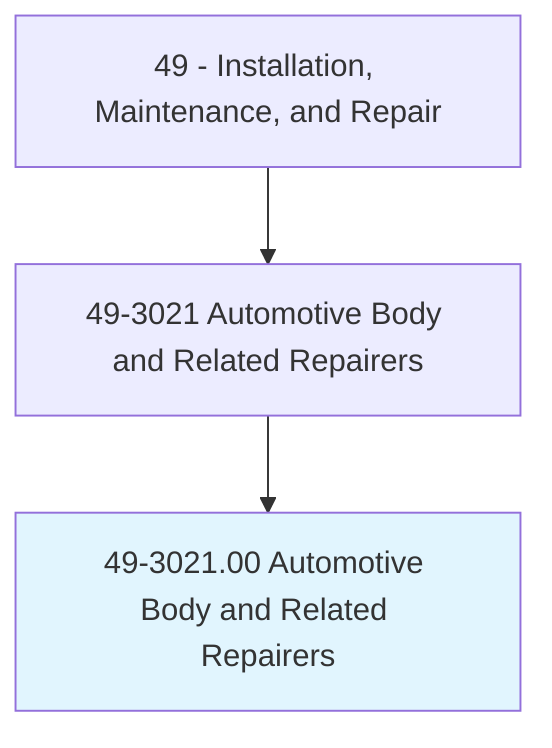
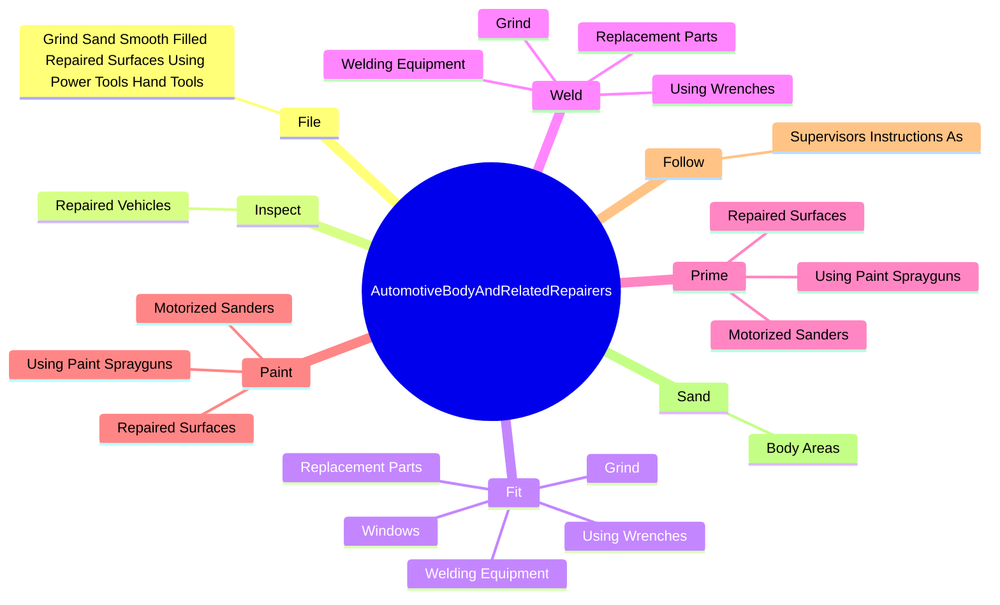
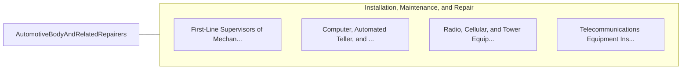

# Automotive Body and Related Repairers

> Repair and refinish automotive vehicle bodies and straighten vehicle frames.

## Overview

Automotive Body and Related Repairers is classified under Installation, Maintenance, and Repair (SOC 49). Repair and refinish automotive vehicle bodies and straighten vehicle frames.

## Classification Hierarchy

## Key Statistics

| Metric | Value |
|--------|-------|
| SOC Code | 49-3021.00 |
| Category | [Installation, Maintenance, and Repair](/occupations/Maintenance) |
| Task Count | 150 |
| Source | O*NET |

## Core Tasks

### file.GrindSandSmoothFilledRepairedSurfacesUsingPowerToolsHandTools

Automotive Body and Related Repairers file grind sand smooth filled repaired surfaces using power tools hand tools as part of their core responsibilities.

**Actions:**
- `file.GrindSandSmoothFilledRepairedSurfacesUsingPowerToolsHandTools`

### inspect.RepairedVehicles

Automotive Body and Related Repairers inspect repaired vehicles as part of their core responsibilities.

**Actions:**
- `inspect.RepairedVehicles.for.ProperFunctioning`
- `inspect.RepairedVehicles.for.Completion.of.Work`
- `inspect.RepairedVehicles.for.DimensionalAccuracy`
- `inspect.RepairedVehicles.for.OverallAppearance.of.PaintJob`

### fit.ReplacementParts

Automotive Body and Related Repairers fit replacement parts as part of their core responsibilities.

**Actions:**
- `fit.ReplacementParts.into.Place.to.smooth.Them`
- `fit.ReplacementParts.into.PlaceToUsingPowerGrinders`
- `fit.ReplacementParts.into.PlaceToOtherTools`
- `fit.UsingWrenches.to.smooth.Them`

## Skills & Competencies

### Technical Skills
- **Equipment Repair** - Advanced
- **Diagnostic Testing** - Advanced
- **Preventive Maintenance** - Advanced

### Soft Skills
- **Communication** - Essential
- **Problem Solving** - Essential
- **Critical Thinking** - Important
- **Teamwork** - Important
- **Adaptability** - Important

## Related Occupations

## Industries

This occupation is found across multiple industries. See [Industries](/industries) for sector-specific employment data.

## Career Progression

---

*Source: O*NET 49-3021.00 - ONETOccupation*
