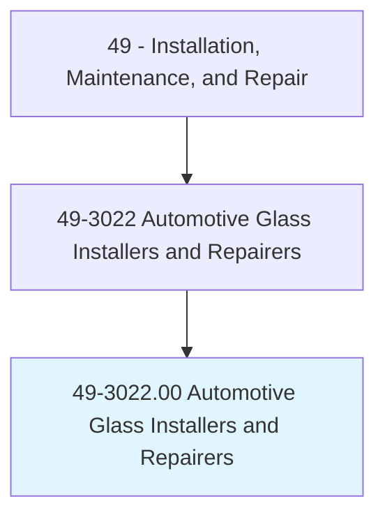
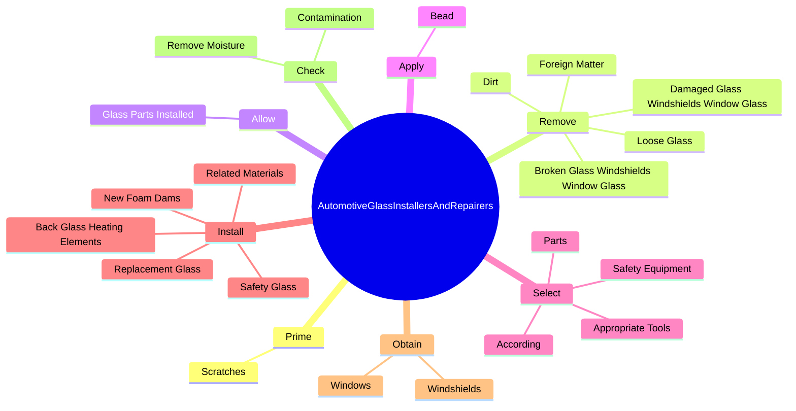
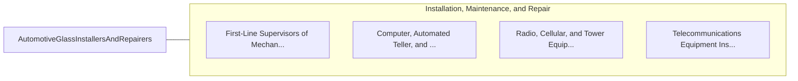

# Automotive Glass Installers and Repairers

> Replace or repair broken windshields and window glass in motor vehicles.

## Overview

Automotive Glass Installers and Repairers is classified under Installation, Maintenance, and Repair (SOC 49). Replace or repair broken windshields and window glass in motor vehicles.

## Classification Hierarchy

## Key Statistics

| Metric | Value |
|--------|-------|
| SOC Code | 49-3022.00 |
| Category | [Installation, Maintenance, and Repair](/occupations/Maintenance) |
| Task Count | 96 |
| Source | O*NET |

## Core Tasks

### prime.Scratches

Automotive Glass Installers and Repairers prime scratches as part of their core responsibilities.

**Actions:**
- `prime.Scratches.on.Pinchwelds.with.Primer`
- `prime.Scratches.on.Allow.to.Dry`

### remove.Dirt

Automotive Glass Installers and Repairers remove dirt as part of their core responsibilities.

**Actions:**
- `remove.Dirt.from.DamagedAreas`
- `remove.Dirt.from.ApplyPrimerAlongWindshield`
- `remove.Dirt.from.WindowEdges`
- `remove.Dirt.from.AllowPrimer.to.Dry`

### allow.GlassPartsInstalled

Automotive Glass Installers and Repairers allow glass parts installed as part of their core responsibilities.

**Actions:**
- `allow.GlassPartsInstalled.with.UrethaneAmpleTime.to.Cure`
- `allow.GlassPartsInstalled.with.TakingTemperature`
- `allow.GlassPartsInstalled.with.HumidityIntoAccount`

## Skills & Competencies

### Technical Skills
- **Equipment Repair** - Advanced
- **Diagnostic Testing** - Advanced
- **Preventive Maintenance** - Advanced

### Soft Skills
- **Communication** - Essential
- **Problem Solving** - Essential
- **Critical Thinking** - Important
- **Teamwork** - Important
- **Adaptability** - Important

## Related Occupations

## Industries

This occupation is found across multiple industries. See [Industries](/industries) for sector-specific employment data.

## Career Progression

---

*Source: O*NET 49-3022.00 - ONETOccupation*
