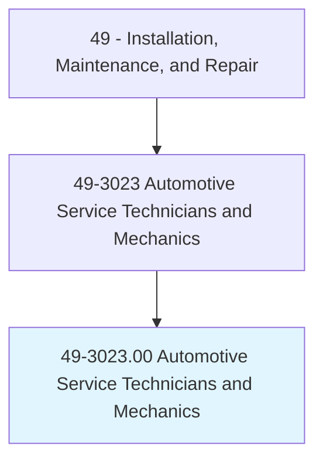
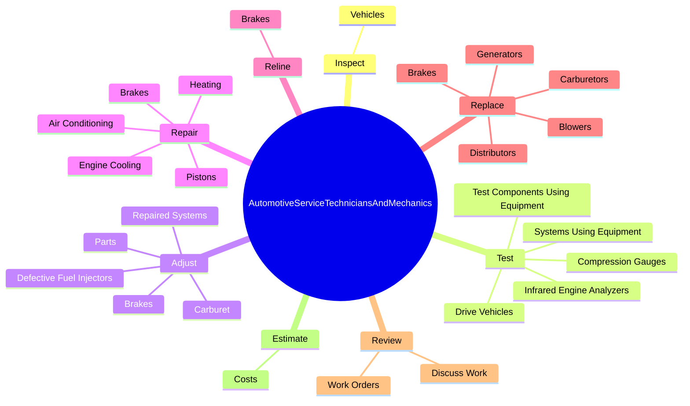
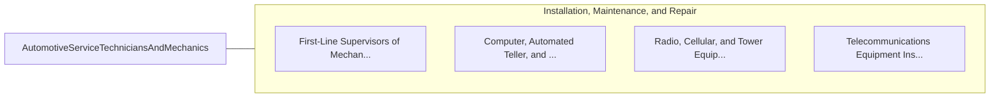

# Automotive Service Technicians and Mechanics

> Diagnose, adjust, repair, or overhaul automotive vehicles.

## Overview

Automotive Service Technicians and Mechanics is classified under Installation, Maintenance, and Repair (SOC 49). Diagnose, adjust, repair, or overhaul automotive vehicles.

## Classification Hierarchy

## Key Statistics

| Metric | Value |
|--------|-------|
| SOC Code | 49-3023.00 |
| Category | [Installation, Maintenance, and Repair](/occupations/Maintenance/index) |
| Task Count | 175 |
| Source | O*NET |

## Core Tasks

### inspect.Vehicles

Automotive Service Technicians and Mechanics inspect vehicles as part of their core responsibilities.

**Actions:**
- `inspect.Vehicles.for.Damage`
- `inspect.Vehicles.for.RecordFindingsSoNecessaryRepairsCanBeMade`

### test.DriveVehicles

Automotive Service Technicians and Mechanics test drive vehicles as part of their core responsibilities.

**Actions:**
- `test.DriveVehicles`
- `test.TestComponentsUsingEquipment`
- `test.SystemsUsingEquipment`
- `test.InfraredEngineAnalyzers`

### adjust.RepairedSystems

Automotive Service Technicians and Mechanics adjust repaired systems as part of their core responsibilities.

**Actions:**
- `adjust.RepairedSystems.to.meet.ManufacturersPerformanceSpecifications`
- `adjust.Brakes`
- `adjust.DefectiveFuelInjectors`
- `adjust.Carburet`

## Skills & Competencies

### Technical Skills
- **Equipment Repair** - Advanced
- **Diagnostic Testing** - Advanced
- **Preventive Maintenance** - Advanced

### Soft Skills
- **Communication** - Essential
- **Problem Solving** - Essential
- **Critical Thinking** - Important
- **Teamwork** - Important
- **Adaptability** - Important

## Related Occupations

## Industries

This occupation is found across multiple industries. See [Industries](/industries) for sector-specific employment data.

## Career Progression

---

*Source: O*NET 49-3023.00 - ONETOccupation*
