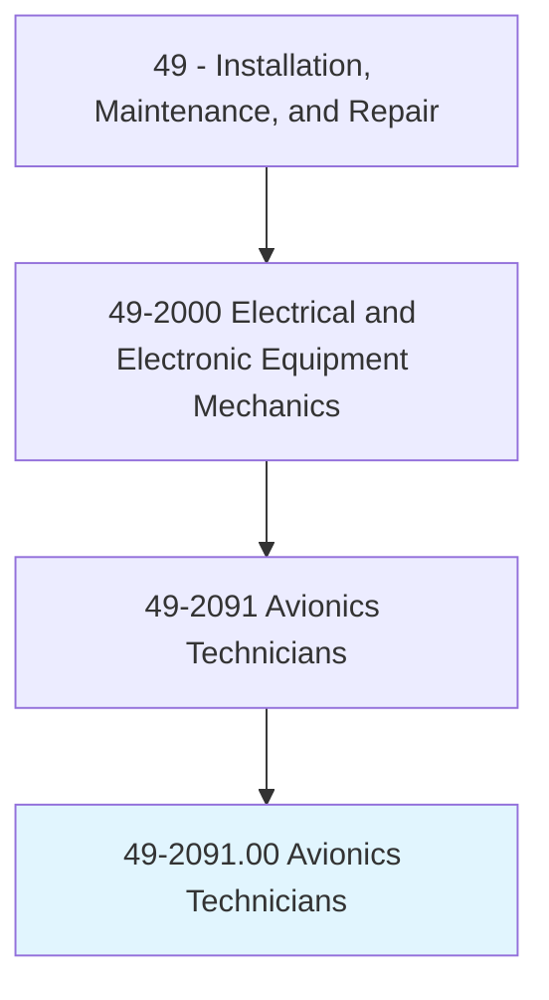
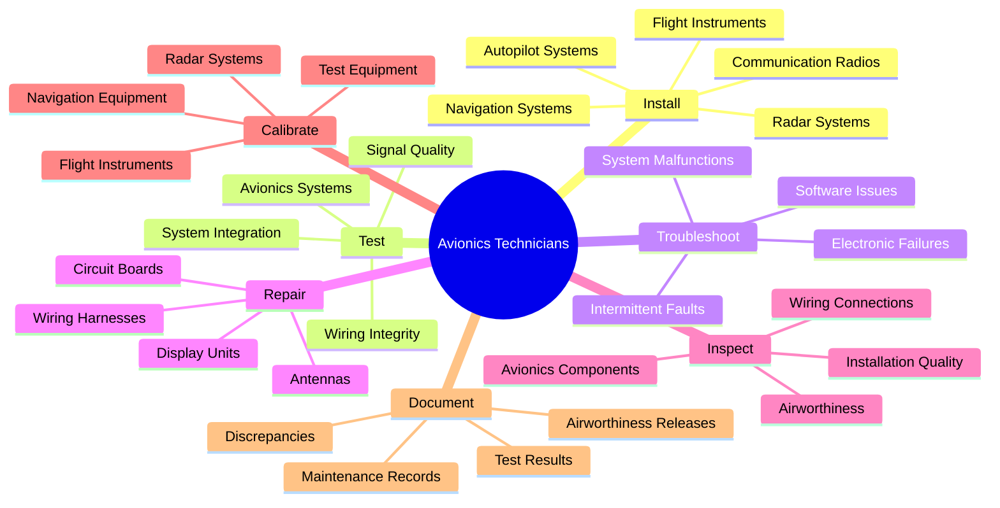
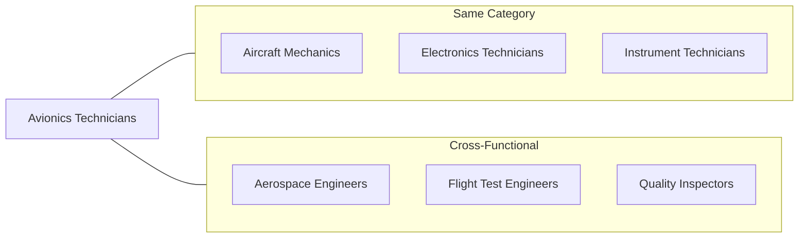
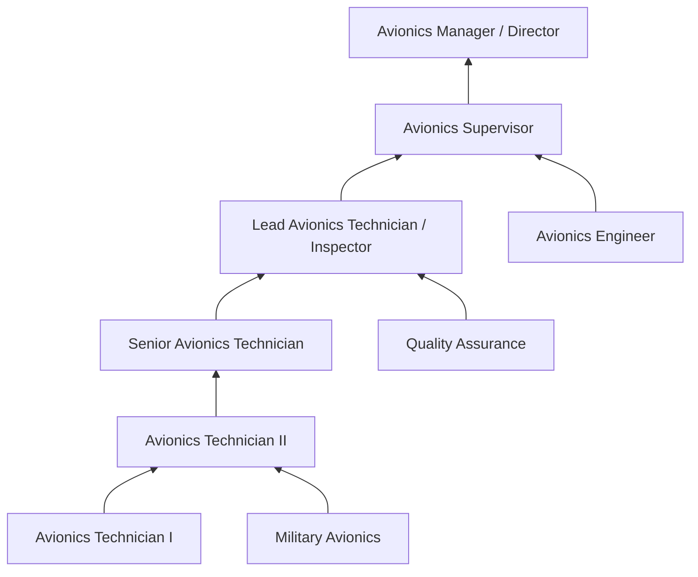

# Avionics Technicians

> Install, inspect, test, adjust, or repair avionics equipment, such as radar, radio, navigation, and missile control systems in aircraft or space vehicles.

## Overview

Avionics Technicians are highly skilled specialists who work on the sophisticated electronic systems that are essential to modern aviation. They install, inspect, test, troubleshoot, and repair a wide range of avionics equipment including navigation systems, communication radios, radar systems, autopilots, flight management computers, and electronic flight instruments. These technicians ensure that aircraft electronic systems meet strict safety and performance standards required by the Federal Aviation Administration (FAA). Working in hangars, on flight lines, or in specialized repair facilities, avionics technicians combine electronics expertise with aviation knowledge to keep aircraft safe and operational. The increasing complexity of modern avionics, including glass cockpits, GPS navigation, and digital fly-by-wire systems, makes this a technically demanding and critically important occupation.

## Classification Hierarchy

## Key Statistics

| Metric | Value |
|--------|-------|
| SOC Code | 49-2091.00 |
| Job Zone | 4 (Considerable Preparation) |
| Category | [Installation, Maintenance, and Repair](/occupations/Maintenance/index) |
| Core Tasks | 15+ |
| Source | O*NET |

## Core Tasks

### install.NavigationSystems

Avionics Technicians install and configure navigation equipment that enables safe flight operations.

**Actions:**
- `install.NavigationSystems.in.Aircraft.to.enable.SafeNavigation` - Mount and wire GPS, VOR, ILS receivers
- `install.FlightManagementComputers.in.Aircraft.to.enable.AutomatedNavigation` - Deploy FMS systems
- `configure.NavigationDatabases.in.Systems.to.ensure.Accuracy` - Load current navigation data
- `align.InertialReferenceSystems.to.Specifications.to.ensure.Precision` - Calibrate INS/IRS units

### install.CommunicationRadios

Avionics Technicians deploy radio systems for pilot communications.

**Actions:**
- `install.CommunicationRadios.in.Aircraft.to.enable.AirToGround` - Set up VHF/UHF comm radios
- `install.TransponderSystems.in.Aircraft.to.enable.Identification` - Deploy ATC transponders
- `install.ACARS.in.Aircraft.to.enable.DataLink` - Set up digital communication systems
- `configure.FrequencySettings.on.Radios.to.match.Assignments` - Program radio presets

### test.AvionicsSystems

Avionics Technicians verify that electronic systems function correctly.

**Actions:**
- `test.AvionicsSystems.using.BITE.to.identify.Faults` - Use built-in test equipment
- `test.AvionicsSystems.using.TestSets.to.verify.Performance` - Employ specialized test equipment
- `test.WiringIntegrity.using.Meters.to.ensure.Connections` - Check continuity and insulation
- `test.SystemIntegration.by.OperationalTests.to.verify.Function` - Conduct flight deck functional checks

### troubleshoot.ElectronicFailures

Avionics Technicians diagnose problems with aircraft electronic systems.

**Actions:**
- `troubleshoot.ElectronicFailures.using.Schematics.to.isolate.Faults` - Trace circuit problems
- `troubleshoot.SystemMalfunctions.using.Diagnostics.to.identify.Causes` - Interpret fault codes
- `troubleshoot.IntermittentFaults.by.MonitoringSystems.to.capture.Events` - Track elusive problems
- `analyze.FlightData.to.diagnose.Anomalies` - Review recorded system data

### repair.CircuitBoards

Avionics Technicians restore failed components to working condition.

**Actions:**
- `repair.CircuitBoards.by.ReplacingComponents.to.restore.Function` - Perform board-level repairs
- `repair.WiringHarnesses.by.SplicingWires.to.restore.Connections` - Fix damaged wiring
- `repair.Antennas.by.ReplacingElements.to.restore.Performance` - Service antenna systems
- `repair.DisplayUnits.by.ReplacingScreens.to.restore.Visibility` - Fix cockpit displays

### inspect.AvionicsComponents

Avionics Technicians conduct detailed inspections to ensure airworthiness.

**Actions:**
- `inspect.AvionicsComponents.for.Damage.to.ensure.Airworthiness` - Visual and functional inspections
- `inspect.WiringConnections.for.Corrosion.to.prevent.Failures` - Check connector condition
- `inspect.InstallationQuality.against.Standards.to.ensure.Compliance` - Verify workmanship
- `inspect.Components.per.MaintenanceSchedule.to.ensure.Reliability` - Perform scheduled inspections

### calibrate.NavigationEquipment

Avionics Technicians ensure instruments provide accurate readings.

**Actions:**
- `calibrate.NavigationEquipment.to.Specifications.to.ensure.Accuracy` - Adjust nav system parameters
- `calibrate.FlightInstruments.to.Standards.to.ensure.Precision` - Set altimeters, airspeed indicators
- `calibrate.RadarSystems.to.Specifications.to.optimize.Performance` - Tune weather radar
- `calibrate.TestEquipment.to.Standards.to.ensure.Measurement.Accuracy` - Maintain calibration of tools

### document.MaintenanceRecords

Avionics Technicians maintain detailed records required by regulations.

**Actions:**
- `document.MaintenanceRecords.in.Logbooks.to.track.History` - Record all maintenance actions
- `document.TestResults.in.WorkOrders.to.verify.Compliance` - Log test data
- `document.AirworthinessReleases.to.authorize.Return.to.Service` - Sign off completed work
- `document.Discrepancies.in.SquawkSheets.to.communicate.Issues` - Report found defects

## Skills & Competencies

### Technical Skills
- **Avionics Systems** - Expert
- **Electronics Repair** - Expert
- **Aircraft Systems Integration** - Advanced
- **Test Equipment Operation** - Expert
- **Blueprint and Schematic Reading** - Expert
- **Soldering and Wire Termination** - Advanced
- **Software Loading and Configuration** - Advanced

### Soft Skills
- **Attention to Detail** - Critical
- **Problem Solving** - Critical
- **Safety Consciousness** - Critical
- **Communication** - Essential
- **Continuous Learning** - Essential
- **Integrity** - Critical

## Related Occupations

## Industries

- [Air Transportation](/industries/AirTransportation) - High Employment
- Aerospace Manufacturing - High Employment
- Aircraft Maintenance, Repair, Overhaul (MRO) - High Employment
- Military/Defense - High Employment
- General Aviation - Moderate Employment
- [Government](/industries/PublicAdministration) - Moderate Employment

## Industry Variations

### Commercial Airlines
- Focus on dispatch reliability and quick turnaround
- Line maintenance and overnight checks
- MEL (Minimum Equipment List) management
- Large fleet standardization

### Aircraft Manufacturing
- New aircraft installation and testing
- Production line quality control
- Engineering support and modifications
- First article inspections

### Military Aviation
- Weapon systems integration
- Mission-specific equipment
- Depot-level overhaul
- Security clearance required

### Business Aviation
- Diverse avionics suite configurations
- Customer customization work
- Retrofit and upgrade installations
- VIP cabin entertainment systems

### Repair Stations (MRO)
- Component repair and overhaul
- Bench testing and troubleshooting
- Warranty and exchange programs
- Certification compliance

## Regulatory Requirements

### FAA Certifications
- FCC Radiotelephone Operator Permit (required for radio work)
- FAA Repairman Certificate or A&P with IA (for return to service authority)
- Employer-specific authorizations

### Required Documentation
- Adherence to FAA regulations (14 CFR Part 43, 145)
- Compliance with manufacturer maintenance manuals
- Following approved repair station procedures
- Maintaining training currency records

## Career Progression

## Education & Training

| Requirement | Details |
|-------------|---------|
| Typical Education | Associate's degree in avionics technology or aviation electronics; FAA-approved training program |
| Work Experience | 2-5 years for senior positions; military experience often valued |
| On-the-Job Training | Extensive manufacturer-specific training on aircraft types and systems |
| Common Certifications | FCC GROL, NCATT AET, manufacturer type training, FAA Repairman Certificate |

## Departments

This occupation typically works in:
- Avionics/Electronics
- [Maintenance](/departments/Operations)
- [Quality Assurance](/departments/Quality)
- [Engineering](/departments/Technology)

## Work Environment

- Work in hangars, on flight lines, and in repair shops
- Exposure to noise, fuels, and hydraulic fluids
- Work at heights on aircraft platforms and in confined spaces
- May involve shift work, nights, weekends, and holidays
- Deadline pressure for aircraft dispatch
- Climate-controlled repair facilities for bench work
- Strict adherence to safety protocols and FOD prevention
- Some outdoor work in various weather conditions

## Tools and Equipment

- Avionics test sets (ramp test equipment)
- Oscilloscopes and spectrum analyzers
- Multimeters and megohm meters
- Soldering stations and rework equipment
- Wire crimping and stripping tools
- Torque wrenches and calibrated tools
- ESD protection equipment
- Aircraft maintenance stands and platforms
- Technical publications and maintenance manuals
- Software loading equipment and data loaders

## Avionics Systems Categories

### Navigation Systems
- GPS/GNSS receivers
- VOR/ILS/DME receivers
- Inertial Reference Systems (IRS)
- Flight Management Systems (FMS)
- Radar altimeters

### Communication Systems
- VHF/UHF communication radios
- HF radio systems
- SATCOM systems
- ACARS/CPDLC data link
- Cockpit voice recorders

### Surveillance Systems
- ATC transponders (Mode S, ADS-B)
- Weather radar
- TCAS/ACAS collision avoidance
- TAWS/GPWS terrain awareness
- Flight data recorders

### Flight Control Systems
- Autopilot systems
- Flight director systems
- Fly-by-wire controls
- Stall warning systems
- Trim and feel systems

---

*Source: O*NET 49-2091.00 - ONETOccupation*
