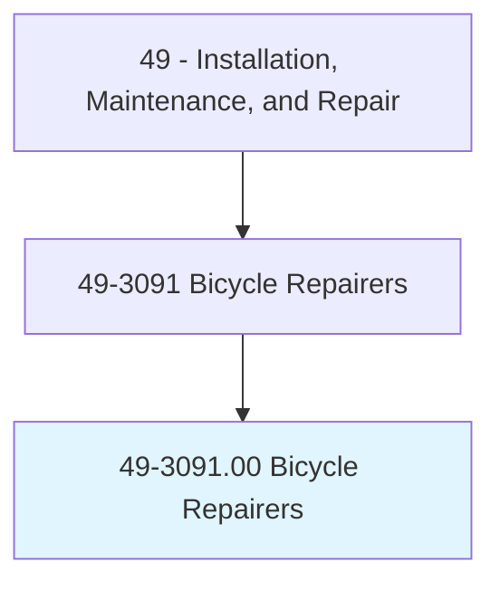
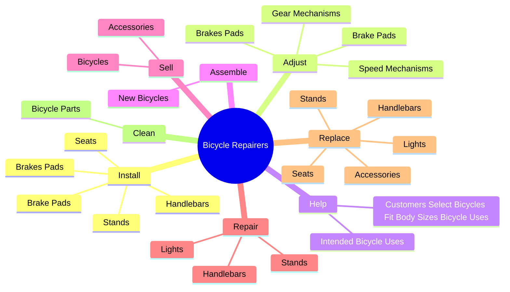
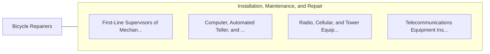

# Bicycle Repairers

> Repair and service bicycles.

## Overview

Bicycle Repairers is classified under Installation, Maintenance, and Repair (SOC 49). Repair and service bicycles.

## Classification Hierarchy

## Key Statistics

| Metric | Value |
|--------|-------|
| SOC Code | 49-3091.00 |
| Category | [Installation, Maintenance, and Repair](/occupations/Maintenance) |
| Task Count | 41 |
| Source | O*NET |

## Core Tasks

### install.BrakesPads

Bicycle Repairers install brakes pads as part of their core responsibilities.

**Actions:**
- `install.BrakesPads`
- `install.BrakePads`
- `install.Handlebars`
- `install.Stands`

### adjust.BrakesPads

Bicycle Repairers adjust brakes pads as part of their core responsibilities.

**Actions:**
- `adjust.BrakesPads`
- `adjust.BrakePads`
- `adjust.SpeedMechanisms`
- `adjust.GearMechanisms`

### help.CustomersSelectBicyclesFitBodySizesBicycleUses

Bicycle Repairers help customers select bicycles fit body sizes bicycle uses as part of their core responsibilities.

**Actions:**
- `help.CustomersSelectBicyclesFitBodySizesBicycleUses`
- `help.IntendedBicycleUses`

## Skills & Competencies

### Technical Skills
- **Equipment Repair** - Advanced
- **Diagnostic Testing** - Advanced
- **Preventive Maintenance** - Advanced

### Soft Skills
- **Communication** - Essential
- **Problem Solving** - Essential
- **Critical Thinking** - Important
- **Teamwork** - Important
- **Adaptability** - Important

## Related Occupations

## Industries

This occupation is found across multiple industries. See [Industries](/industries) for sector-specific employment data.

## Career Progression

---

*Source: O*NET 49-3091.00 - ONETOccupation*
