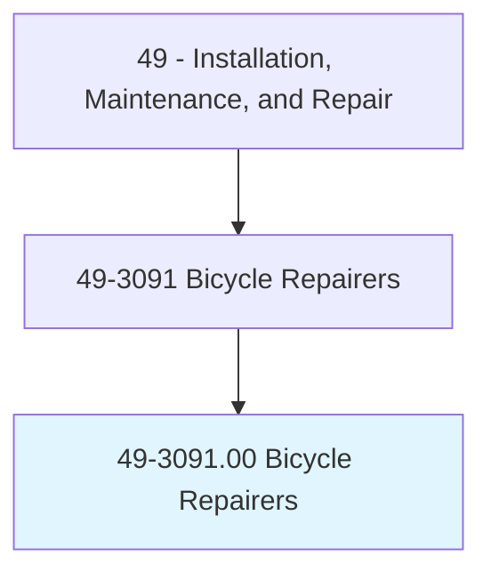
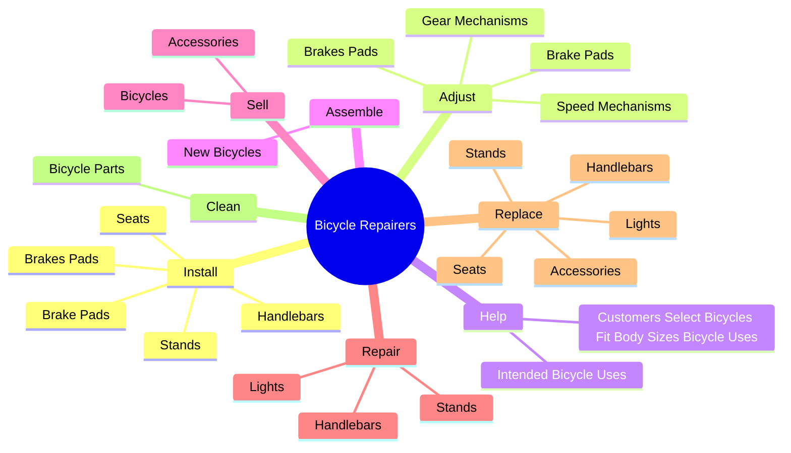
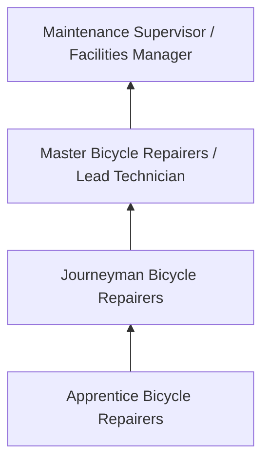
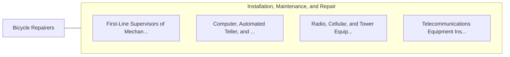

# Bicycle Repairers

> Repair and service bicycles.

## Overview

Bicycle Repairers professionals serve a vital function within the Installation, Maintenance, and Repair field. They bring specialized skills and knowledge to their roles, contributing to organizational objectives and societal needs.

These practitioners work in varied environments, adapting their expertise to meet specific requirements of their industry and employer. The role requires ongoing professional development to maintain competency and respond to changing demands.

Career paths in this field offer opportunities for advancement through experience, additional education, and specialized certifications. Employment prospects are influenced by industry trends, technological change, and workforce demographics.

## Classification Hierarchy



## Key Statistics

| Metric | Value |
|--------|-------|
| SOC Code | 49-3091.00 |
| Job Zone | N/A |
| Category | [Installation, Maintenance, and Repair](/occupations/Maintenance/index) |
| Core Tasks | 41+ |
| Salary Range | $35,000 - $80,000 |
| Median Salary | $50,000 |
| Growth Outlook | 5% (As fast as average) |
| Source | O*NET |

## Core Tasks



### install.BrakesPads

Bicycle Repairers install brakes pads as part of their core responsibilities.

**Actions:**
- `install.BrakesPads` - Install and adjust brakes and brake pads.
- `install.BrakePads` - Install and adjust brakes and brake pads.
- `install.Handlebars` - Install, repair, and replace equipment or accessories, such as handlebars, st...
- `install.Stands` - Install, repair, and replace equipment or accessories, such as handlebars, st...
- `install.Seats` - Install, repair, and replace equipment or accessories, such as handlebars, st...

### repair.Handlebars

Bicycle Repairers repair handlebars as part of their core responsibilities.

**Actions:**
- `repair.Handlebars` - Install, repair, and replace equipment or accessories, such as handlebars, st...
- `repair.Stands` - Install, repair, and replace equipment or accessories, such as handlebars, st...
- `repair.Lights` - Install, repair, and replace equipment or accessories, such as handlebars, st...
- `repair.Holes.in.TireTubes` - Repair holes in tire tubes, using scrapers and patches.
- `repair.Holes.in.UsingScrapers` - Repair holes in tire tubes, using scrapers and patches.

### replace.Accessories

Bicycle Repairers replace accessories as part of their core responsibilities.

**Actions:**
- `replace.Accessories` - Install, repair, and replace equipment or accessories, such as handlebars, st...
- `replace.Handlebars` - Install, repair, and replace equipment or accessories, such as handlebars, st...
- `replace.Stands` - Install, repair, and replace equipment or accessories, such as handlebars, st...
- `replace.Lights` - Install, repair, and replace equipment or accessories, such as handlebars, st...
- `replace.Seats` - Install, repair, and replace equipment or accessories, such as handlebars, st...

### disassemble.Axles

Bicycle Repairers disassemble axles as part of their core responsibilities.

**Actions:**
- `disassemble.Axles.to.repair` - Disassemble axles to repair, adjust, and replace defective parts, using hand ...
- `disassemble.Axles.to.adjust` - Disassemble axles to repair, adjust, and replace defective parts, using hand ...
- `disassemble.Axles.to.replace.DefectiveParts` - Disassemble axles to repair, adjust, and replace defective parts, using hand ...
- `disassemble.Axles.to.UsingH` - Disassemble axles to repair, adjust, and replace defective parts, using hand ...
- `disassemble.Axles.to.Tools` - Disassemble axles to repair, adjust, and replace defective parts, using hand ...


## Skills & Competencies

### Technical Skills
- **Diagnostics and Troubleshooting** - Expert
- **Repair Techniques** - Advanced
- **Preventive Maintenance** - Advanced
- **Electrical Systems** - Advanced
- **Mechanical Systems** - Advanced
- **Safety Compliance** - Advanced

### Soft Skills
- **Problem Solving** - Critical
- **Attention to Detail** - Critical
- **Physical Stamina** - Essential
- **Communication** - Essential
- **Time Management** - Essential

## Education & Certifications

| Requirement | Details |
|-------------|---------|
| Typical Education | Post-secondary technical training or apprenticeship |
| Work Experience | 1-4 years hands-on experience |
| On-the-Job Training | Extensive - apprenticeship or technical certification programs |
| Certifications | Trade-specific licenses, EPA certifications, manufacturer certifications |

## Career Progression



## Industry Variations

### Industrial Maintenance
Equipment repair in manufacturing and production facilities. Bicycle Repairers professionals keep production lines running efficiently.

### Commercial Building Services
HVAC, electrical, and plumbing maintenance for commercial properties. Focus on preventive maintenance and tenant satisfaction.

### Automotive and Vehicle
Diagnosis and repair of vehicles and mobile equipment. Emphasis on diagnostic technology and manufacturer specifications.

### Specialized Technical
Maintenance of specialized systems such as telecommunications, medical equipment, or industrial controls.

## Technology & Tools

- **Diagnostic equipment and multimeters**
- **Computerized maintenance management systems (CMMS)**
- **Specialty hand and power tools**
- **Thermal imaging cameras**
- **Technical documentation systems**

## Related Occupations



## Industries

- [Automotive Repair](/industries/AutomotiveRepair) - High Employment
- [Manufacturing](/industries/Manufacturing) - High Employment
- Commercial Building Services - Moderate Employment
- Telecommunications - Moderate Employment

## Departments

This occupation typically works in:
- [Maintenance and Repair](/departments/Operations)
- [Facilities Management](/departments/Operations)
- Technical Services

## GraphDL Semantic Structure

```graphdl
Bicycle Repairers perform:
- install.BrakesPads
- install.BrakePads
- adjust.BrakesPads
- adjust.BrakePads
- help.CustomersSelectBicyclesFitBodySizesBicycleUses
- help.IntendedBicycleUses
```

---

*Source: O*NET 49-3091.00 - ONETOccupation*
