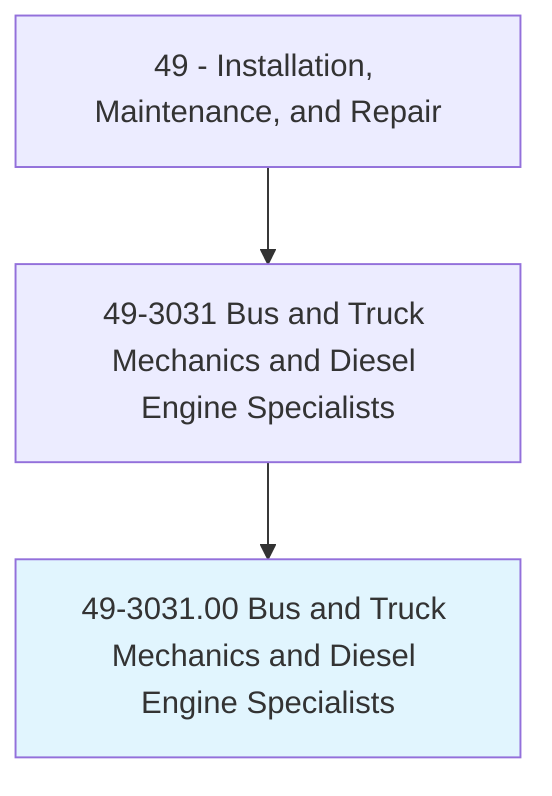
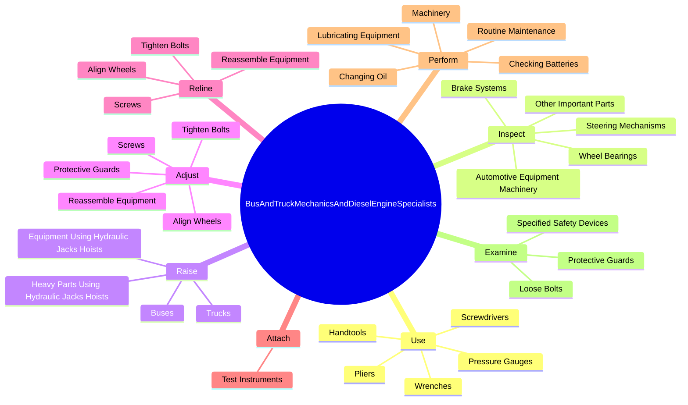
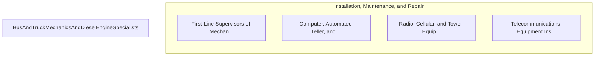

# Bus and Truck Mechanics and Diesel Engine Specialists

> Diagnose, adjust, repair, or overhaul buses and trucks, or maintain and repair any type of diesel engines. Includes mechanics working primarily with automobile or marine diesel engines.

## Overview

Bus and Truck Mechanics and Diesel Engine Specialists is an occupation within the Installation, Maintenance, and Repair category. Diagnose, adjust, repair, or overhaul buses and trucks, or maintain and repair any type of diesel engines. 

## Classification Hierarchy

## Key Statistics

| Metric | Value |
|--------|-------|
| SOC Code | 49-3031.00 |
| Category | [Installation, Maintenance, and Repair](/occupations/Maintenance/index) |
| Task Count | 111 |
| Source | O*NET |

## Core Tasks

### use.Handtools

Bus and Truck Mechanics and Diesel Engine Specialists use handtools as part of their core responsibilities.

**Actions:**
- `use.Handtools`
- `use.Screwdrivers`
- `use.Pliers`
- `use.Wrenches`

### inspect.BrakeSystems

Bus and Truck Mechanics and Diesel Engine Specialists inspect brake systems as part of their core responsibilities.

**Actions:**
- `inspect.BrakeSystems.to.ensure.TheyAreInProperOperatingCondition`
- `inspect.SteeringMechanisms.to.ensure.TheyAreInProperOperatingCondition`
- `inspect.WheelBearings.to.ensure.TheyAreInProperOperatingCondition`
- `inspect.OtherImportantParts.to.ensure.TheyAreInProperOperatingCondition`

### raise.Trucks

Bus and Truck Mechanics and Diesel Engine Specialists raise trucks as part of their core responsibilities.

**Actions:**
- `raise.Trucks`
- `raise.Buses`
- `raise.HeavyPartsUsingHydraulicJacksHoists`
- `raise.EquipmentUsingHydraulicJacksHoists`

## Skills & Competencies

### Technical Skills
- **Equipment Repair** - Advanced
- **Diagnostic Testing** - Advanced
- **Preventive Maintenance** - Advanced

### Soft Skills
- **Communication** - Essential
- **Problem Solving** - Essential
- **Critical Thinking** - Important
- **Teamwork** - Important
- **Adaptability** - Important

## Related Occupations

## Industries

This occupation is found across multiple industries. See [Industries](/industries) for sector-specific employment data.

## Career Progression

---

*Source: O*NET 49-3031.00 - ONETOccupation*
