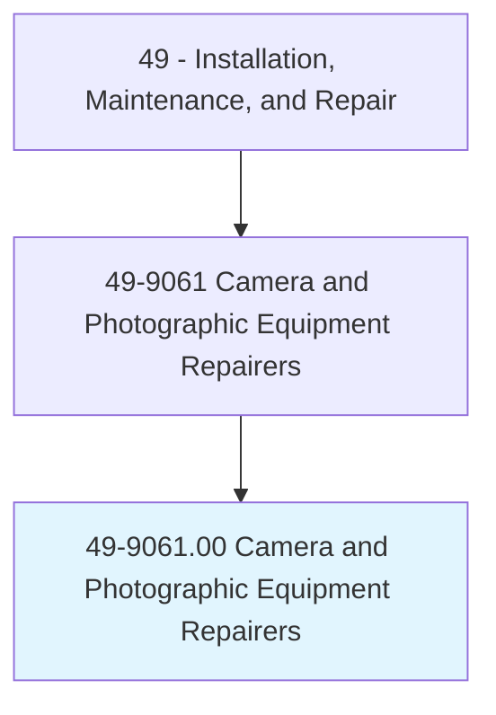
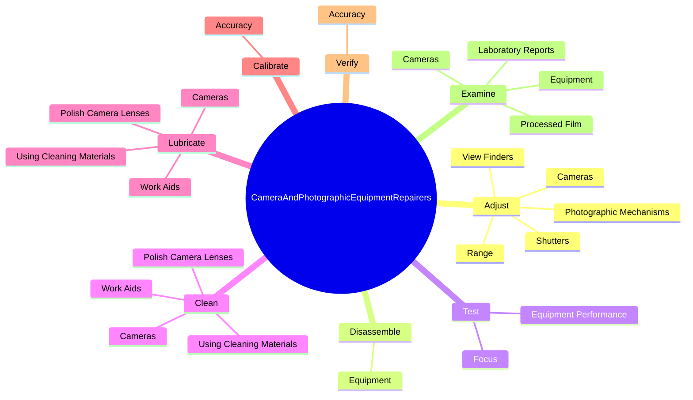

# Camera and Photographic Equipment Repairers

> Repair and adjust cameras and photographic equipment, including commercial video and motion picture camera equipment.

## Overview

Camera and Photographic Equipment Repairers is classified under Installation, Maintenance, and Repair (SOC 49). Repair and adjust cameras and photographic equipment, including commercial video and motion picture camera equipment.

## Classification Hierarchy

## Key Statistics

| Metric | Value |
|--------|-------|
| SOC Code | 49-9061.00 |
| Category | [Installation, Maintenance, and Repair](/occupations/Maintenance) |
| Task Count | 123 |
| Source | O*NET |

## Core Tasks

### adjust.Cameras

Camera and Photographic Equipment Repairers adjust cameras as part of their core responsibilities.

**Actions:**
- `adjust.Cameras`
- `adjust.PhotographicMechanisms`
- `adjust.Range`
- `adjust.ViewFinders`

### disassemble.Equipment

Camera and Photographic Equipment Repairers disassemble equipment as part of their core responsibilities.

**Actions:**
- `disassemble.Equipment.to.gain.AccessToDefect`
- `disassemble.Equipment.to.UsingH`
- `disassemble.Equipment.to.Tools`

### test.EquipmentPerformance

Camera and Photographic Equipment Repairers test equipment performance as part of their core responsibilities.

**Actions:**
- `test.EquipmentPerformance.of.LensSystem`
- `test.EquipmentPerformance.of.DiaphragmAlignment`
- `test.EquipmentPerformance.of.LensMounts`
- `test.EquipmentPerformance.of.FilmTransport`

## Skills & Competencies

### Technical Skills
- **Equipment Repair** - Advanced
- **Diagnostic Testing** - Advanced
- **Preventive Maintenance** - Advanced

### Soft Skills
- **Communication** - Essential
- **Problem Solving** - Essential
- **Critical Thinking** - Important
- **Teamwork** - Important
- **Adaptability** - Important

## Related Occupations

## Industries

This occupation is found across multiple industries. See [Industries](/industries) for sector-specific employment data.

## Career Progression

---

*Source: O*NET 49-9061.00 - ONETOccupation*
