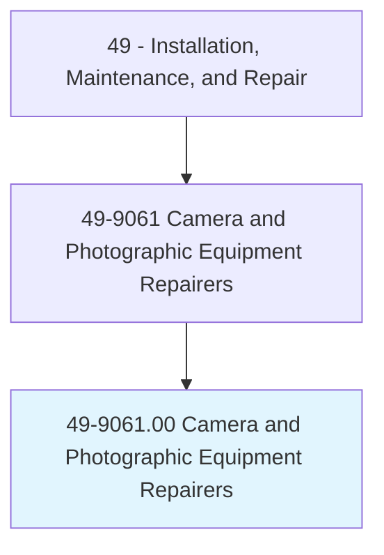
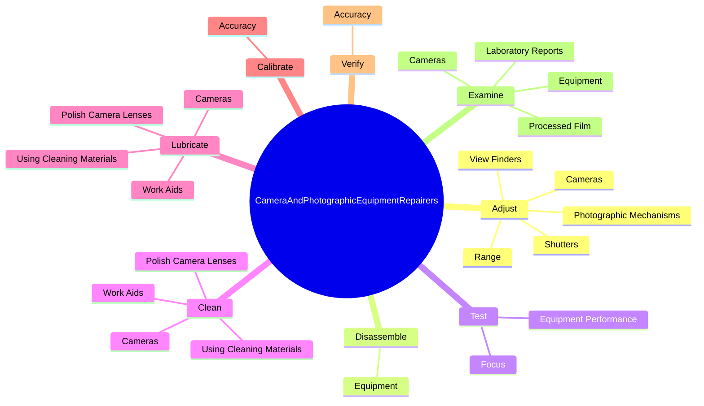
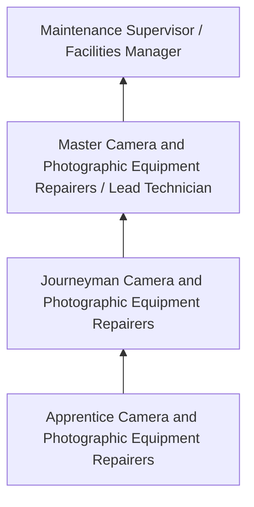

# Camera and Photographic Equipment Repairers

> Repair and adjust cameras and photographic equipment, including commercial video and motion picture camera equipment.

## Overview

Camera and Photographic Equipment Repairers professionals repair and adjust cameras and photographic equipment, including commercial video and motion picture camera equipment.. This occupation falls within the Installation, Maintenance, and Repair category and requires a combination of specialized knowledge, technical skills, and practical experience.

These professionals work across diverse settings and organizational contexts, applying their expertise to meet the demands of their field. They must stay current with industry standards, emerging practices, and regulatory requirements that affect their work. The role demands both independent judgment and collaborative skills, as practitioners regularly interact with colleagues, stakeholders, and the public.

As the field continues to evolve, Camera and Photographic Equipment Repairers professionals increasingly leverage technology and data-driven approaches to enhance their effectiveness. Career opportunities span the public and private sectors, with demand influenced by economic conditions, demographic shifts, and technological advancement.

## Classification Hierarchy



## Key Statistics

| Metric | Value |
|--------|-------|
| SOC Code | 49-9061.00 |
| Job Zone | N/A |
| Category | [Installation, Maintenance, and Repair](/occupations/Maintenance/index) |
| Core Tasks | N/A+ |
| Salary Range | $35,000 - $80,000 |
| Median Salary | $50,000 |
| Growth Outlook | 5% (As fast as average) |
| Source | O*NET |

## Core Tasks



### adjust.Cameras

Camera and Photographic Equipment Repairers adjust cameras as part of their core responsibilities.

**Actions:**
- `adjust.Cameras`
- `adjust.PhotographicMechanisms`
- `adjust.Range`
- `adjust.ViewFinders`

### disassemble.Equipment

Camera and Photographic Equipment Repairers disassemble equipment as part of their core responsibilities.

**Actions:**
- `disassemble.Equipment.to.gain.AccessToDefect`
- `disassemble.Equipment.to.UsingH`
- `disassemble.Equipment.to.Tools`

### test.EquipmentPerformance

Camera and Photographic Equipment Repairers test equipment performance as part of their core responsibilities.

**Actions:**
- `test.EquipmentPerformance.of.LensSystem`
- `test.EquipmentPerformance.of.DiaphragmAlignment`
- `test.EquipmentPerformance.of.LensMounts`
- `test.EquipmentPerformance.of.FilmTransport`

### Technical Skills
- **Equipment Repair** - Advanced
- **Diagnostic Testing** - Advanced
- **Preventive Maintenance** - Advanced

### Soft Skills
- **Communication** - Essential
- **Problem Solving** - Essential
- **Critical Thinking** - Important
- **Teamwork** - Important
- **Adaptability** - Important


## Skills & Competencies

### Technical Skills
- **Diagnostics and Troubleshooting** - Expert
- **Repair Techniques** - Advanced
- **Preventive Maintenance** - Advanced
- **Electrical Systems** - Advanced
- **Mechanical Systems** - Advanced
- **Safety Compliance** - Advanced

### Soft Skills
- **Problem Solving** - Critical
- **Attention to Detail** - Critical
- **Physical Stamina** - Essential
- **Communication** - Essential
- **Time Management** - Essential

## Education & Certifications

| Requirement | Details |
|-------------|---------|
| Typical Education | Post-secondary technical training or apprenticeship |
| Work Experience | 1-4 years hands-on experience |
| On-the-Job Training | Extensive - apprenticeship or technical certification programs |
| Certifications | Trade-specific licenses, EPA certifications, manufacturer certifications |

## Career Progression



## Industry Variations

### Industrial Maintenance
Equipment repair in manufacturing and production facilities. Camera and Photographic Equipment Repairers professionals keep production lines running efficiently.

### Commercial Building Services
HVAC, electrical, and plumbing maintenance for commercial properties. Focus on preventive maintenance and tenant satisfaction.

### Automotive and Vehicle
Diagnosis and repair of vehicles and mobile equipment. Emphasis on diagnostic technology and manufacturer specifications.

### Specialized Technical
Maintenance of specialized systems such as telecommunications, medical equipment, or industrial controls.

## Technology & Tools

- **Diagnostic equipment and multimeters**
- **Computerized maintenance management systems (CMMS)**
- **Specialty hand and power tools**
- **Thermal imaging cameras**
- **Technical documentation systems**

## Related Occupations


## Industries

- [Automotive Repair](/industries/AutomotiveRepair) - High Employment
- [Manufacturing](/industries/Manufacturing) - High Employment
- Commercial Building Services - Moderate Employment
- Telecommunications - Moderate Employment

## Departments

This occupation typically works in:
- [Maintenance and Repair](/departments/Operations)
- [Facilities Management](/departments/Operations)
- Technical Services

## GraphDL Semantic Structure

```graphdl
Camera and Photographic Equipment Repairers perform:
- diagnose.Problems.in.EquipmentSystems
- repair.Equipment.using.SpecializedTools
- maintain.Systems.for.OptimalPerformance
- inspect.Components.for.WearAndDamage
- document.Repairs.in.MaintenanceRecords
```

---

*Source: O*NET 49-9061.00 - ONETOccupation*
