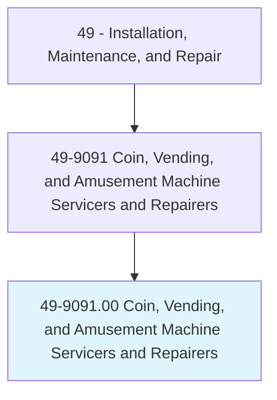
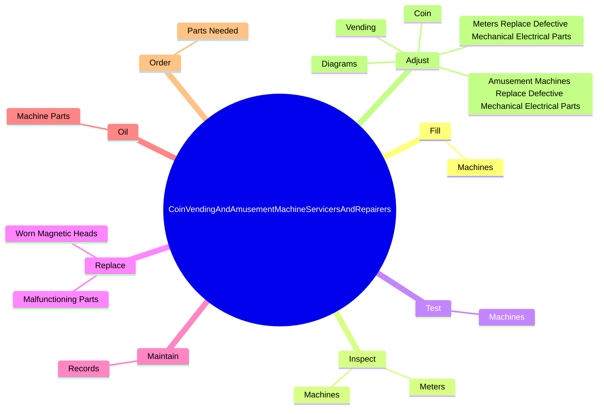
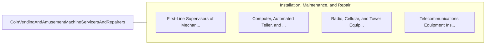

# Coin, Vending, and Amusement Machine Servicers and Repairers

> Install, service, adjust, or repair coin, vending, or amusement machines including video games, juke boxes, pinball machines, or slot machines.

## Overview

Coin, Vending, and Amusement Machine Servicers and Repairers is classified under Installation, Maintenance, and Repair (SOC 49). Install, service, adjust, or repair coin, vending, or amusement machines including video games, juke boxes, pinball machines, or slot machines.

## Classification Hierarchy

## Key Statistics

| Metric | Value |
|--------|-------|
| SOC Code | 49-9091.00 |
| Category | [Installation, Maintenance, and Repair](/occupations/Maintenance) |
| Task Count | 58 |
| Source | O*NET |

## Core Tasks

### fill.Machines

Coin, Vending, and Amusement Machine Servicers and Repairers fill machines as part of their core responsibilities.

**Actions:**
- `fill.Machines.with.Products`
- `fill.Machines.with.Ingredients`
- `fill.Machines.with.Money`
- `fill.Machines.with.OtherSupplies`

### inspect.Machines

Coin, Vending, and Amusement Machine Servicers and Repairers inspect machines as part of their core responsibilities.

**Actions:**
- `inspect.Machines.to.determine.CausesOfMalfunctions`
- `inspect.Machines.to.fix.MinorProblems`
- `inspect.Machines.to.JammedBills`
- `inspect.Machines.to.StuckProducts`

### test.Machines

Coin, Vending, and Amusement Machine Servicers and Repairers test machines as part of their core responsibilities.

**Actions:**
- `test.Machines.to.determine.ProperFunctioning`

## Skills & Competencies

### Technical Skills
- **Equipment Repair** - Advanced
- **Diagnostic Testing** - Advanced
- **Preventive Maintenance** - Advanced

### Soft Skills
- **Communication** - Essential
- **Problem Solving** - Essential
- **Critical Thinking** - Important
- **Teamwork** - Important
- **Adaptability** - Important

## Related Occupations

## Industries

This occupation is found across multiple industries. See [Industries](/industries) for sector-specific employment data.

## Career Progression

---

*Source: O*NET 49-9091.00 - ONETOccupation*
