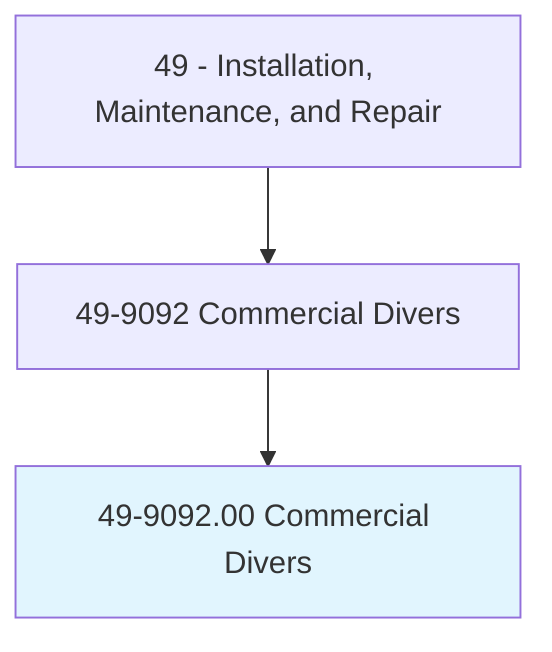
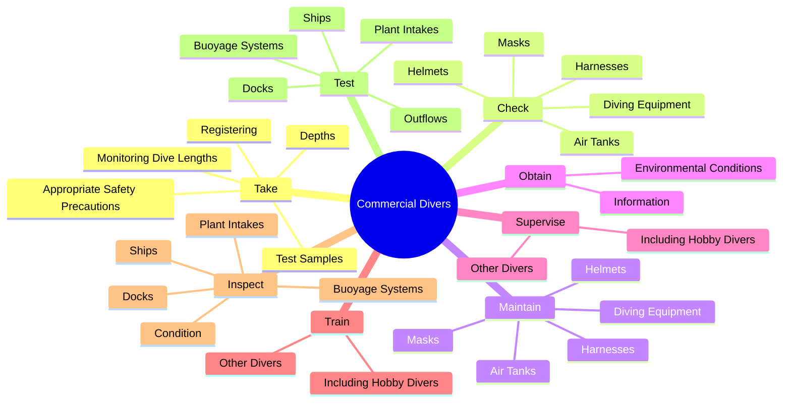
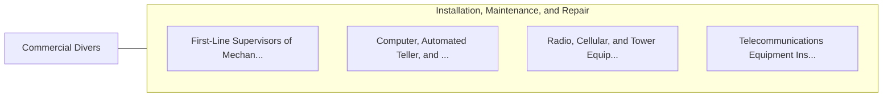

# Commercial Divers

> Work below surface of water, using surface-supplied air or scuba equipment to inspect, repair, remove, or install equipment and structures. May use a variety of power and hand tools, such as drills, sledgehammers, torches, and welding equipment. May conduct tests or experiments, rig explosives, or photograph structures or marine life.

## Overview

Commercial Divers is an occupation within the Installation, Maintenance, and Repair category. Work below surface of water, using surface-supplied air or scuba equipment to inspect, repair, remove, or install equipment and structures. May use a variety of power and hand tools, such as drills, sledgehammers, torches, and welding equipment.

## Classification Hierarchy

## Key Statistics

| Metric | Value |
|--------|-------|
| SOC Code | 49-9092.00 |
| Category | [Installation, Maintenance, and Repair](/occupations/Maintenance) |
| Task Count | 123 |
| Source | O*NET |

## Core Tasks

### take.AppropriateSafetyPrecautions

Commercial Divers take appropriate safety precautions as part of their core responsibilities.

**Actions:**
- `take.AppropriateSafetyPrecautions.with.AuthoritiesBeforeDivingExpeditionsBegin`
- `take.MonitoringDiveLengths.with.AuthoritiesBeforeDivingExpeditionsBegin`
- `take.Depths.with.AuthoritiesBeforeDivingExpeditionsBegin`
- `take.Registering.with.AuthoritiesBeforeDivingExpeditionsBegin`

### check.DivingEquipment

Commercial Divers check diving equipment as part of their core responsibilities.

**Actions:**
- `check.DivingEquipment`
- `check.Helmets`
- `check.Masks`
- `check.AirTanks`

### maintain.DivingEquipment

Commercial Divers maintain diving equipment as part of their core responsibilities.

**Actions:**
- `maintain.DivingEquipment`
- `maintain.Helmets`
- `maintain.Masks`
- `maintain.AirTanks`

## Skills & Competencies

### Technical Skills
- **Equipment Repair** - Advanced
- **Diagnostic Testing** - Advanced
- **Preventive Maintenance** - Advanced

### Soft Skills
- **Communication** - Essential
- **Problem Solving** - Essential
- **Critical Thinking** - Important
- **Teamwork** - Important
- **Adaptability** - Important

## Related Occupations

## Industries

This occupation is found across multiple industries. See [Industries](/industries) for sector-specific employment data.

## Career Progression

---

*Source: O*NET 49-9092.00 - ONETOccupation*
