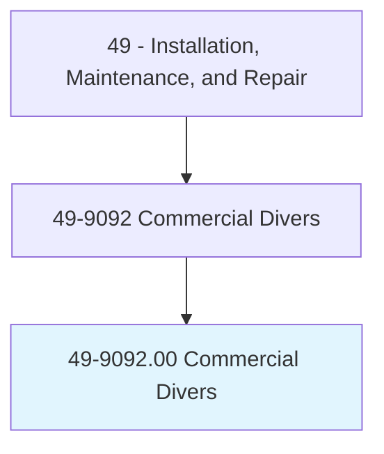
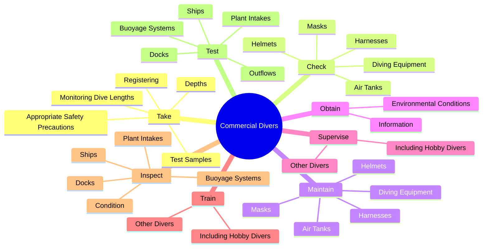
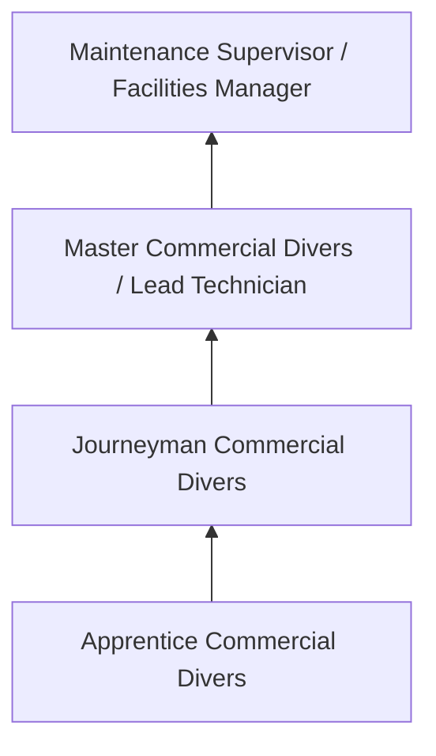
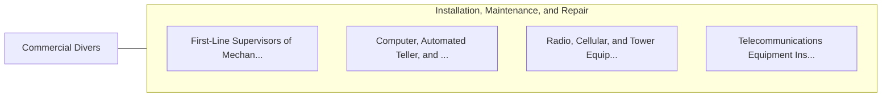

# Commercial Divers

> Work below surface of water, using surface-supplied air or scuba equipment to inspect, repair, remove, or install equipment and structures. May use a variety of power and hand tools, such as drills, sledgehammers, torches, and welding equipment. May conduct tests or experiments, rig explosives, or photograph structures or marine life.

## Overview

Commercial Divers professionals work below surface of water, using surface-supplied air or scuba equipment to inspect, repair, remove, or install equipment and structures. This occupation falls within the Installation, Maintenance, and Repair category and requires a combination of specialized knowledge, technical skills, and practical experience.

These professionals work across diverse settings and organizational contexts, applying their expertise to meet the demands of their field. They must stay current with industry standards, emerging practices, and regulatory requirements that affect their work. The role demands both independent judgment and collaborative skills, as practitioners regularly interact with colleagues, stakeholders, and the public.

As the field continues to evolve, Commercial Divers professionals increasingly leverage technology and data-driven approaches to enhance their effectiveness. Career opportunities span the public and private sectors, with demand influenced by economic conditions, demographic shifts, and technological advancement.

## Classification Hierarchy



## Key Statistics

| Metric | Value |
|--------|-------|
| SOC Code | 49-9092.00 |
| Job Zone | N/A |
| Category | [Installation, Maintenance, and Repair](/occupations/Maintenance/index) |
| Core Tasks | 123+ |
| Salary Range | $35,000 - $80,000 |
| Median Salary | $50,000 |
| Growth Outlook | 5% (As fast as average) |
| Source | O*NET |

## Core Tasks



### inspect.Condition

Commercial Divers inspect condition as part of their core responsibilities.

**Actions:**
- `inspect.Condition.of.UnderwaterSteelStructures` - Inspect the condition of underwater steel or wood structures.
- `inspect.Condition.of.WoodStructures` - Inspect the condition of underwater steel or wood structures.
- `inspect.Docks` - Inspect and test docks, ships, buoyage systems, plant intakes or outflows, or...
- `inspect.Ships` - Inspect and test docks, ships, buoyage systems, plant intakes or outflows, or...
- `inspect.BuoyageSystems` - Inspect and test docks, ships, buoyage systems, plant intakes or outflows, or...

### test.Docks

Commercial Divers test docks as part of their core responsibilities.

**Actions:**
- `test.Docks` - Inspect and test docks, ships, buoyage systems, plant intakes or outflows, or...
- `test.Ships` - Inspect and test docks, ships, buoyage systems, plant intakes or outflows, or...
- `test.BuoyageSystems` - Inspect and test docks, ships, buoyage systems, plant intakes or outflows, or...
- `test.PlantIntakes` - Inspect and test docks, ships, buoyage systems, plant intakes or outflows, or...
- `test.Outflows` - Inspect and test docks, ships, buoyage systems, plant intakes or outflows, or...

### perform.ActivitiesRelated

Commercial Divers perform activities related as part of their core responsibilities.

**Actions:**
- `perform.ActivitiesRelated.to.UnderwaterSearch` - Perform activities related to underwater search and rescue, salvage, recovery...
- `perform.ActivitiesRelated.to.rescue` - Perform activities related to underwater search and rescue, salvage, recovery...
- `perform.ActivitiesRelated.to.salvage` - Perform activities related to underwater search and rescue, salvage, recovery...
- `perform.ActivitiesRelated.to.Recovery` - Perform activities related to underwater search and rescue, salvage, recovery...
- `perform.ActivitiesRelated.to.CleanupOperations` - Perform activities related to underwater search and rescue, salvage, recovery...

### take.AppropriateSafetyPrecautions

Commercial Divers take appropriate safety precautions as part of their core responsibilities.

**Actions:**
- `take.AppropriateSafetyPrecautions.with.AuthoritiesBeforeDivingExpeditionsBegin` - Take appropriate safety precautions, such as monitoring dive lengths and dept...
- `take.MonitoringDiveLengths.with.AuthoritiesBeforeDivingExpeditionsBegin` - Take appropriate safety precautions, such as monitoring dive lengths and dept...
- `take.Depths.with.AuthoritiesBeforeDivingExpeditionsBegin` - Take appropriate safety precautions, such as monitoring dive lengths and dept...
- `take.Registering.with.AuthoritiesBeforeDivingExpeditionsBegin` - Take appropriate safety precautions, such as monitoring dive lengths and dept...
- `take.TestSamples.to.assess.ConditionOfVessels` - Take test samples or photographs to assess the condition of vessels or struct...


## Skills & Competencies

### Technical Skills
- **Diagnostics and Troubleshooting** - Expert
- **Repair Techniques** - Advanced
- **Preventive Maintenance** - Advanced
- **Electrical Systems** - Advanced
- **Mechanical Systems** - Advanced
- **Safety Compliance** - Advanced

### Soft Skills
- **Problem Solving** - Critical
- **Attention to Detail** - Critical
- **Physical Stamina** - Essential
- **Communication** - Essential
- **Time Management** - Essential

## Education & Certifications

| Requirement | Details |
|-------------|---------|
| Typical Education | Post-secondary technical training or apprenticeship |
| Work Experience | 1-4 years hands-on experience |
| On-the-Job Training | Extensive - apprenticeship or technical certification programs |
| Certifications | Trade-specific licenses, EPA certifications, manufacturer certifications |

## Career Progression



## Industry Variations

### Industrial Maintenance
Equipment repair in manufacturing and production facilities. Commercial Divers professionals keep production lines running efficiently.

### Commercial Building Services
HVAC, electrical, and plumbing maintenance for commercial properties. Focus on preventive maintenance and tenant satisfaction.

### Automotive and Vehicle
Diagnosis and repair of vehicles and mobile equipment. Emphasis on diagnostic technology and manufacturer specifications.

### Specialized Technical
Maintenance of specialized systems such as telecommunications, medical equipment, or industrial controls.

## Technology & Tools

- **Diagnostic equipment and multimeters**
- **Computerized maintenance management systems (CMMS)**
- **Specialty hand and power tools**
- **Thermal imaging cameras**
- **Technical documentation systems**

## Related Occupations



## Industries

- [Automotive Repair](/industries/AutomotiveRepair) - High Employment
- [Manufacturing](/industries/Manufacturing) - High Employment
- Commercial Building Services - Moderate Employment
- Telecommunications - Moderate Employment

## Departments

This occupation typically works in:
- [Maintenance and Repair](/departments/Operations)
- [Facilities Management](/departments/Operations)
- Technical Services

## GraphDL Semantic Structure

```graphdl
Commercial Divers perform:
- take.AppropriateSafetyPrecautions.with.AuthoritiesBeforeDivingExpeditionsBegin
- take.MonitoringDiveLengths.with.AuthoritiesBeforeDivingExpeditionsBegin
- take.Depths.with.AuthoritiesBeforeDivingExpeditionsBegin
- take.Registering.with.AuthoritiesBeforeDivingExpeditionsBegin
- check.DivingEquipment
- check.Helmets
```

---

*Source: O*NET 49-9092.00 - ONETOccupation*
