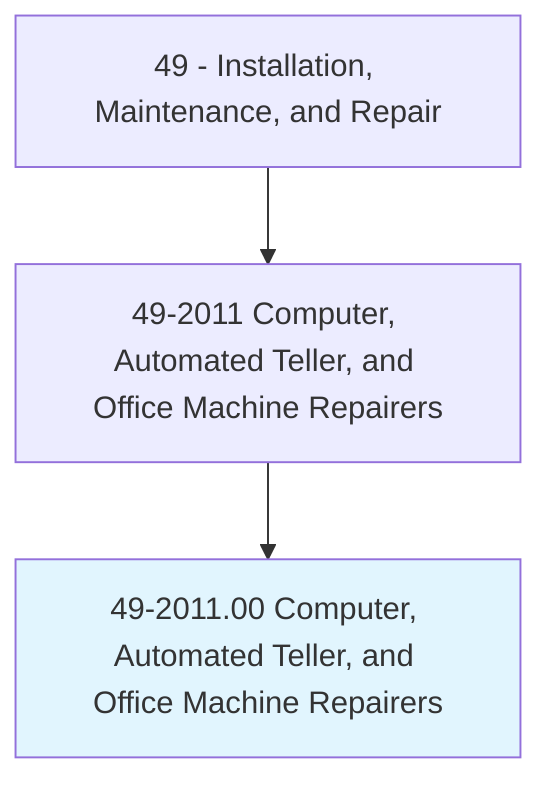
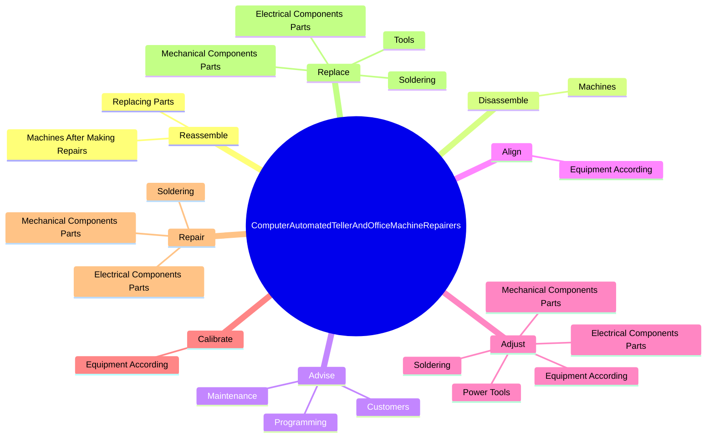
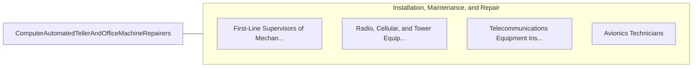

# Computer, Automated Teller, and Office Machine Repairers

> Repair, maintain, or install computers, word processing systems, automated teller machines, and electronic office machines, such as duplicating and fax machines.

## Overview

Computer, Automated Teller, and Office Machine Repairers is classified under Installation, Maintenance, and Repair (SOC 49). Repair, maintain, or install computers, word processing systems, automated teller machines, and electronic office machines, such as duplicating and fax machines.

## Classification Hierarchy

## Key Statistics

| Metric | Value |
|--------|-------|
| SOC Code | 49-2011.00 |
| Category | [Installation, Maintenance, and Repair](/occupations/Maintenance) |
| Task Count | 95 |
| Source | O*NET |

## Core Tasks

### reassemble.MachinesAfterMakingRepairs

Computer, Automated Teller, and Office Machine Repairers reassemble machines after making repairs as part of their core responsibilities.

**Actions:**
- `reassemble.MachinesAfterMakingRepairs`
- `reassemble.ReplacingParts`

### disassemble.Machines

Computer, Automated Teller, and Office Machine Repairers disassemble machines as part of their core responsibilities.

**Actions:**
- `disassemble.Machines.to.examine.Parts`
- `disassemble.Machines.to.wires`
- `disassemble.Machines.to.Gears`
- `disassemble.Machines.to.BearingsForWear`

### advise.Customers

Computer, Automated Teller, and Office Machine Repairers advise customers as part of their core responsibilities.

**Actions:**
- `advise.Customers.concerning.EquipmentOperation`
- `advise.Maintenance`
- `advise.Programming`

## Skills & Competencies

### Technical Skills
- **Equipment Repair** - Advanced
- **Diagnostic Testing** - Advanced
- **Preventive Maintenance** - Advanced

### Soft Skills
- **Communication** - Essential
- **Problem Solving** - Essential
- **Critical Thinking** - Important
- **Teamwork** - Important
- **Adaptability** - Important

## Related Occupations

## Industries

This occupation is found across multiple industries. See [Industries](/industries) for sector-specific employment data.

## Career Progression

---

*Source: O*NET 49-2011.00 - ONETOccupation*
