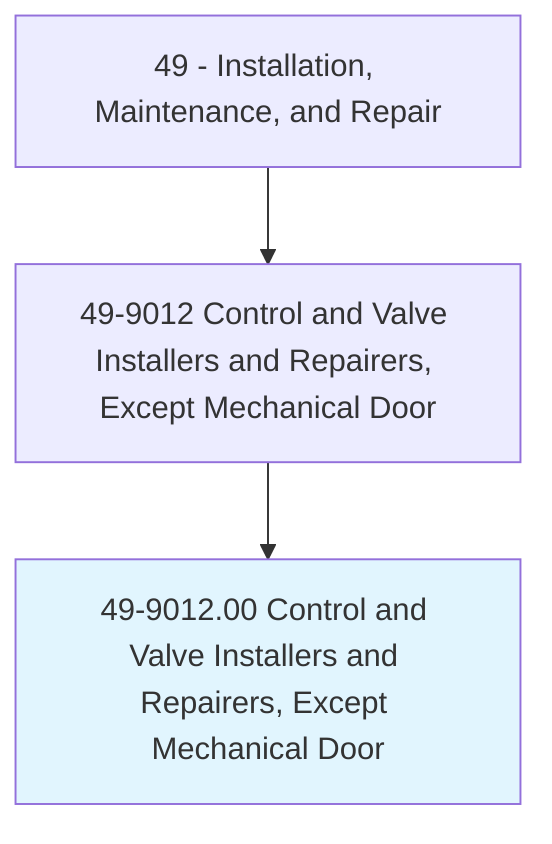
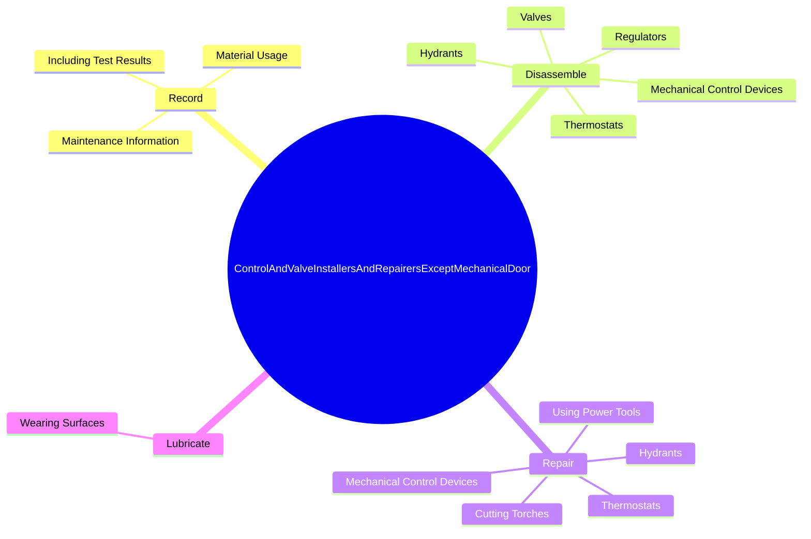
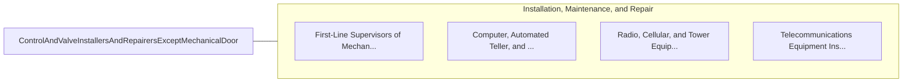

# Control and Valve Installers and Repairers, Except Mechanical Door

> Install, repair, and maintain mechanical regulating and controlling devices, such as electric meters, gas regulators, thermostats, safety and flow valves, and other mechanical governors.

## Overview

Control and Valve Installers and Repairers, Except Mechanical Door is classified under Installation, Maintenance, and Repair (SOC 49). Install, repair, and maintain mechanical regulating and controlling devices, such as electric meters, gas regulators, thermostats, safety and flow valves, and other mechanical governors.

## Classification Hierarchy

## Key Statistics

| Metric | Value |
|--------|-------|
| SOC Code | 49-9012.00 |
| Category | [Installation, Maintenance, and Repair](/occupations/Maintenance) |
| Task Count | 246 |
| Source | O*NET |

## Core Tasks

### record.MaintenanceInformation

Control and Valve Installers and Repairers, Except Mechanical Door record maintenance information as part of their core responsibilities.

**Actions:**
- `record.MaintenanceInformation`
- `record.IncludingTestResults`
- `record.MaterialUsage`

### disassemble.MechanicalControlDevices

Control and Valve Installers and Repairers, Except Mechanical Door disassemble mechanical control devices as part of their core responsibilities.

**Actions:**
- `disassemble.MechanicalControlDevices`
- `disassemble.Valves`
- `disassemble.Regulators`
- `disassemble.Thermostats`

### repair.MechanicalControlDevices

Control and Valve Installers and Repairers, Except Mechanical Door repair mechanical control devices as part of their core responsibilities.

**Actions:**
- `repair.MechanicalControlDevices`
- `repair.Thermostats`
- `repair.Hydrants`
- `repair.UsingPowerTools`

## Skills & Competencies

### Technical Skills
- **Equipment Repair** - Advanced
- **Diagnostic Testing** - Advanced
- **Preventive Maintenance** - Advanced

### Soft Skills
- **Communication** - Essential
- **Problem Solving** - Essential
- **Critical Thinking** - Important
- **Teamwork** - Important
- **Adaptability** - Important

## Related Occupations

## Industries

This occupation is found across multiple industries. See [Industries](/industries) for sector-specific employment data.

## Career Progression

---

*Source: O*NET 49-9012.00 - ONETOccupation*
