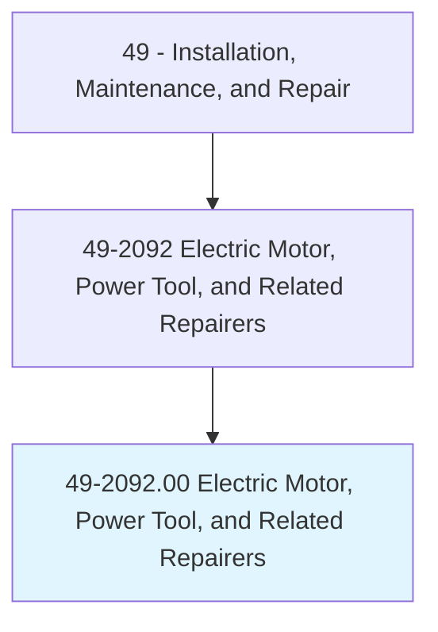
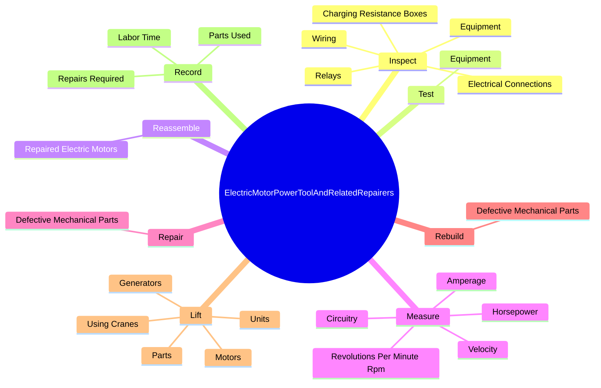
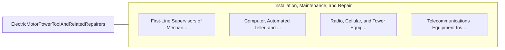

# Electric Motor, Power Tool, and Related Repairers

> Repair, maintain, or install electric motors, wiring, or switches.

## Overview

Electric Motor, Power Tool, and Related Repairers is classified under Installation, Maintenance, and Repair (SOC 49). Repair, maintain, or install electric motors, wiring, or switches.

## Classification Hierarchy

## Key Statistics

| Metric | Value |
|--------|-------|
| SOC Code | 49-2092.00 |
| Category | [Installation, Maintenance, and Repair](/occupations/Maintenance) |
| Task Count | 194 |
| Source | O*NET |

## Core Tasks

### inspect.Equipment

Electric Motor, Power Tool, and Related Repairers inspect equipment as part of their core responsibilities.

**Actions:**
- `inspect.Equipment.to.locate.DamagePartsDiagnoseMalfunctions`
- `inspect.Equipment.to.WornPartsDiagnoseMalfunctions`
- `inspect.Equipment.to.ReadWorkOrders`
- `inspect.Equipment.to.SchematicDrawingsToDetermineRequiredRepairs`

### test.Equipment

Electric Motor, Power Tool, and Related Repairers test equipment as part of their core responsibilities.

**Actions:**
- `test.Equipment.to.locate.DamagePartsDiagnoseMalfunctions`
- `test.Equipment.to.WornPartsDiagnoseMalfunctions`
- `test.Equipment.to.ReadWorkOrders`
- `test.Equipment.to.SchematicDrawingsToDetermineRequiredRepairs`

### reassemble.RepairedElectricMotors

Electric Motor, Power Tool, and Related Repairers reassemble repaired electric motors as part of their core responsibilities.

**Actions:**
- `reassemble.RepairedElectricMotors.to.specified.Requirements`
- `reassemble.RepairedElectricMotors.to.Ratings`
- `reassemble.RepairedElectricMotors.to.UsingH`
- `reassemble.RepairedElectricMotors.to.ToolsMeters`

## Skills & Competencies

### Technical Skills
- **Equipment Repair** - Advanced
- **Diagnostic Testing** - Advanced
- **Preventive Maintenance** - Advanced

### Soft Skills
- **Communication** - Essential
- **Problem Solving** - Essential
- **Critical Thinking** - Important
- **Teamwork** - Important
- **Adaptability** - Important

## Related Occupations

## Industries

This occupation is found across multiple industries. See [Industries](/industries) for sector-specific employment data.

## Career Progression

---

*Source: O*NET 49-2092.00 - ONETOccupation*
