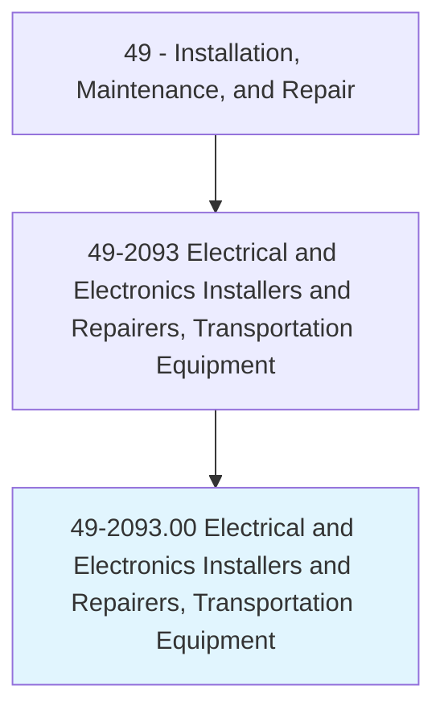
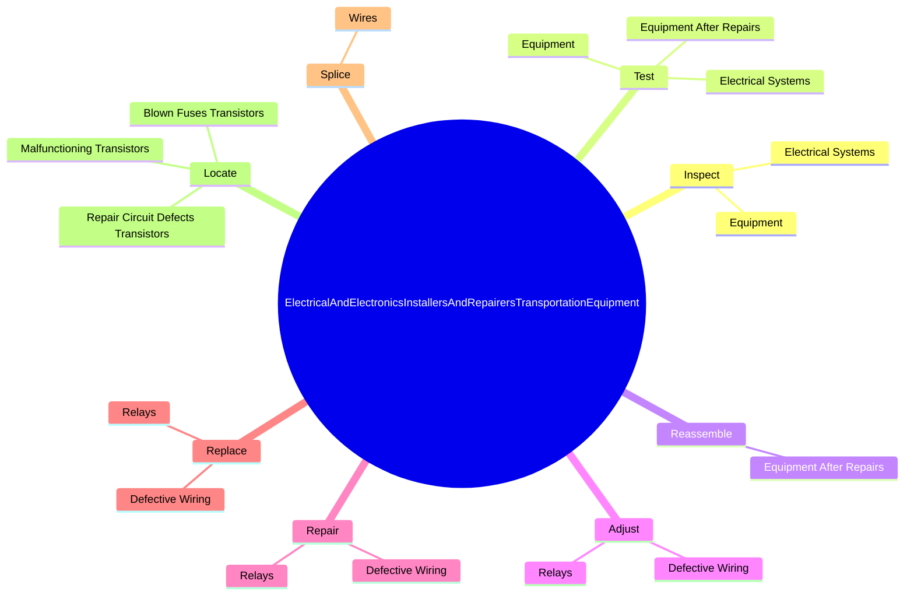
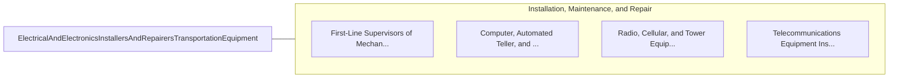

# Electrical and Electronics Installers and Repairers, Transportation Equipment

> Install, adjust, or maintain mobile electronics communication equipment, including sound, sonar, security, navigation, and surveillance systems on trains, watercraft, or other mobile equipment.

## Overview

Electrical and Electronics Installers and Repairers, Transportation Equipment is classified under Installation, Maintenance, and Repair (SOC 49). Install, adjust, or maintain mobile electronics communication equipment, including sound, sonar, security, navigation, and surveillance systems on trains, watercraft, or other mobile equipment.

## Classification Hierarchy

## Key Statistics

| Metric | Value |
|--------|-------|
| SOC Code | 49-2093.00 |
| Category | [Installation, Maintenance, and Repair](/occupations/Maintenance) |
| Task Count | 137 |
| Source | O*NET |

## Core Tasks

### inspect.ElectricalSystems

Electrical and Electronics Installers and Repairers, Transportation Equipment inspect electrical systems as part of their core responsibilities.

**Actions:**
- `inspect.ElectricalSystems.to.locate.Malfunctions`
- `inspect.ElectricalSystems.to.diagnose.Malfunctions`
- `inspect.ElectricalSystems.to.UsingVisualInspections`
- `inspect.ElectricalSystems.to.TestingDevices`

### test.ElectricalSystems

Electrical and Electronics Installers and Repairers, Transportation Equipment test electrical systems as part of their core responsibilities.

**Actions:**
- `test.ElectricalSystems.to.locate.Malfunctions`
- `test.ElectricalSystems.to.diagnose.Malfunctions`
- `test.ElectricalSystems.to.UsingVisualInspections`
- `test.ElectricalSystems.to.TestingDevices`

### reassemble.EquipmentAfterRepairs

Electrical and Electronics Installers and Repairers, Transportation Equipment reassemble equipment after repairs as part of their core responsibilities.

**Actions:**
- `reassemble.EquipmentAfterRepairs`

## Skills & Competencies

### Technical Skills
- **Equipment Repair** - Advanced
- **Diagnostic Testing** - Advanced
- **Preventive Maintenance** - Advanced

### Soft Skills
- **Communication** - Essential
- **Problem Solving** - Essential
- **Critical Thinking** - Important
- **Teamwork** - Important
- **Adaptability** - Important

## Related Occupations

## Industries

This occupation is found across multiple industries. See [Industries](/industries) for sector-specific employment data.

## Career Progression

---

*Source: O*NET 49-2093.00 - ONETOccupation*
