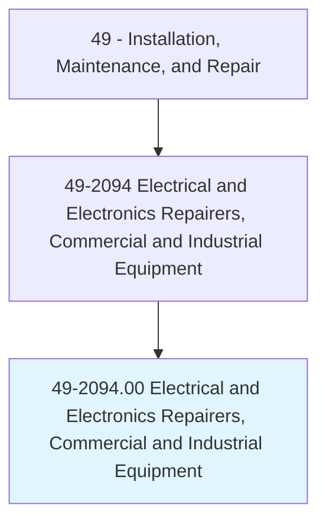
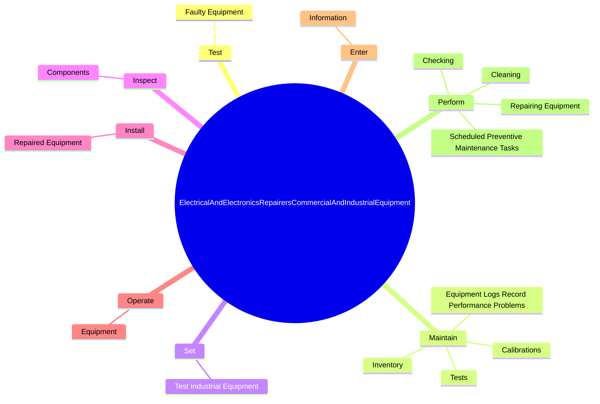
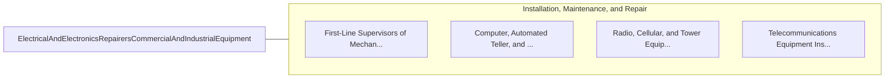

# Electrical and Electronics Repairers, Commercial and Industrial Equipment

> Repair, test, adjust, or install electronic equipment, such as industrial controls, transmitters, and antennas.

## Overview

Electrical and Electronics Repairers, Commercial and Industrial Equipment is classified under Installation, Maintenance, and Repair (SOC 49). Repair, test, adjust, or install electronic equipment, such as industrial controls, transmitters, and antennas.

## Classification Hierarchy

## Key Statistics

| Metric | Value |
|--------|-------|
| SOC Code | 49-2094.00 |
| Category | [Installation, Maintenance, and Repair](/occupations/Maintenance/index) |
| Task Count | 79 |
| Source | O*NET |

## Core Tasks

### test.FaultyEquipment

Electrical and Electronics Repairers, Commercial and Industrial Equipment test faulty equipment as part of their core responsibilities.

**Actions:**
- `test.FaultyEquipment.to.diagnose.Malfunctions`
- `test.FaultyEquipment.to.UsingTestEquipment`
- `test.FaultyEquipment.to.Software`
- `test.FaultyEquipment.to.ApplyingKnowledgeOfFunctionalOperationOfElectronicUnits`

### maintain.EquipmentLogsRecordPerformanceProblems

Electrical and Electronics Repairers, Commercial and Industrial Equipment maintain equipment logs record performance problems as part of their core responsibilities.

**Actions:**
- `maintain.EquipmentLogsRecordPerformanceProblems`
- `maintain.Calibrations`
- `maintain.Tests`
- `maintain.Inventory.of.SpareParts`

### set.TestIndustrialEquipment

Electrical and Electronics Repairers, Commercial and Industrial Equipment set test industrial equipment as part of their core responsibilities.

**Actions:**
- `set.TestIndustrialEquipment.to.ensure.ItFunctionsProperly`

## Skills & Competencies

### Technical Skills
- **Equipment Repair** - Advanced
- **Diagnostic Testing** - Advanced
- **Preventive Maintenance** - Advanced

### Soft Skills
- **Communication** - Essential
- **Problem Solving** - Essential
- **Critical Thinking** - Important
- **Teamwork** - Important
- **Adaptability** - Important

## Related Occupations

## Industries

This occupation is found across multiple industries. See [Industries](/industries) for sector-specific employment data.

## Career Progression

---

*Source: O*NET 49-2094.00 - ONETOccupation*
