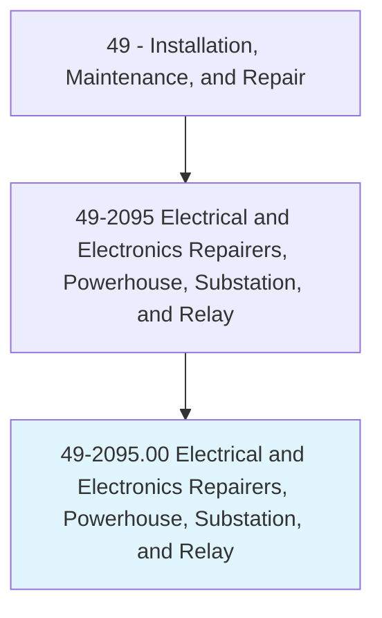
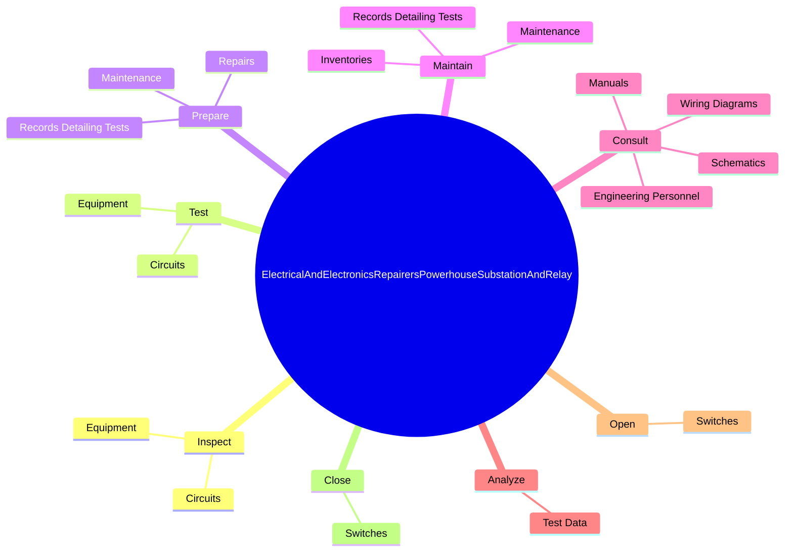
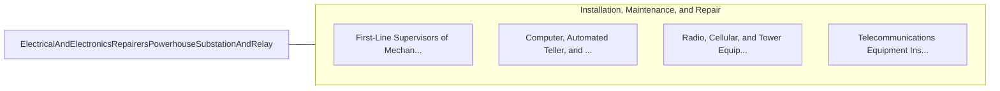

# Electrical and Electronics Repairers, Powerhouse, Substation, and Relay

> Inspect, test, repair, or maintain electrical equipment in generating stations, substations, and in-service relays.

## Overview

Electrical and Electronics Repairers, Powerhouse, Substation, and Relay is classified under Installation, Maintenance, and Repair (SOC 49). Inspect, test, repair, or maintain electrical equipment in generating stations, substations, and in-service relays.

## Classification Hierarchy

## Key Statistics

| Metric | Value |
|--------|-------|
| SOC Code | 49-2095.00 |
| Category | [Installation, Maintenance, and Repair](/occupations/Maintenance/index) |
| Task Count | 101 |
| Source | O*NET |

## Core Tasks

### inspect.Equipment

Electrical and Electronics Repairers, Powerhouse, Substation, and Relay inspect equipment as part of their core responsibilities.

**Actions:**
- `inspect.Equipment.to.identify.Malfunctions`
- `inspect.Equipment.to.UsingWiringDiagrams`
- `inspect.Equipment.to.Ohmmeters`
- `inspect.Equipment.to.Voltmeters`

### test.Equipment

Electrical and Electronics Repairers, Powerhouse, Substation, and Relay test equipment as part of their core responsibilities.

**Actions:**
- `test.Equipment.to.identify.Malfunctions`
- `test.Equipment.to.Defects`
- `test.Equipment.to.UsingWiringDiagrams`
- `test.Equipment.to.Ohmmeters`

### prepare.RecordsDetailingTests

Electrical and Electronics Repairers, Powerhouse, Substation, and Relay prepare records detailing tests as part of their core responsibilities.

**Actions:**
- `prepare.RecordsDetailingTests`
- `prepare.Repairs`
- `prepare.Maintenance`

## Skills & Competencies

### Technical Skills
- **Equipment Repair** - Advanced
- **Diagnostic Testing** - Advanced
- **Preventive Maintenance** - Advanced

### Soft Skills
- **Communication** - Essential
- **Problem Solving** - Essential
- **Critical Thinking** - Important
- **Teamwork** - Important
- **Adaptability** - Important

## Related Occupations

## Industries

This occupation is found across multiple industries. See [Industries](/industries) for sector-specific employment data.

## Career Progression

---

*Source: O*NET 49-2095.00 - ONETOccupation*
