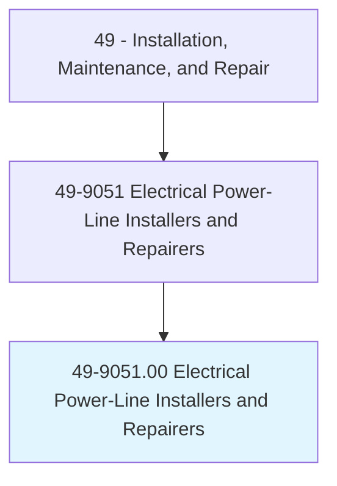
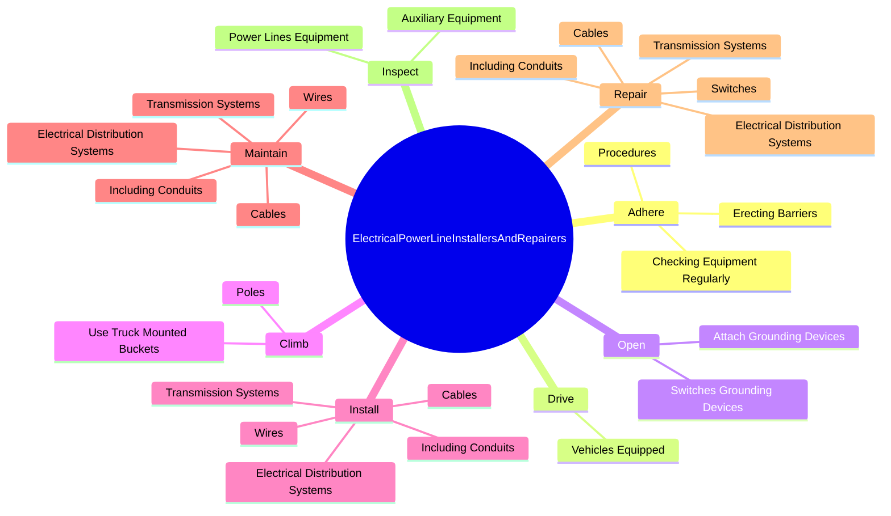
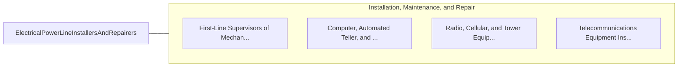

# Electrical Power-Line Installers and Repairers

> Install or repair cables or wires used in electrical power or distribution systems. May erect poles and light or heavy duty transmission towers.

## Overview

Electrical Power-Line Installers and Repairers is an occupation within the Installation, Maintenance, and Repair category. Install or repair cables or wires used in electrical power or distribution systems. 

## Classification Hierarchy

## Key Statistics

| Metric | Value |
|--------|-------|
| SOC Code | 49-9051.00 |
| Category | [Installation, Maintenance, and Repair](/occupations/Maintenance/index) |
| Task Count | 128 |
| Source | O*NET |

## Core Tasks

### adhere.Procedures

Electrical Power-Line Installers and Repairers adhere procedures as part of their core responsibilities.

**Actions:**
- `adhere.Procedures`
- `adhere.CheckingEquipmentRegularly`
- `adhere.ErectingBarriers.around.WorkAreas`

### drive.VehiclesEquipped

Electrical Power-Line Installers and Repairers drive vehicles equipped as part of their core responsibilities.

**Actions:**
- `drive.VehiclesEquipped.with.ToolsToJobSites`
- `drive.VehiclesEquipped.with.MaterialsToJobSites`

### open.SwitchesGroundingDevices

Electrical Power-Line Installers and Repairers open switches grounding devices as part of their core responsibilities.

**Actions:**
- `open.SwitchesGroundingDevices.to.remove.ElectricalHazardsFromDisturbedLinesToFacilitateRepairs`
- `open.SwitchesGroundingDevices.to.FallenLinesToFacilitateRepairs`
- `open.AttachGroundingDevices.to.remove.ElectricalHazardsFromDisturbedLinesToFacilitateRepairs`
- `open.AttachGroundingDevices.to.FallenLinesToFacilitateRepairs`

## Skills & Competencies

### Technical Skills
- **Equipment Repair** - Advanced
- **Diagnostic Testing** - Advanced
- **Preventive Maintenance** - Advanced

### Soft Skills
- **Communication** - Essential
- **Problem Solving** - Essential
- **Critical Thinking** - Important
- **Teamwork** - Important
- **Adaptability** - Important

## Related Occupations

## Industries

This occupation is found across multiple industries. See [Industries](/industries) for sector-specific employment data.

## Career Progression

---

*Source: O*NET 49-9051.00 - ONETOccupation*
