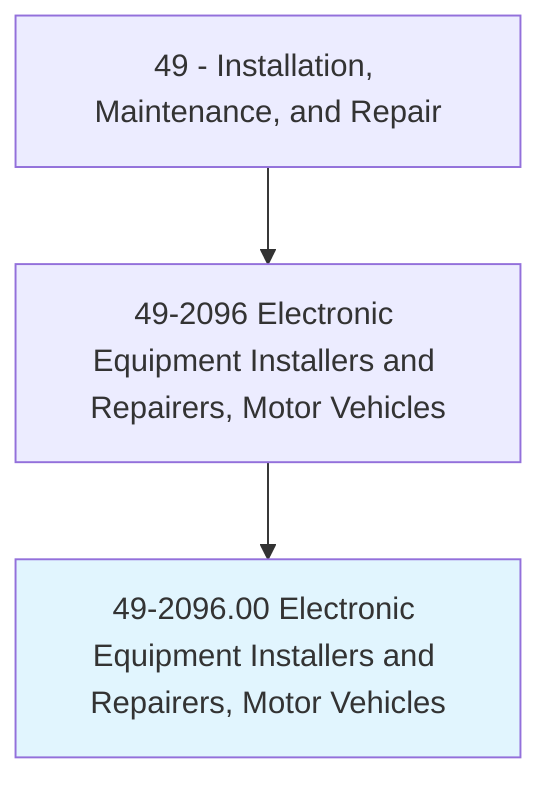
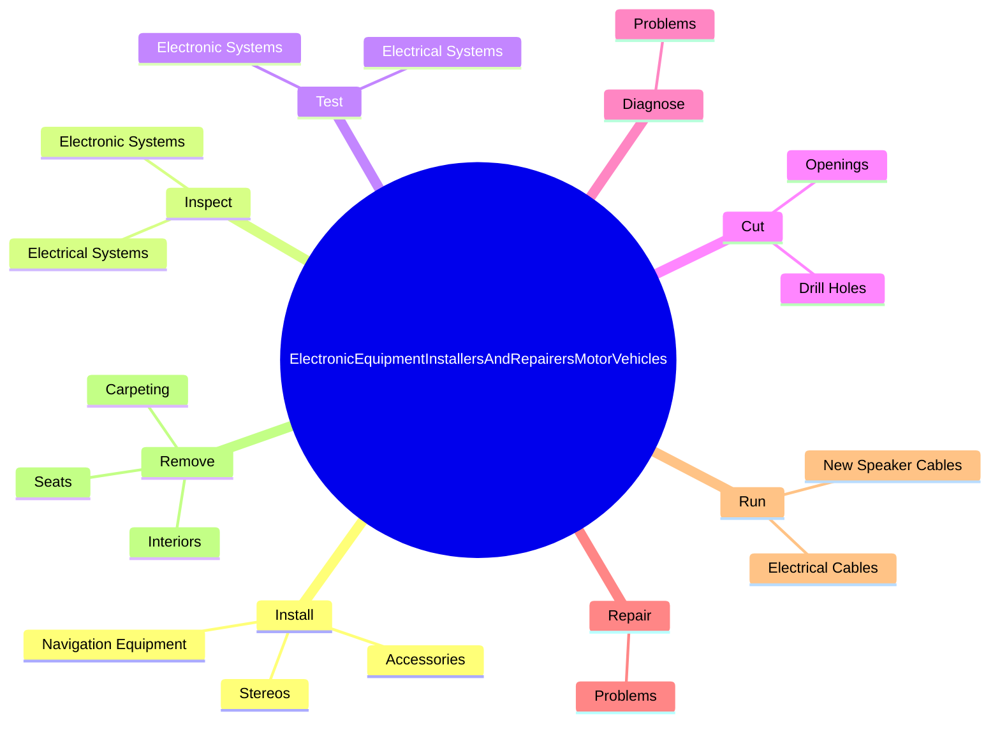
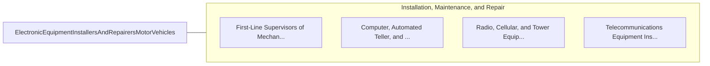

# Electronic Equipment Installers and Repairers, Motor Vehicles

> Install, diagnose, or repair communications, sound, security, or navigation equipment in motor vehicles.

## Overview

Electronic Equipment Installers and Repairers, Motor Vehicles is classified under Installation, Maintenance, and Repair (SOC 49). Install, diagnose, or repair communications, sound, security, or navigation equipment in motor vehicles.

## Classification Hierarchy

## Key Statistics

| Metric | Value |
|--------|-------|
| SOC Code | 49-2096.00 |
| Category | [Installation, Maintenance, and Repair](/occupations/Maintenance/index) |
| Task Count | 61 |
| Source | O*NET |

## Core Tasks

### install.Accessories

Electronic Equipment Installers and Repairers, Motor Vehicles install accessories as part of their core responsibilities.

**Actions:**
- `install.Accessories`
- `install.Stereos`
- `install.NavigationEquipment`

### inspect.ElectricalSystems

Electronic Equipment Installers and Repairers, Motor Vehicles inspect electrical systems as part of their core responsibilities.

**Actions:**
- `inspect.ElectricalSystems.to.TestingInstruments`
- `inspect.ElectricalSystems.to.Oscilloscopes`
- `inspect.ElectricalSystems.to.Voltmeters`
- `inspect.ElectronicSystems.to.locate.Malfunctions`

### test.ElectricalSystems

Electronic Equipment Installers and Repairers, Motor Vehicles test electrical systems as part of their core responsibilities.

**Actions:**
- `test.ElectricalSystems.to.TestingInstruments`
- `test.ElectricalSystems.to.Oscilloscopes`
- `test.ElectricalSystems.to.Voltmeters`
- `test.ElectronicSystems.to.locate.Malfunctions`

## Skills & Competencies

### Technical Skills
- **Equipment Repair** - Advanced
- **Diagnostic Testing** - Advanced
- **Preventive Maintenance** - Advanced

### Soft Skills
- **Communication** - Essential
- **Problem Solving** - Essential
- **Critical Thinking** - Important
- **Teamwork** - Important
- **Adaptability** - Important

## Related Occupations

## Industries

This occupation is found across multiple industries. See [Industries](/industries) for sector-specific employment data.

## Career Progression

---

*Source: O*NET 49-2096.00 - ONETOccupation*
