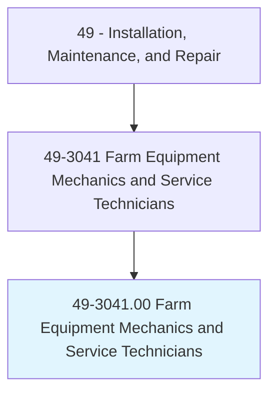
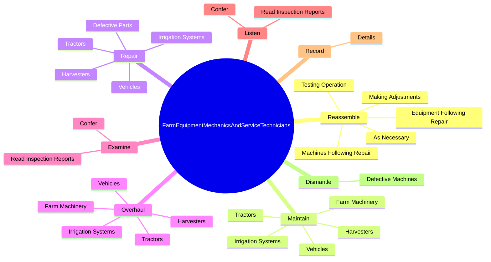
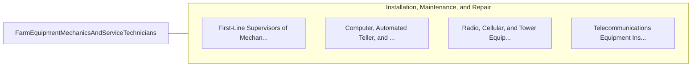

# Farm Equipment Mechanics and Service Technicians

> Diagnose, adjust, repair, or overhaul farm machinery and vehicles, such as tractors, harvesters, dairy equipment, and irrigation systems.

## Overview

Farm Equipment Mechanics and Service Technicians is classified under Installation, Maintenance, and Repair (SOC 49). Diagnose, adjust, repair, or overhaul farm machinery and vehicles, such as tractors, harvesters, dairy equipment, and irrigation systems.

## Classification Hierarchy

## Key Statistics

| Metric | Value |
|--------|-------|
| SOC Code | 49-3041.00 |
| Category | [Installation, Maintenance, and Repair](/occupations/Maintenance) |
| Task Count | 70 |
| Source | O*NET |

## Core Tasks

### reassemble.MachinesFollowingRepair

Farm Equipment Mechanics and Service Technicians reassemble machines following repair as part of their core responsibilities.

**Actions:**
- `reassemble.MachinesFollowingRepair`
- `reassemble.EquipmentFollowingRepair`
- `reassemble.TestingOperation`
- `reassemble.MakingAdjustments`

### maintain.FarmMachinery

Farm Equipment Mechanics and Service Technicians maintain farm machinery as part of their core responsibilities.

**Actions:**
- `maintain.FarmMachinery`
- `maintain.Vehicles`
- `maintain.Tractors`
- `maintain.Harvesters`

### repair.Vehicles

Farm Equipment Mechanics and Service Technicians repair vehicles as part of their core responsibilities.

**Actions:**
- `repair.Vehicles`
- `repair.Tractors`
- `repair.Harvesters`
- `repair.IrrigationSystems`

## Skills & Competencies

### Technical Skills
- **Equipment Repair** - Advanced
- **Diagnostic Testing** - Advanced
- **Preventive Maintenance** - Advanced

### Soft Skills
- **Communication** - Essential
- **Problem Solving** - Essential
- **Critical Thinking** - Important
- **Teamwork** - Important
- **Adaptability** - Important

## Related Occupations

## Industries

This occupation is found across multiple industries. See [Industries](/industries) for sector-specific employment data.

## Career Progression

---

*Source: O*NET 49-3041.00 - ONETOccupation*
