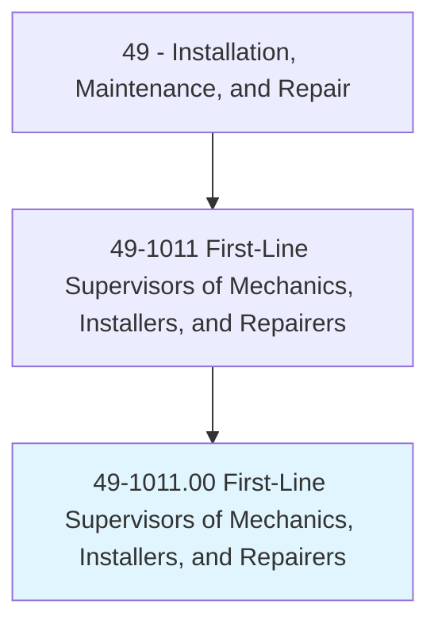
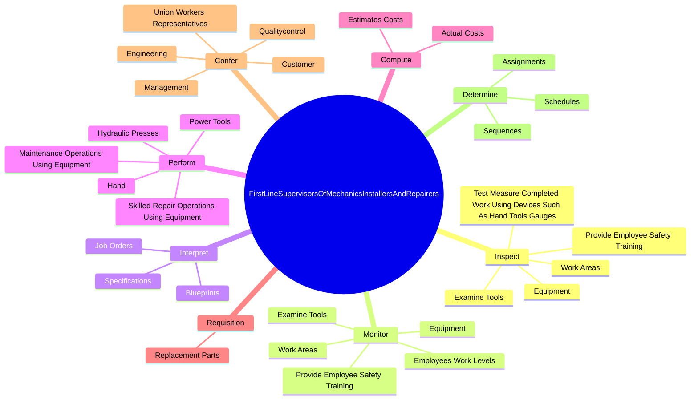
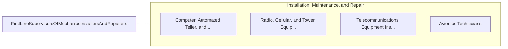

# First-Line Supervisors of Mechanics, Installers, and Repairers

> Directly supervise and coordinate the activities of mechanics, installers, and repairers. May also advise customers on recommended services. Excludes team or work leaders.

## Overview

First-Line Supervisors of Mechanics, Installers, and Repairers is an occupation within the Installation, Maintenance, and Repair category. Directly supervise and coordinate the activities of mechanics, installers, and repairers. May also advise customers on recommended services.

## Classification Hierarchy

## Key Statistics

| Metric | Value |
|--------|-------|
| SOC Code | 49-1011.00 |
| Category | [Installation, Maintenance, and Repair](/occupations/Maintenance/index) |
| Task Count | 139 |
| Source | O*NET |

## Core Tasks

### inspect.TestMeasureCompletedWorkUsingDevicesSuchAsHandToolsGauges

First-Line Supervisors of Mechanics, Installers, and Repairers inspect test measure completed work using devices such as hand tools gauges as part of their core responsibilities.

**Actions:**
- `inspect.TestMeasureCompletedWorkUsingDevicesSuchAsHandToolsGauges.to.verify.ConformanceToStandardsRepairRequirements`
- `inspect.WorkAreas.to.prevent`
- `inspect.WorkAreas.to.detect`
- `inspect.WorkAreas.to.correct.UnsafeConditionsOfProceduresSafetyRules`

### monitor.WorkAreas

First-Line Supervisors of Mechanics, Installers, and Repairers monitor work areas as part of their core responsibilities.

**Actions:**
- `monitor.WorkAreas.to.prevent`
- `monitor.WorkAreas.to.detect`
- `monitor.WorkAreas.to.correct.UnsafeConditionsOfProceduresSafetyRules`
- `monitor.WorkAreas.to.ViolationsOfProceduresSafetyRules`

### interpret.Specifications

First-Line Supervisors of Mechanics, Installers, and Repairers interpret specifications as part of their core responsibilities.

**Actions:**
- `interpret.Specifications.to.construct.Templates`
- `interpret.Specifications.to.lay.OutReferencePointsForWorkers`
- `interpret.Blueprints.to.construct.Templates`
- `interpret.Blueprints.to.lay.OutReferencePointsForWorkers`

## Skills & Competencies

### Technical Skills
- **Equipment Repair** - Advanced
- **Diagnostic Testing** - Advanced
- **Preventive Maintenance** - Advanced

### Soft Skills
- **Communication** - Essential
- **Problem Solving** - Essential
- **Critical Thinking** - Important
- **Teamwork** - Important
- **Adaptability** - Important

## Related Occupations

## Industries

This occupation is found across multiple industries. See [Industries](/industries) for sector-specific employment data.

## Career Progression

---

*Source: O*NET 49-1011.00 - ONETOccupation*
